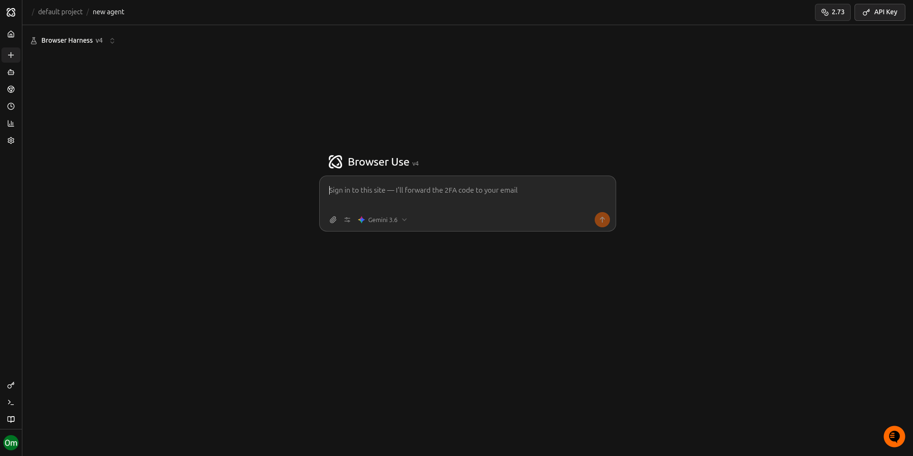
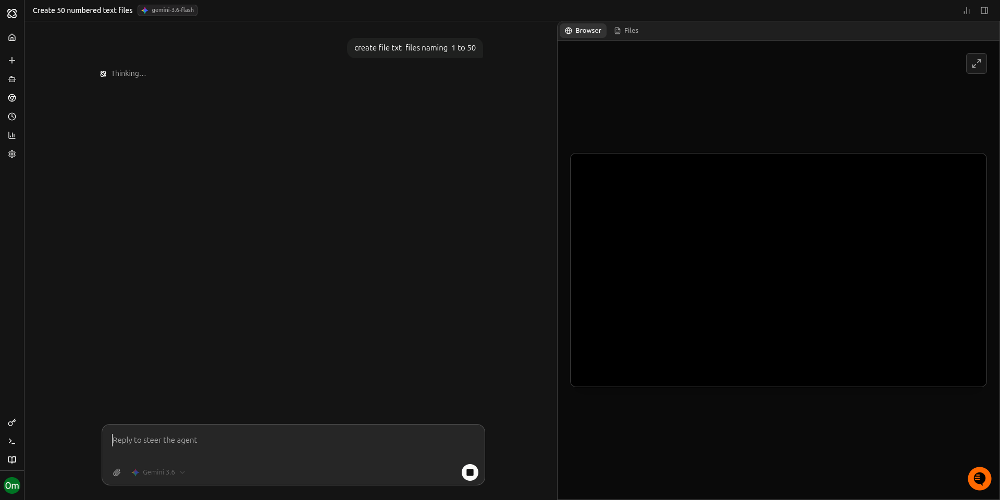
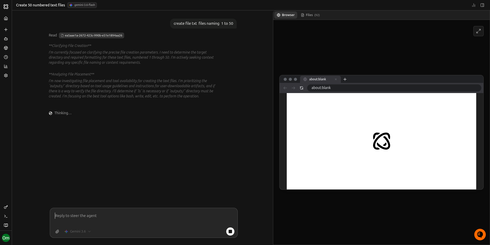
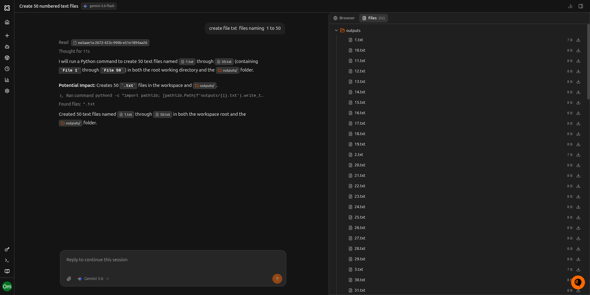

make the whole system in full black at
at start open black bg backgorund and show /code/ATLAS/frontend/public/favicon.png

then open ui like 

when prompt is given change the layout to 

font communicatin and all animations should look like

file system should always present in layout and look like
