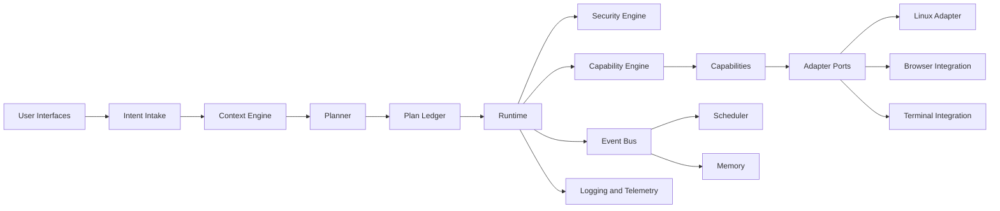
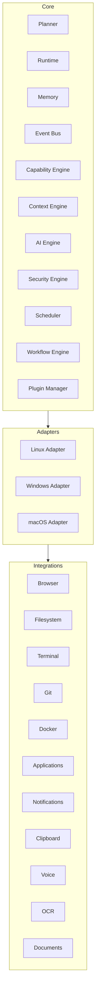
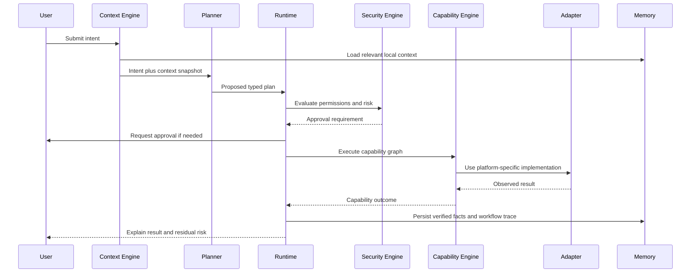

# Atlas Architecture

## Purpose

This document defines the durable architecture for Atlas. It is the source of truth for subsystem boundaries, runtime responsibilities, dependency direction, trust boundaries, and platform separation.

## Overview

Atlas is an event-driven, capability-based operating layer. It observes local state, builds context, plans user-intent workflows, executes capabilities through a deterministic runtime, and verifies outcomes before reporting completion.

The central rule is:

> The LLM decides what. The runtime decides how. Capabilities execute.

## Motivation

General-purpose agents often expose raw tools directly to a model. That design creates fragile plans, poor recoverability, and unsafe privilege escalation. Atlas instead uses typed capabilities with explicit contracts, preconditions, effects, permissions, and verification rules. The planner reasons over stable capability semantics while the runtime handles execution mechanics.

## Architecture

Atlas is split into core services, capability modules, adapters, and persistence.



## Design Decisions

Atlas uses dependency inversion around platform and application integrations. Core services depend on ports, not concrete Linux, browser, shell, or desktop implementations.

Plans are represented as explainable, typed data. A plan contains user intent, candidate capabilities, permission requirements, risk classification, execution graph, rollback strategy, and verification checks.

Capabilities are coarse-grained. `CleanStorage` is acceptable; `rm -rf` is not. Low-level actions are implementation details of a capability, guarded by the runtime and security engine.

Atlas is offline-first. Cloud inference may be configured by a user, but the system must remain useful with local models, local storage, and local adapters.

## Component Diagram



## Sequence Diagram



## Folder Structure

The intended implementation layout is:

```text
atlas/
  core/
    planner/
    runtime/
    memory/
    events/
    capabilities/
    context/
    ai/
    security/
    scheduler/
    workflows/
    plugins/
  adapters/
    linux/
    windows/
    macos/
  integrations/
    browser/
    filesystem/
    terminal/
    git/
    docker/
    desktop/
    clipboard/
    notifications/
    voice/
    ocr/
    documents/
  storage/
  observability/
tests/
  unit/
  integration/
  system/
  security/
  performance/
```

## Public Interfaces

The core public interfaces are specified in [docs/api/contracts.md](/code/ATLAS/docs/api/contracts.md):

- `Capability`
- `CapabilityRequest`
- `CapabilityResult`
- `Plan`
- `ExecutionTransaction`
- `PermissionGrant`
- `ContextSnapshot`
- `AdapterPort`
- `Event`
- `Workflow`

## Implementation Strategy

Begin with contracts and an in-memory runtime. Add Linux adapter implementations only after the capability, permission, event, and logging contracts are tested. Build vertical slices such as "organize downloads" and "summarize project state" before broad automation.

## Testing

Every subsystem must provide unit tests for contract behavior, integration tests for adapter boundaries, and system tests for end-to-end plans. Destructive capabilities require failure, rollback, and approval tests.

## Security

Atlas separates planning from authority. The planner may recommend action; only the runtime may execute it. The security engine enforces capability grants, path scopes, command policies, network policies, and human approval rules.

## Future Improvements

Future versions may support distributed workers, remote sync, mobile companion interfaces, encrypted multi-device memory, and richer desktop automation. These features must preserve local-first operation and the capability security model.

## References

- [Runtime Architecture](/code/ATLAS/docs/architecture/runtime.md)
- [Capability Engine](/code/ATLAS/docs/architecture/capability-engine.md)
- [Security Model](/code/ATLAS/docs/architecture/security.md)
- [Cross Platform Layer](/code/ATLAS/docs/architecture/cross-platform-layer.md)
