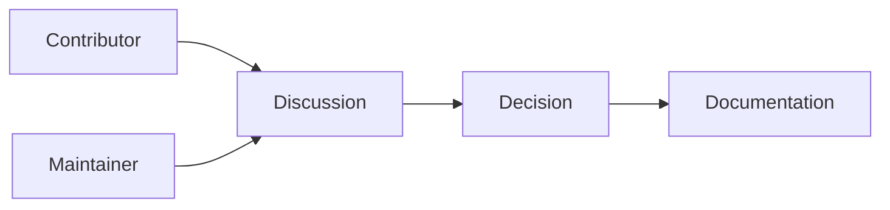
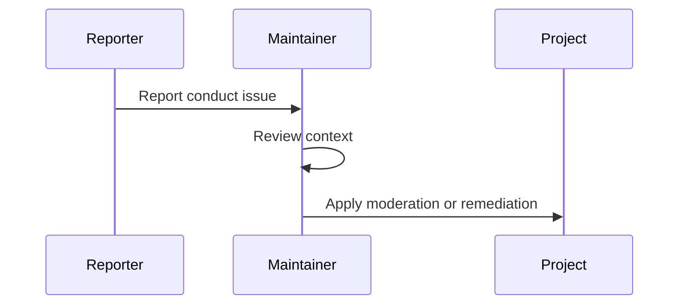

# Atlas Code of Conduct

## Purpose

The Atlas community should be serious about systems engineering and generous with people. This document defines expected conduct for contributors, maintainers, users, and reviewers.

## Overview

Atlas welcomes thoughtful technical disagreement. It does not welcome harassment, personal attacks, discriminatory behavior, or attempts to intimidate contributors.

## Motivation

Operating-layer software requires careful review and sometimes difficult tradeoffs. A healthy project culture makes those tradeoffs explicit without making participation costly or unsafe.

## Architecture

Community governance affects technical quality. Maintainers should keep review conversations grounded in architecture documents, tests, and user impact.

## Design Decisions

Discussions should prioritize evidence, reproducibility, and clear reasoning. Maintainers may close issues or pull requests that violate community expectations.

## Component Diagram

## Sequence Diagram

## Folder Structure

Governance documents live at the repository root. Process details may be expanded under `docs/specifications`.

## Public Interfaces

The community interface is issue discussions, pull requests, reviews, and maintainer decisions.

## Implementation Strategy

Maintain clear issue templates, respectful review standards, and documented decision records as the project grows.

## Testing

Community process is evaluated through moderation consistency, contributor retention, and review quality.

## Security

Conduct reports may include private information and must be handled with discretion.

## Future Improvements

The project should eventually publish maintainer rotation rules, moderation escalation paths, and decision-record templates.

## References

- [Contributing Guide](/code/ATLAS/CONTRIBUTING.md)
- [Security Policy](/code/ATLAS/SECURITY.md)
