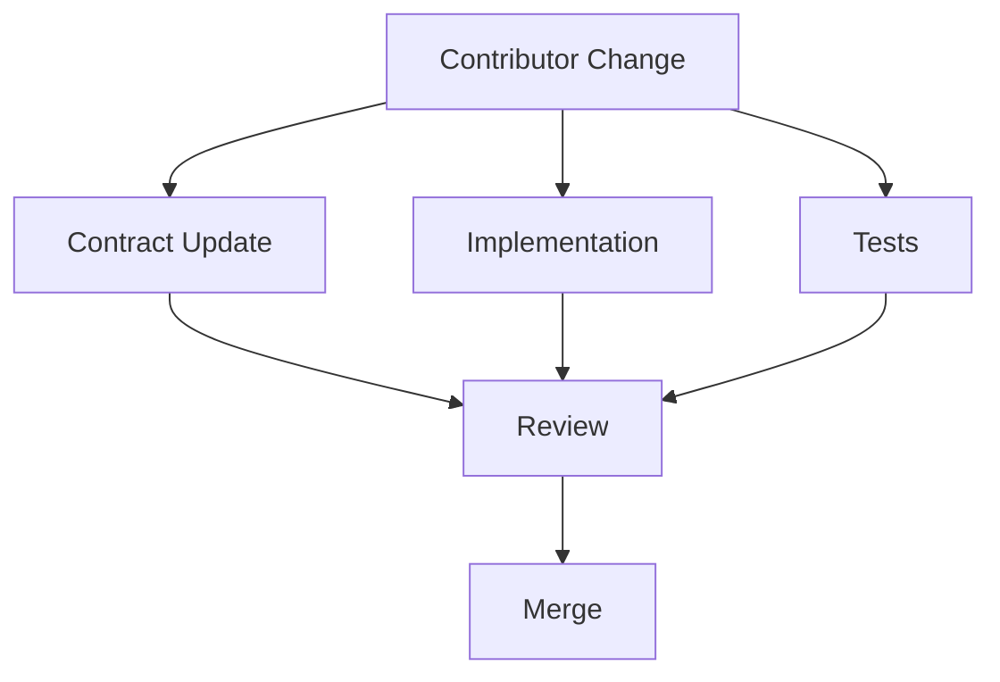
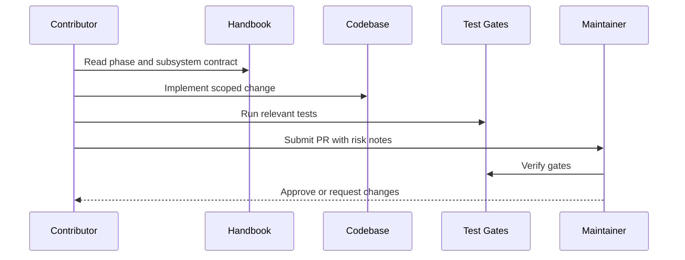

# Contributing to Atlas

## Purpose

This document defines how contributors design, implement, test, and review Atlas changes.

## Overview

Atlas contributors work from contracts and phase plans. A contribution should state the capability or subsystem it changes, the permissions it affects, the tests it adds, and the user-visible behavior it enables.

## Motivation

Atlas coordinates real machines. Contributions must be more rigorous than typical automation scripts because defects can affect files, terminals, repositories, browsers, and private user context.

## Architecture

Contributions must preserve these dependency rules:

- Core services must not depend on concrete OS adapters.
- Planners must not call low-level tools.
- Capabilities must declare preconditions, permissions, effects, and verification rules.
- Adapters must be replaceable without changing planner logic.
- Security checks must execute in the runtime path, not only in UI code.

## Design Decisions

Prefer small vertical changes with tests. Avoid broad refactors unless they remove a known architecture violation. Use interfaces before concrete integrations and document any new capability contract in [docs/api/contracts.md](/code/ATLAS/docs/api/contracts.md).

## Component Diagram

## Sequence Diagram

## Folder Structure

Implementation code should follow the layout in [ARCHITECTURE.md](/code/ATLAS/ARCHITECTURE.md). Documentation for new subsystems belongs in the matching directory under [docs](/code/ATLAS/docs).

## Public Interfaces

Public contracts require documentation, tests, and backwards-compatibility notes. Breaking changes must include a migration strategy.

## Implementation Strategy

1. Identify the phase and subsystem.
2. Update or add the architecture/specification document.
3. Implement the smallest useful slice.
4. Add tests matching the phase test matrix.
5. Run formatting, linting, and tests.
6. Include risk and rollback notes in review.

## Testing

Every behavior change needs tests. Destructive capabilities also need approval-denial, rollback, and partial-failure tests.

## Security

Never introduce a path that executes shell commands, writes files, captures screen contents, reads clipboard data, or opens network connections without a permission contract and runtime enforcement.

## Future Improvements

Contributor tooling should eventually include architecture linting, capability manifest validation, permission policy simulation, and generated API documentation.

## References

- [Security Policy](/code/ATLAS/SECURITY.md)
- [Testing Strategy](/code/ATLAS/docs/testing/strategy.md)
- [API Contracts](/code/ATLAS/docs/api/contracts.md)
