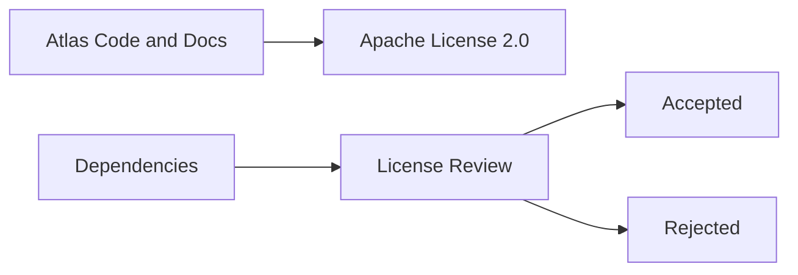
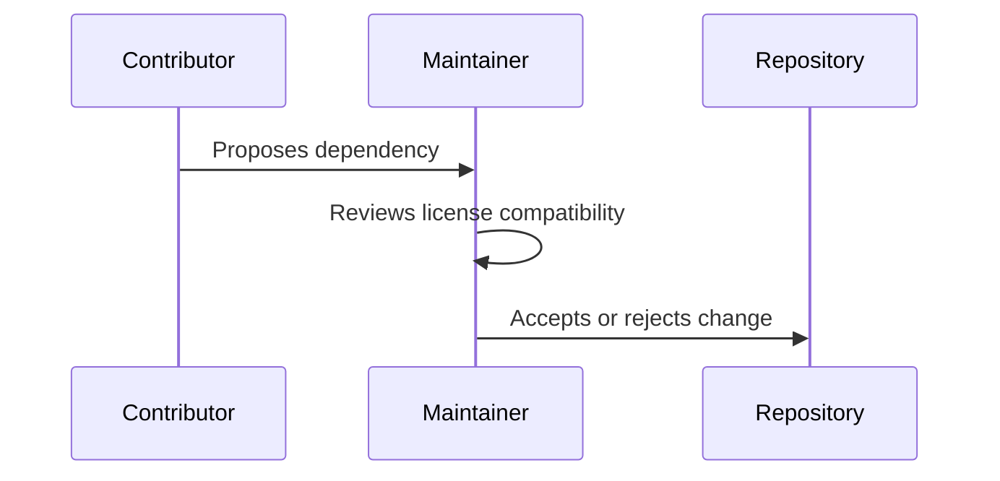

# Apache License 2.0

SPDX-License-Identifier: Apache-2.0

Atlas documentation and source code are licensed under the Apache License, Version 2.0, unless a file states otherwise.

## Purpose

The license permits use, modification, distribution, and contribution while preserving patent grants and attribution requirements.

## Overview

Use of this repository is governed by the Apache License 2.0.

## Motivation

Atlas is intended to be a serious open-source operating-layer project. Apache 2.0 is compatible with broad commercial and non-commercial adoption while protecting contributors through an explicit patent license.

## Architecture

Licensing applies across documentation, source code, examples, and tests. Third-party dependencies must be reviewed separately before inclusion.

## Design Decisions

The project should avoid dependencies with licenses that prevent distribution, commercial use, static linking where needed, or plugin ecosystem growth.

## Component Diagram

## Sequence Diagram

## Folder Structure

Dependency research belongs in [docs/research](/code/ATLAS/docs/research). License notes should accompany dependency evaluations.

## Public Interfaces

License commitments affect contributors, downstream users, packagers, and plugin authors.

## Implementation Strategy

Before adding a dependency, document license, maintenance status, alternatives, integration strategy, and long-term risks.

## Testing

Release checks should eventually include automated license scanning.

## Security

Licensing and supply-chain security overlap. A dependency that cannot be audited or updated reliably should not become a core dependency.

## Future Improvements

Add generated software bill of materials artifacts and dependency policy gates before binary releases.

## References

- Apache License 2.0: https://www.apache.org/licenses/LICENSE-2.0
- [Dependency Research](/code/ATLAS/docs/research/dependency-evaluations.md)

## Terms

The canonical Apache License 2.0 text is maintained by the Apache Software Foundation at https://www.apache.org/licenses/LICENSE-2.0. Release artifacts should include that canonical text, this SPDX identifier, and any third-party notices required by dependency licenses.
