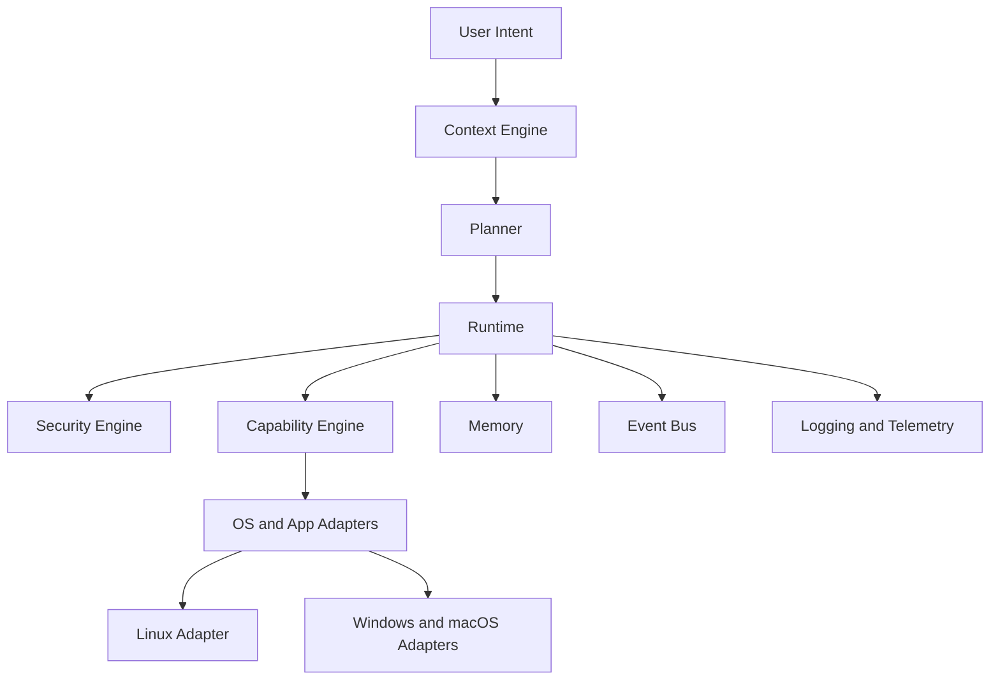

# Atlas Engineering Handbook

Atlas is an AI operating layer for personal computers. It sits between the user and the operating system, turns intent into verified capabilities, and maintains local context about files, projects, applications, terminals, browsers, clipboard, notifications, and long-running workflows.

Atlas is not a chatbot, browser agent, or macro recorder. It is a local-first runtime for coordinating computer capabilities through explicit permissions, deterministic execution, auditable plans, and extensible plugins.

## Purpose

This repository is the engineering handbook for building Atlas from an empty repository into a production-quality open-source system. It defines the product philosophy, architecture, subsystem contracts, implementation phases, testing strategy, security model, and contributor expectations.

## Overview

Atlas is organized around three hard boundaries:

1. The planner decides what should happen.
2. The runtime decides how work is executed safely.
3. Capabilities own concrete implementation details.

The planner never receives raw primitives such as mouse clicks, shell commands, or direct filesystem mutations. It receives capability contracts such as `OrganizeDownloads`, `ReviewPullRequest`, `LaunchWorkspace`, or `PrepareMeeting`. Capability implementations may use low-level adapters, but those adapters are hidden behind stable interfaces owned by the runtime.

## Repository Map

| Path | Responsibility |
| --- | --- |
| [ROADMAP.md](/code/ATLAS/ROADMAP.md) | Release strategy and phase sequencing |
| [ARCHITECTURE.md](/code/ATLAS/ARCHITECTURE.md) | System architecture and core design decisions |
| [CONTRIBUTING.md](/code/ATLAS/CONTRIBUTING.md) | Contributor workflow and engineering standards |
| [SECURITY.md](/code/ATLAS/SECURITY.md) | Vulnerability reporting and secure development rules |
| [docs/architecture](/code/ATLAS/docs/architecture) | Subsystem architecture documents |
| [docs/specifications](/code/ATLAS/docs/specifications) | Product, runtime, interface, and platform specifications |
| [docs/research](/code/ATLAS/docs/research) | Dependency and open-source project evaluations |
| [docs/phases](/code/ATLAS/docs/phases) | Implementation phase plans |
| [docs/api](/code/ATLAS/docs/api) | Public interfaces and internal API contracts |
| [docs/testing](/code/ATLAS/docs/testing) | Test philosophy, acceptance gates, and test matrices |
| [docs/plugins](/code/ATLAS/docs/plugins) | Plugin SDK and capability extension model |
| [docs/diagrams](/code/ATLAS/docs/diagrams) | Mermaid diagrams used by the handbook |
| [docs/examples](/code/ATLAS/docs/examples) | Worked examples for capabilities and workflows |
| [docs/benchmarks](/code/ATLAS/docs/benchmarks) | Performance budgets and benchmark plans |
| [docs/implementation](/code/ATLAS/docs/implementation) | Build map from architecture to modules, services, workers, IPC, and storage |
| [docs/features](/code/ATLAS/docs/features) | User-facing scenarios and feature acceptance criteria |
| [docs/audits](/code/ATLAS/docs/audits) | Documentation audit records and gap closure notes |

## Mission

Atlas should become the user's permanent local AI operating layer. A user should eventually think, "I use Atlas because Atlas understands my computer." That trust only exists if Atlas is private by default, reliable under failure, explainable under uncertainty, and careful with destructive authority.

## Design Principles

Atlas follows ten product principles:

1. Local first
2. Offline first
3. Privacy first
4. Capability based
5. Event driven
6. Deterministic runtime
7. Explainable planning
8. Human approval for destructive actions
9. Extensible plugin architecture
10. Cross-platform core

## Architecture

Atlas consists of a platform-independent core and platform-specific adapters.

Read [ARCHITECTURE.md](/code/ATLAS/ARCHITECTURE.md) before implementing any code. Subsystem details live in [docs/architecture](/code/ATLAS/docs/architecture). Use [docs/implementation/implementation-map.md](/code/ATLAS/docs/implementation/implementation-map.md) to translate the architecture into modules, managers, workers, IPC, storage, and execution flow.

## Implementation Strategy

Atlas should be built in vertical slices. Each phase must produce running code, testable capability contracts, and updated documentation. The first implementation target is Linux on Ubuntu, Debian, and Kali Linux, but platform assumptions must live only in OS adapters.

## Testing

Atlas is not complete until acceptance tests pass for the relevant phase. Every phase defines unit, integration, system, performance, failure, recovery, security, regression, and acceptance tests. See [docs/testing/strategy.md](/code/ATLAS/docs/testing/strategy.md).

## Security

Atlas treats local machine authority as high risk. Destructive or privacy-sensitive actions require capability grants and, where appropriate, human approval. See [SECURITY.md](/code/ATLAS/SECURITY.md) and [docs/architecture/security.md](/code/ATLAS/docs/architecture/security.md).

## Future Improvements

The handbook anticipates future Windows and macOS adapters, distributed execution, richer local models, voice input, OCR, document understanding, and plugin marketplaces. These are documented as explicit research and phase items rather than assumed runtime dependencies.

## References

- [Architecture Overview](/code/ATLAS/ARCHITECTURE.md)
- [Documentation Standard](/code/ATLAS/docs/specifications/documentation-standard.md)
- [Roadmap](/code/ATLAS/ROADMAP.md)
- [Phase 0 Plan](/code/ATLAS/docs/phases/phase-00-foundation.md)
- [Phase 1 Plan](/code/ATLAS/docs/phases/phase-01-local-runtime.md)
- [Plugin SDK](/code/ATLAS/docs/plugins/sdk.md)
- [Implementation Map](/code/ATLAS/docs/implementation/implementation-map.md)
- [Core Feature Scenarios](/code/ATLAS/docs/features/core-feature-scenarios.md)
