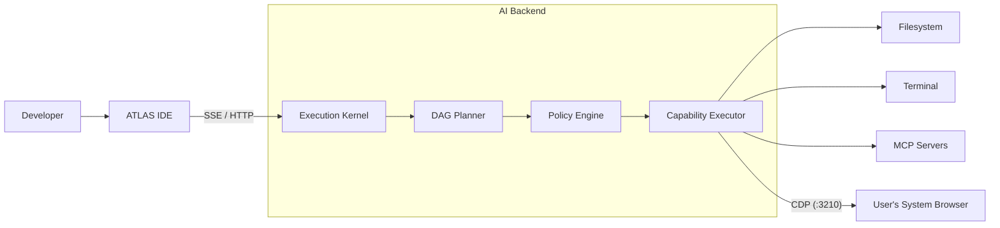

<p align="center">
  
</p>

<h1 align="center">ATLAS</h1>

<p align="center">
  <strong>AI-Native Browser Runtime / IDE</strong><br>
  <em>A capability-driven execution kernel integrated directly into your development workflow and local browser.</em>
</p>

<p align="center">
  
  
  
  
</p>

---

## What is ATLAS?

ATLAS is an experimental hybrid architecture that blends an Intelligent Execution Kernel with the VS Code IDE. It allows an AI agent to seamlessly reason about your codebase, operate your terminal, and—most importantly—drive your active local web browsers via the Chrome DevTools Protocol (CDP).

Unlike traditional headless automation tools, ATLAS acts on your behalf within your authenticated, active browser sessions, while exposing its execution traces natively in the IDE.

## Core Capabilities

- 🧠 **Intent-Driven Orchestration:** Uses a fast, local LLM to detect intent and graph out dependencies, falling back to OpenRouter for complex multi-step reasoning.
- 🌐 **Native CDP Proxy:** Discovers local Chrome/Brave/Edge browser ports and proxies connections dynamically.
- 🔌 **Extensible Capabilities:** Native Python plugin architecture combined with full support for Model Context Protocol (MCP) servers.
- 💻 **IDE Integration:** A customized VS Code fork streams real-time execution graphs directly into your editor sidebar.

## Architecture at a Glance

ATLAS separates *Intent* from *Execution*.



## Quick Start

ATLAS is designed for local deployment. Ensure you have Python 3.10+, Node.js (v18/v20), and a chromium-based browser installed.

```bash
# 1. Setup the Python Execution Kernel
python3 -m venv .venv
source .venv/bin/activate
pip install -r requirements.txt
cp .env.example .env

# 2. Build the VS Code Frontend
cd apps/vscode
npm install
npm run build-fast

# 3. Launch ATLAS
cd ../..
./scripts/run.sh
```

## Documentation

Comprehensive engineering documentation is available in the [`docs/`](docs/README.md) directory:

- 🏗 **[Architecture Overview](docs/architecture/system-architecture.md)**
- 🤖 **[Agent Execution & Planning](docs/architecture/agent.md)**
- 🌐 **[Browser CDP Architecture](docs/architecture/browser.md)**
- 🔌 **[MCP and Plugins](docs/architecture/mcp-and-plugins.md)**
- 💻 **[IDE Integration](docs/architecture/vscode.md)**
- ⚙️ **[Development Setup](docs/development/setup.md)**
- 🛡 **[Security Model](docs/security/security.md)**

## Project Status

> [!CAUTION]
> ATLAS is an active engineering **prototype**.
> - The Policy Engine currently defaults to auto-approval for development velocity.
> - **Do not use ATLAS with untrusted repositories or adversarial websites.**
> 
> See [Prototype Status & Limitations](docs/status/prototype-status.md) for a detailed technical breakdown.

---
**Confidentiality:** This is a closed-source, proprietary repository. Code and architecture patterns herein must not be distributed.
