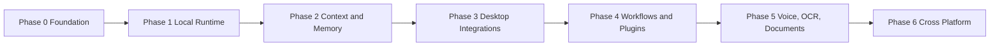
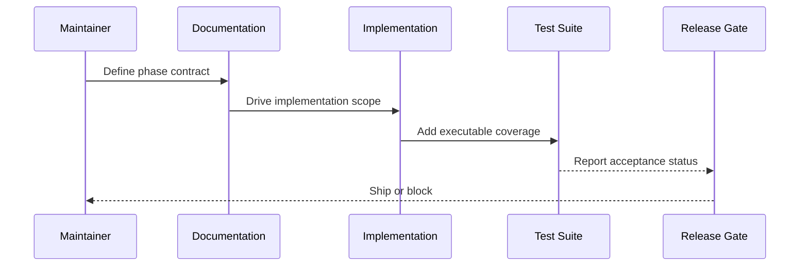

# Atlas Roadmap

## Purpose

The roadmap defines how Atlas moves from handbook to production implementation without sacrificing reliability, security, or platform independence.

## Overview

Atlas should be implemented in phases that each produce runnable code, tested contracts, working documentation, and clear acceptance criteria. The roadmap avoids speculative feature piles; each phase establishes a layer that later phases depend on.

## Motivation

Atlas needs durable foundations before broad automation. A local AI operating layer can damage user data if planning, permissions, logging, and recovery are bolted on later. The roadmap front-loads contracts, runtime determinism, and safety.

## Architecture

## Design Decisions

Phase 0 defines interfaces before implementation. Phase 1 proves deterministic execution. Phase 2 adds durable context. Phase 3 expands local machine control. Phase 4 exposes the extension model. Phase 5 adds multimodal input. Phase 6 broadens platform support after adapter contracts are stable.

## Component Diagram

See [docs/diagrams/system-context.md](/code/ATLAS/docs/diagrams/system-context.md).

## Sequence Diagram

Every phase follows this release sequence:

## Folder Structure

Phase documents live in [docs/phases](/code/ATLAS/docs/phases). Each phase owns deliverables, risks, tests, and definition of done.

## Public Interfaces

Public interfaces stabilize in this order:

1. Runtime and capability contracts
2. Permission and event contracts
3. Context and memory contracts
4. Adapter contracts
5. Plugin SDK contracts

## Implementation Strategy

Build thin vertical workflows before expanding coverage horizontally. A phase is not accepted because files compile; it is accepted when a user-visible workflow completes with logged decisions, verified outcomes, and tested failure handling. The feature-level expansion for every phase lives in [docs/phases/phase-feature-matrix.md](/code/ATLAS/docs/phases/phase-feature-matrix.md).

## Testing

Each phase must document unit, integration, system, performance, failure, recovery, security, regression, and acceptance tests. See [docs/testing/strategy.md](/code/ATLAS/docs/testing/strategy.md).

## Security

Security milestones are blocking. A phase cannot ship if destructive actions are unapproved, sensitive data is logged without redaction, or adapter authority bypasses runtime permission checks.

## Future Improvements

Later roadmap extensions may add distributed execution, marketplace packaging, collaborative workflows, and enterprise policy packs. These belong after the local system is reliable.

## References

- [Phase 0 Foundation](/code/ATLAS/docs/phases/phase-00-foundation.md)
- [Phase 1 Local Runtime](/code/ATLAS/docs/phases/phase-01-local-runtime.md)
- [Phase Feature Matrix](/code/ATLAS/docs/phases/phase-feature-matrix.md)
- [Release Strategy](/code/ATLAS/docs/specifications/release-strategy.md)
