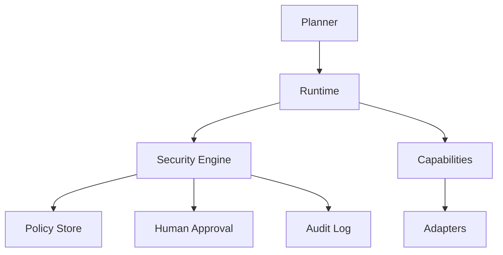
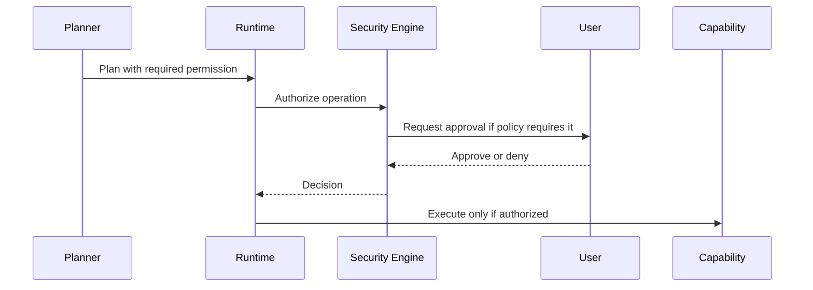

# Atlas Security Policy

## Purpose

This document defines Atlas security expectations for maintainers, contributors, and users.

## Overview

Atlas runs with access to local machine context. Security is therefore a core architecture property, not an afterthought. The runtime must enforce permission boundaries even when a planner proposes unsafe actions.

## Motivation

Atlas may interact with files, terminals, browsers, repositories, Docker, clipboard contents, notifications, voice input, OCR captures, and application windows. Mishandling any of these can expose private data or damage user work.

## Architecture

## Design Decisions

All sensitive operations require typed permissions. The permission scope must include subject, action, resource, duration, and approval state. The planner may request a permission, but only the runtime and security engine may grant or deny it.

## Component Diagram

See [docs/architecture/security.md](/code/ATLAS/docs/architecture/security.md).

## Sequence Diagram

## Folder Structure

Security code should live in `atlas/core/security`, policy schemas in `atlas/core/security/policies`, and security tests in `tests/security`.

## Public Interfaces

Security-sensitive interfaces include `PermissionRequest`, `PermissionGrant`, `RiskLevel`, `PolicyDecision`, `AuditEvent`, and `RedactionRule`.

## Implementation Strategy

Start with deny-by-default policies. Add allow rules only through explicit capability contracts. Implement audit logging before enabling filesystem, terminal, browser, or desktop mutation.

## Testing

Security tests must cover denied permissions, expired grants, path traversal, shell injection attempts, sensitive log redaction, rollback behavior, and plugin isolation.

## Reporting Vulnerabilities

Until a dedicated security address exists, report vulnerabilities privately to project maintainers through the repository's private advisory mechanism. Do not disclose exploitable issues publicly before maintainers have had time to ship a fix.

## Future Improvements

Atlas should add signed plugin manifests, reproducible releases, secret scanning, sandboxed capability execution, and optional hardware-backed key storage.

## References

- [Security Architecture](/code/ATLAS/docs/architecture/security.md)
- [Permissions Specification](/code/ATLAS/docs/specifications/permissions.md)
- [Plugin SDK](/code/ATLAS/docs/plugins/sdk.md)
