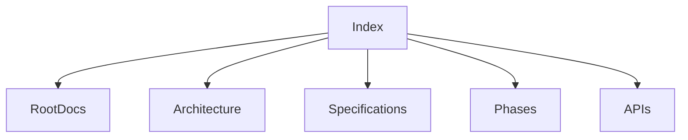
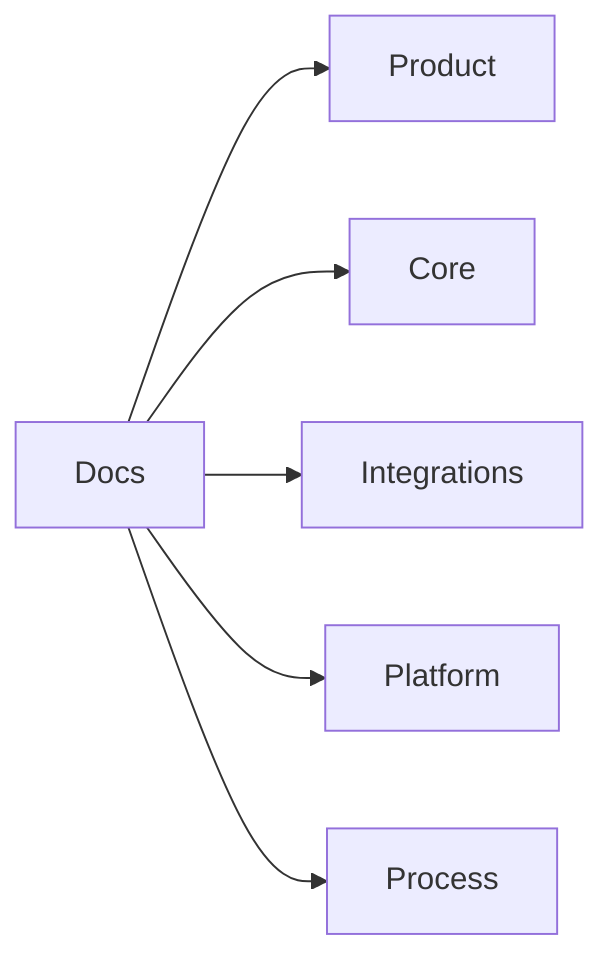
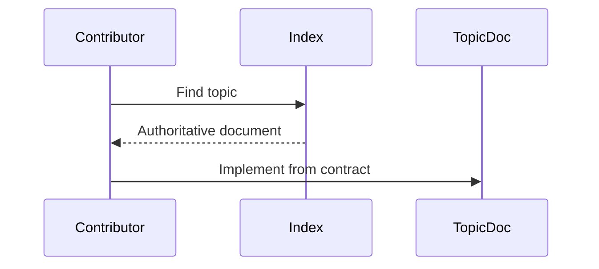

# Atlas Documentation Index

## Purpose

This index maps the Atlas handbook to the engineering topics required for implementation.

## Overview

The handbook is organized by root governance documents, architecture, specifications, phases, APIs, plugins, research, testing, examples, diagrams, and benchmarks.

## Motivation

Atlas has many subsystems. Contributors need a fast way to find the authoritative document for each topic.

## Architecture



## Design Decisions

Each document uses the same production-readiness sections: purpose, overview, motivation, architecture, design decisions, diagrams, folder structure, interfaces, implementation strategy, testing, security, future improvements, and references.

## Component Diagram



## Sequence Diagram



## Folder Structure

```text
docs/
  INDEX.md
  api/
  architecture/
  audits/
  benchmarks/
  diagrams/
  examples/
  features/
  implementation/
  phases/
  plugins/
  research/
  specifications/
  testing/
```

## Public Interfaces

The index is a contributor navigation interface.

## Topic Map

| Topic | Document |
| --- | --- |
| Vision | [vision-and-philosophy.md](/code/ATLAS/docs/specifications/vision-and-philosophy.md) |
| Product Philosophy | [vision-and-philosophy.md](/code/ATLAS/docs/specifications/vision-and-philosophy.md) |
| Architecture | [ARCHITECTURE.md](/code/ATLAS/ARCHITECTURE.md) |
| Documentation Audit | [2026-08-01-documentation-audit.md](/code/ATLAS/docs/audits/2026-08-01-documentation-audit.md) |
| Documentation Standard | [documentation-standard.md](/code/ATLAS/docs/specifications/documentation-standard.md) |
| Implementation Map | [implementation-map.md](/code/ATLAS/docs/implementation/implementation-map.md) |
| Core Feature Scenarios | [core-feature-scenarios.md](/code/ATLAS/docs/features/core-feature-scenarios.md) |
| Runtime | [runtime.md](/code/ATLAS/docs/architecture/runtime.md) |
| Planner | [planner.md](/code/ATLAS/docs/architecture/planner.md) |
| Memory | [memory.md](/code/ATLAS/docs/architecture/memory.md) |
| Filesystem Runtime | [runtime-integrations.md](/code/ATLAS/docs/specifications/runtime-integrations.md) |
| Terminal Runtime | [runtime-integrations.md](/code/ATLAS/docs/specifications/runtime-integrations.md) |
| Browser Runtime | [runtime-integrations.md](/code/ATLAS/docs/specifications/runtime-integrations.md) |
| Desktop Runtime | [runtime-integrations.md](/code/ATLAS/docs/specifications/runtime-integrations.md) |
| Window Manager | [runtime-integrations.md](/code/ATLAS/docs/specifications/runtime-integrations.md) |
| Clipboard Runtime | [runtime-integrations.md](/code/ATLAS/docs/specifications/runtime-integrations.md) |
| Notification Runtime | [runtime-integrations.md](/code/ATLAS/docs/specifications/runtime-integrations.md) |
| Event Bus | [event-bus.md](/code/ATLAS/docs/architecture/event-bus.md) |
| Scheduler | [scheduler.md](/code/ATLAS/docs/architecture/scheduler.md) |
| Capability Engine | [capability-engine.md](/code/ATLAS/docs/architecture/capability-engine.md) |
| Workflow Engine | [workflow-engine.md](/code/ATLAS/docs/architecture/workflow-engine.md) |
| Context Engine | [context-engine.md](/code/ATLAS/docs/architecture/context-engine.md) |
| Plugin SDK | [sdk.md](/code/ATLAS/docs/plugins/sdk.md) |
| Security | [security.md](/code/ATLAS/docs/architecture/security.md) |
| Error Handling and Recovery | [error-recovery.md](/code/ATLAS/docs/specifications/error-recovery.md) |
| Permissions | [permissions.md](/code/ATLAS/docs/specifications/permissions.md) |
| Storage | [storage.md](/code/ATLAS/docs/specifications/storage.md) |
| Logging and Telemetry | [logging-telemetry.md](/code/ATLAS/docs/specifications/logging-telemetry.md) |
| Performance | [performance.md](/code/ATLAS/docs/specifications/performance.md) |
| AI Models | [ai-models.md](/code/ATLAS/docs/specifications/ai-models.md) |
| OCR | [multimodal-processing.md](/code/ATLAS/docs/specifications/multimodal-processing.md) |
| Speech | [multimodal-processing.md](/code/ATLAS/docs/specifications/multimodal-processing.md) |
| Document Processing | [multimodal-processing.md](/code/ATLAS/docs/specifications/multimodal-processing.md) |
| Developer Experience | [developer-experience.md](/code/ATLAS/docs/specifications/developer-experience.md) |
| Testing | [strategy.md](/code/ATLAS/docs/testing/strategy.md) |
| Release Strategy | [release-strategy.md](/code/ATLAS/docs/specifications/release-strategy.md) |
| Packaging | [release-strategy.md](/code/ATLAS/docs/specifications/release-strategy.md) |
| Deployment | [release-strategy.md](/code/ATLAS/docs/specifications/release-strategy.md) |
| Cross Platform Layer | [cross-platform-layer.md](/code/ATLAS/docs/architecture/cross-platform-layer.md) |
| Linux Adapter | [linux-adapter.md](/code/ATLAS/docs/specifications/linux-adapter.md) |
| Linux System Interfaces | [linux-system-interfaces.md](/code/ATLAS/docs/specifications/linux-system-interfaces.md) |
| Windows Adapter | [windows-adapter.md](/code/ATLAS/docs/specifications/windows-adapter.md) |
| macOS Adapter | [macos-adapter.md](/code/ATLAS/docs/specifications/macos-adapter.md) |
| Phase Feature Matrix | [phase-feature-matrix.md](/code/ATLAS/docs/phases/phase-feature-matrix.md) |
| Dependency Catalog | [dependency-catalog.md](/code/ATLAS/docs/research/dependency-catalog.md) |
| Future Research | [future-research.md](/code/ATLAS/docs/research/future-research.md) |

## Implementation Strategy

When adding a new subsystem, update this index in the same change.

## Testing

Documentation CI should eventually check links and Mermaid rendering.

## Security

The index must not expose private local paths except repository-relative documentation links.

## Future Improvements

Add generated navigation and topic ownership metadata.

## References

- [README](/code/ATLAS/README.md)
- [Architecture](/code/ATLAS/ARCHITECTURE.md)
