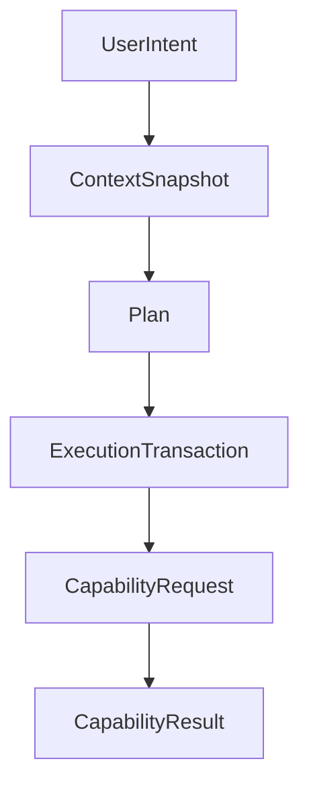
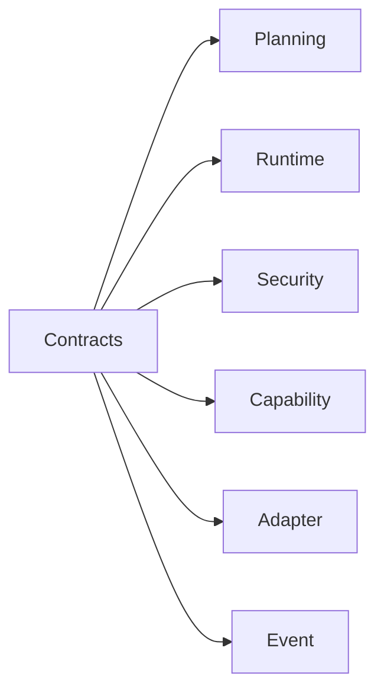
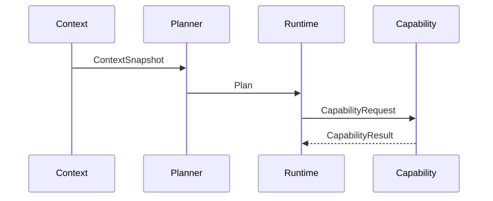

# Atlas Public and Internal Contracts

## Purpose

This document defines the core interfaces that all Atlas implementation work must preserve.

## Overview

Contracts are language-neutral here and should become concrete types in the implementation. They separate planner reasoning, runtime execution, security enforcement, capabilities, adapters, plugins, and memory.

## Motivation

Atlas must avoid tight coupling between model output, capability implementation, and platform APIs. Stable contracts make testing and plugin development possible.

## Architecture



## Design Decisions

Contracts are explicit, versioned, and schema-validated. Runtime-facing objects must be serializable for audit logs, replay, and recovery.

## Component Diagram



## Sequence Diagram



## Folder Structure

Future implementation contracts should live under `atlas/core/contracts` or subsystem-specific schema modules.

## Public Interfaces

```text
UserIntent:
  id
  text
  source
  created_at

ContextSnapshot:
  id
  intent_id
  scope
  facts
  provenance
  sensitivity

Plan:
  id
  objective
  assumptions
  steps
  required_permissions
  risk_summary
  verification

Capability:
  id
  version
  manifest
  execute(request, context)

CapabilityRequest:
  capability_id
  inputs
  permission_grants
  idempotency_key

CapabilityResult:
  status
  outputs
  observed_effects
  verification
  recovery_actions

AdapterPort:
  name
  version
  operations
  conformance_tests

Event:
  id
  type
  version
  timestamp
  payload
  sensitivity
```

## Implementation Strategy

Implement contracts before adapters. Generate validators from schemas where practical and add compatibility tests for every contract version.

## Testing

Test serialization, validation, backwards compatibility, invalid inputs, and replay from stored contract objects.

## Security

Contracts must include sensitivity metadata and permission scope rather than relying on implicit caller behavior.

## Future Improvements

Add generated API reference, schema registry, and plugin compatibility tooling.

## References

- [Runtime](/code/ATLAS/docs/architecture/runtime.md)
- [Capability Engine](/code/ATLAS/docs/architecture/capability-engine.md)
