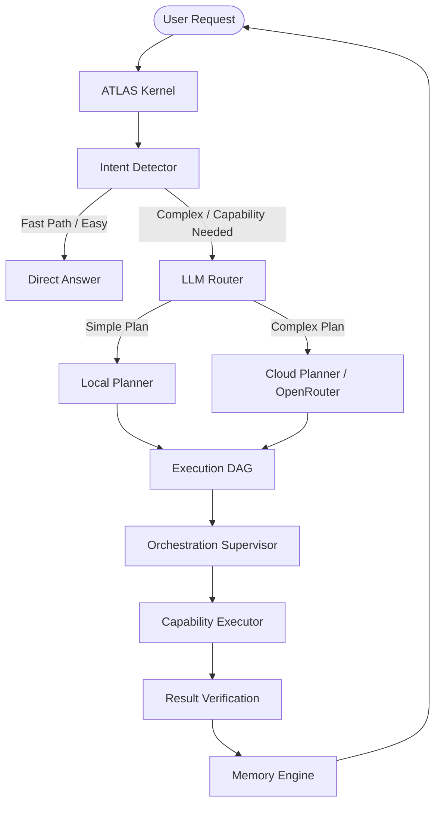

# ATLAS Agent Architecture

ATLAS utilizes a hybrid AI architecture that separates **Intent Detection**, **Planning**, and **Execution**. 

The system relies on a local LLM for fast, privacy-preserving classification and planning, and falls back to cloud models (via OpenRouter) for complex reasoning tasks.

## Conceptual Differences

- **LLM**: The underlying language model (local or cloud).
- **Agent**: The orchestration layer (e.g., the `Supervisor`) that interacts with the LLM to achieve a goal.
- **Planner**: A specialized module that breaks down a goal into a DAG of execution steps without actually executing them.
- **Execution Kernel**: The "Operating System" that schedules tasks, manages state, and triggers capabilities.
- **Capability**: A registered tool (e.g., Browser, Filesystem) that can be invoked by the Execution Kernel.

## Execution Flow

## 1. Intent Detection (`IntentDetector`)

When a user submits a goal, the `IntentDetector` intercepts it.
- **Fast Path:** If the request is a simple question that does not require tool execution (e.g., "What is the capital of France?"), the detector flags it as `easy` and provides a `direct_answer`. The execution loop terminates immediately, saving time and tokens.
- **Capability Path:** If the request requires tools (e.g., "Open gmail and check my unread emails"), the detector flags `needs_cloud_reasoning` if it is highly complex, otherwise it defaults to local planning.

## 2. Planning (`LocalPlanner`)

The Planner is responsible ONLY for generating a Directed Acyclic Graph (DAG) of tasks. It does not execute tools.

- The planner prompts the LLM to output a JSON object containing an `intent`, `needs_cloud_reasoning` boolean, and a `graph` of `TaskNode` objects.
- Each `TaskNode` specifies an `action` (e.g., `browser`, `filesystem`), `parameters`, and `dependencies`.
- **Fallback Plans:** If the LLM fails to generate a valid JSON graph, the `LocalPlanner` employs rule-based fallbacks to generate simple, single-node DAGs based on keyword heuristics (e.g., if the capability `browser` is requested and the goal contains "gmail", it generates a hardcoded script to navigate to Gmail).

## 3. Orchestration & Execution

- The generated DAG is passed to the `Supervisor`, which coordinates the `CorePlanner` and `CoreExecutionDispatcher`.
- The `CoreExecutionDispatcher` (wrapping the `ExecutionScheduler`) resolves dependencies and executes the graph.
- The `AuthorizedToolExecutor` checks permissions with the `PermissionGateway` before invoking the `CapabilityRegistry`.
- Execution happens deterministically.

## 4. Verification and Memory

- **VerificationEngine**: After a node executes, the `VerificationEngine` checks the result deterministically (without an LLM). If it fails, the task is marked with a verification issue.
- **MemoryEngine**: Final summaries and results are stored in the semantic vector database (`MemoryEngine`) for future context retrieval.

---
**Implementation References:**
- `packages/planner/local_planner.py`
- `packages/runtime/kernel/atlas_kernel.py`
- `packages/runtime/intelligence/intent.py`
