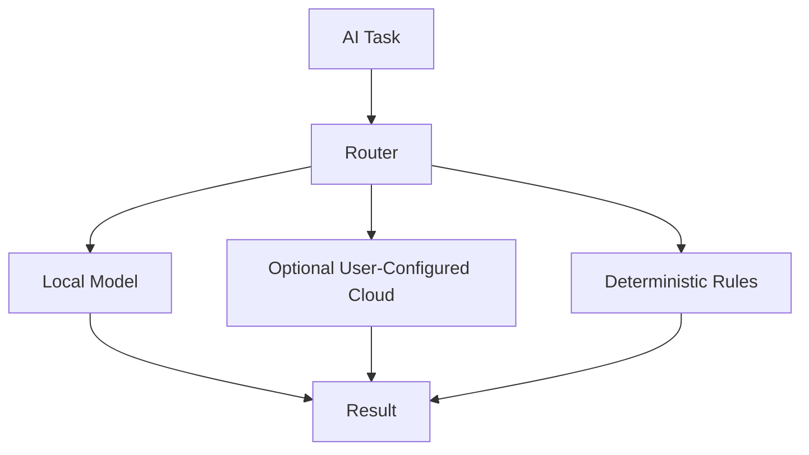
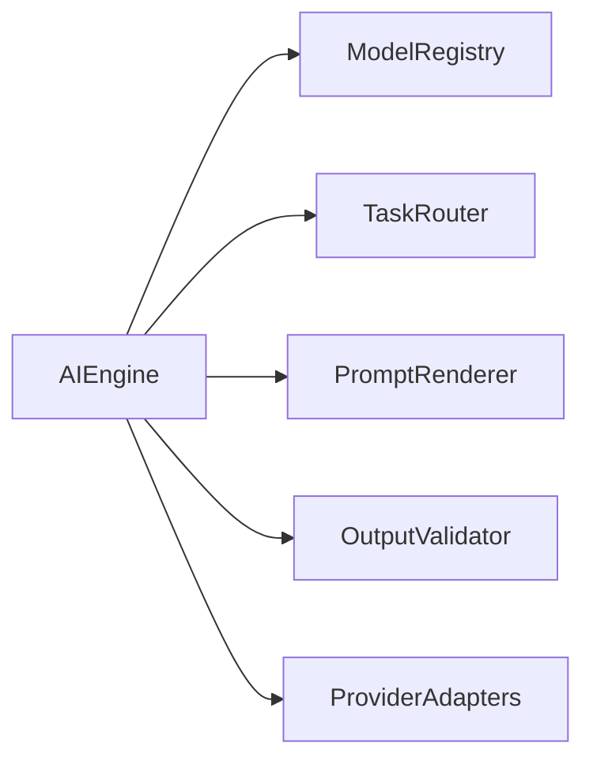
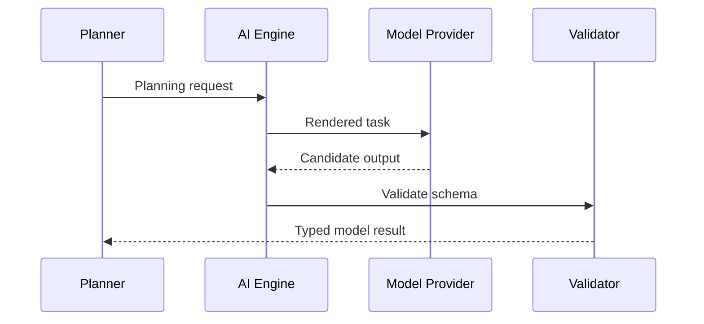

# AI Engine

## Purpose

The AI engine provides model access for planning, summarization, extraction, OCR interpretation, speech processing, and document understanding.

## Overview

Atlas prefers local models and must not require cloud inference. The AI engine hides provider details behind stable task interfaces.

## Motivation

Model availability, latency, cost, and privacy vary by user. Atlas should support multiple backends while preserving deterministic runtime boundaries.

## Architecture



## Design Decisions

Model calls are task-specific. A `PlanningModel` is separate from a `SummarizationModel`, `EmbeddingModel`, `OCRModel`, or `SpeechModel`. Provider credentials are optional user configuration.

## Component Diagram



## Sequence Diagram



## Folder Structure

```text
atlas/core/ai/
  engine.py
  registry.py
  tasks.py
  prompts/
  providers/
  validation.py
```

## Public Interfaces

`AIEngine.run(task: AITask) -> AIResult`.

## Implementation Strategy

Begin with provider-neutral interfaces and deterministic fallback logic. Add local model integrations before optional cloud providers.

## Testing

Test schema validation, provider failure, timeout handling, redaction, deterministic fallback, and model capability routing.

## Security

Secrets and private context must be redacted or explicitly authorized before leaving the local process. Cloud providers are opt-in.

## Future Improvements

Add model benchmarking, per-task provider policies, offline model packs, and reproducible prompt evaluation.

## References

- [AI Models](/code/ATLAS/docs/specifications/ai-models.md)
- [Performance](/code/ATLAS/docs/specifications/performance.md)
