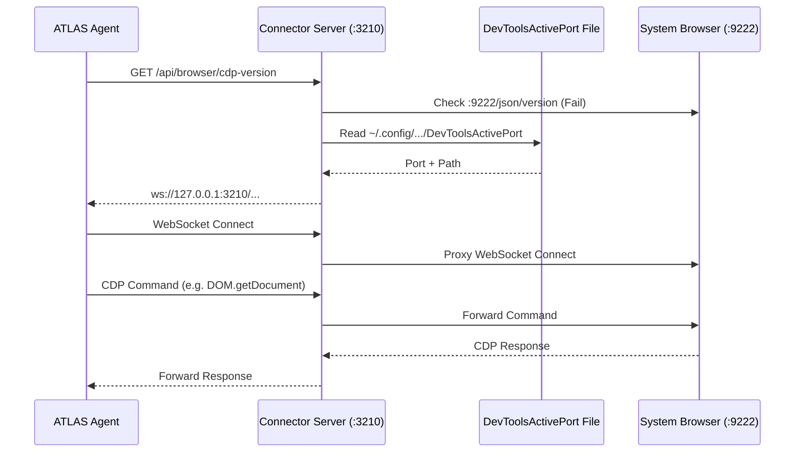

# ATLAS Browser + CDP Architecture

ATLAS utilizes a unique approach to browser automation. Rather than launching an isolated headless browser instance (like Puppeteer or Playwright typically do), ATLAS connects to the user's *existing* system browser via the Chrome DevTools Protocol (CDP).

This allows the agent to execute capabilities within the user's authenticated profiles and existing sessions.

## 1. Browser Discovery

When ATLAS requires browser automation, it does not immediately spawn a new browser. It first looks for a running browser instance that has CDP enabled.

### The Connector Server
The `connector_server.py` runs as a background process (listening on `127.0.0.1:3210`). It intercepts and proxies CDP requests.

**Discovery Process:**
1. The client requests the CDP version (`GET /api/browser/cdp-version?targetPort=9222`).
2. The connector server attempts to hit the local Chrome DevTools port directly.
3. If that fails, the connector searches the filesystem for `DevToolsActivePort` files in known browser profile directories:
   - `~/.config/google-chrome`
   - `~/.config/google-chrome-beta`
   - `~/.config/chromium`
   - `~/.config/BraveSoftware/Brave-Browser`
   - `~/.config/microsoft-edge`
4. It reads the active port and CDP path from the `DevToolsActivePort` file.

## 2. CDP Proxying and Connection

Once the target browser's CDP endpoint is discovered:
1. The server constructs the appropriate WebSocket URL.
2. It returns this URL to the runtime.
3. When the runtime initiates a WebSocket connection (`/api/browser/cdp-proxy`), the connector acts as a bidirectional proxy between the runtime and the actual browser's CDP WebSocket.
4. It modifies the `Host` headers to prevent CORS/Host-header validation issues from rejecting the connection.

## 3. Browser Capability Execution

Within the `packages/browser/port.py`, the `BrowserPort` adapter is responsible for handling `request.parameters.get("script")`.

Instead of running an isolated browser, ATLAS passes the script to the `atlas-browser` executable (a customized browser-harness), which utilizes the discovered CDP connection to execute the script in the context of the user's active browser.

## 4. Security Considerations

Because ATLAS connects to the user's primary browser:
- **Authorization:** `BrowserPort` requests must be authorized. The Kernel's `AuthorizationManager` intercepts capabilities and can require user confirmation before executing potentially dangerous browser actions within authenticated sessions.
- **Profiles:** User profiles, cookies, and active logins are preserved and exposed to the agent. This is powerful but represents a significant security boundary.
- **Network Boundaries:** The connector only listens on `127.0.0.1`, preventing external machines from hijacking the CDP proxy.

---
**Implementation References:**
- `packages/browser/connector_server.py`
- `packages/browser/port.py`
