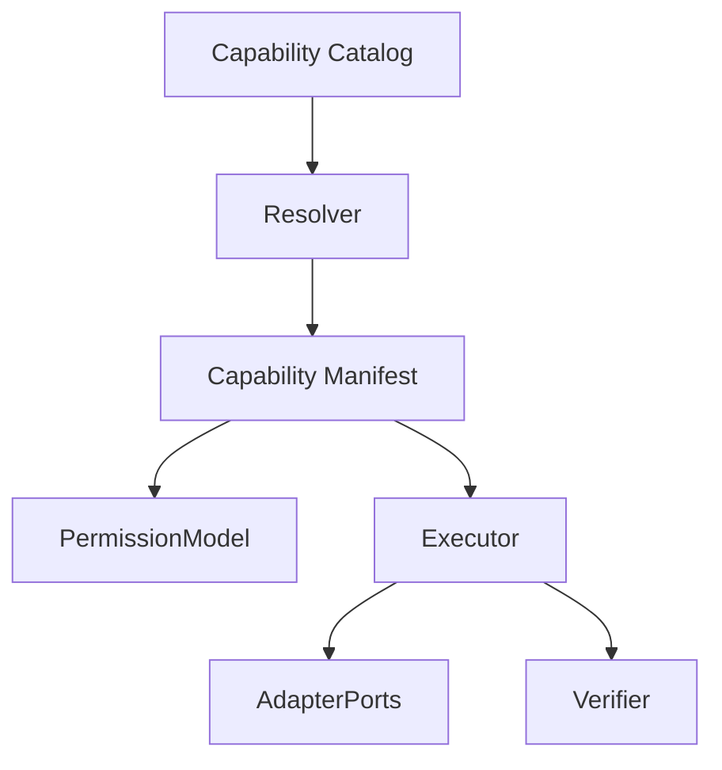
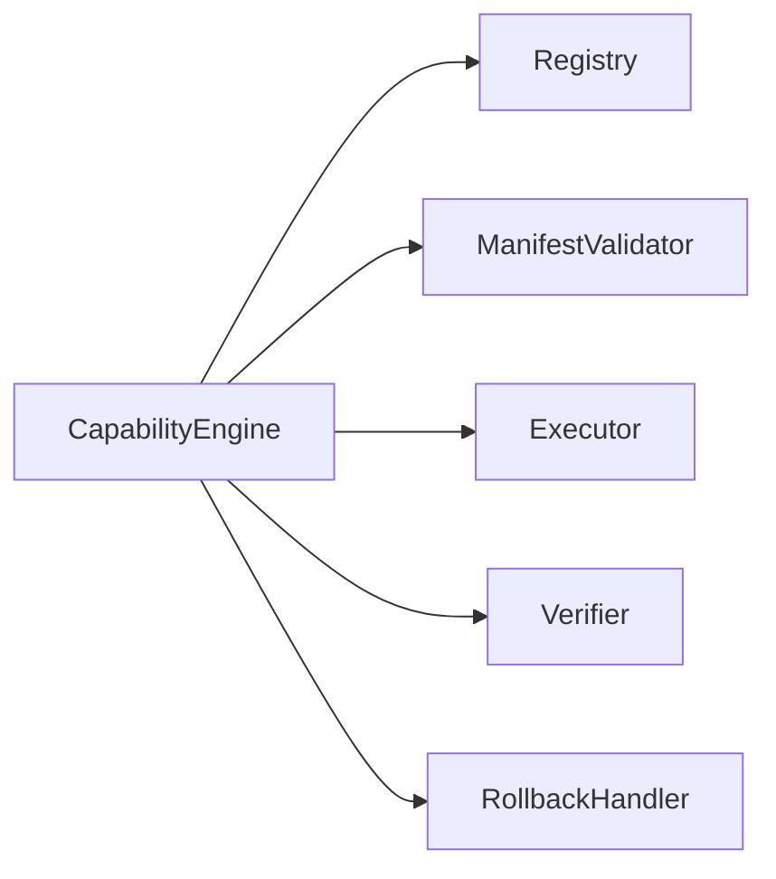
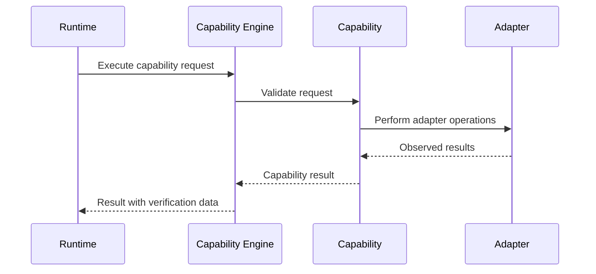

# Capability Engine

## Purpose

The capability engine registers, validates, and executes high-level Atlas capabilities.

## Overview

A capability is a typed unit of user-relevant work. It declares its inputs, outputs, permissions, preconditions, effects, verification method, rollback behavior, and adapter dependencies.

## Motivation

Capabilities are the boundary that prevents low-level automation from leaking into planning. They make work testable, reviewable, and reusable.

## Architecture



## Design Decisions

Capabilities should model outcomes rather than mechanisms. `CommitRepository` may call Git, inspect diffs, and update notes, but the planner only sees a repository commit capability with declared effects.

## Component Diagram



## Sequence Diagram



## Folder Structure

```text
atlas/core/capabilities/
  registry.py
  manifest.py
  engine.py
  verification.py
  builtin/
```

## Public Interfaces

`Capability.execute(request: CapabilityRequest, context: ExecutionContext) -> CapabilityResult`.

## Implementation Strategy

Create a manifest schema before implementing built-ins. Build a small set of safe read-only capabilities first, then add file mutation and terminal capabilities with approval gates.

## Testing

Each capability requires manifest tests, permission tests, unit tests with fake adapters, integration tests with real adapters when available, and failure recovery tests.

## Security

Capabilities cannot bypass the runtime. They must use scoped adapter ports from the execution context and must not create untracked side effects.

## Future Improvements

Add signed capability packages, plugin-provided capabilities, semantic versioning, and capability compatibility tests.

## References

- [Plugin SDK](/code/ATLAS/docs/plugins/sdk.md)
- [Permissions](/code/ATLAS/docs/specifications/permissions.md)
