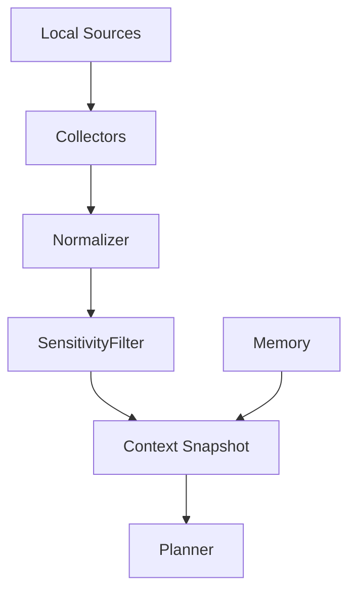
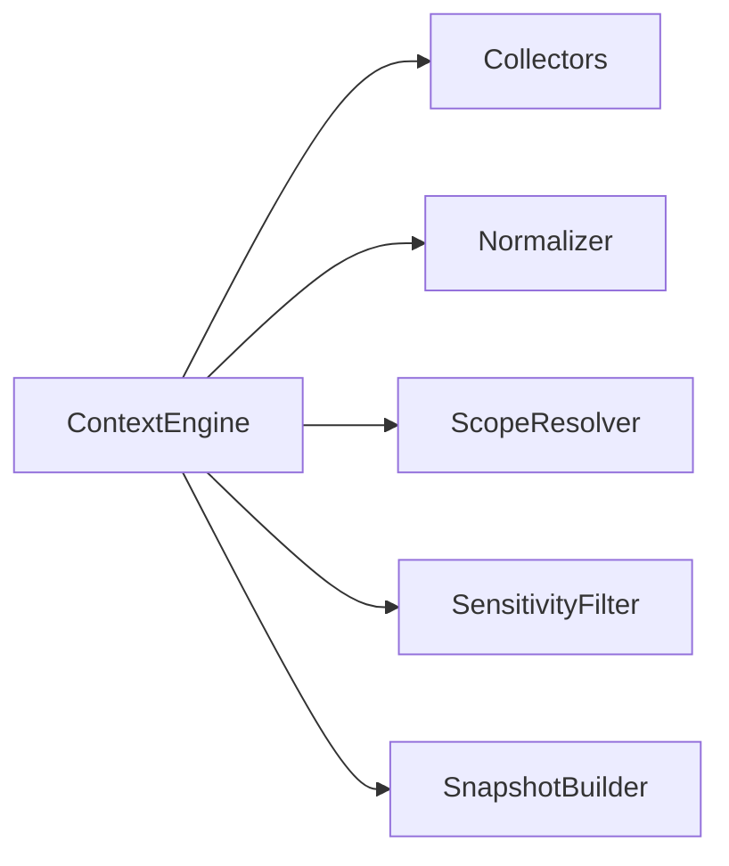
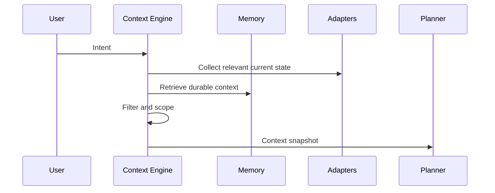

# Context Engine

## Purpose

The context engine builds scoped, current, privacy-aware snapshots of the machine for planning and workflow execution.

## Overview

Context is assembled from files, projects, applications, browser state, terminal sessions, Git repositories, Docker resources, clipboard, notifications, calendar data, notes, OCR, voice, and memory. The engine returns only the context needed for a task.

## Motivation

Atlas should understand the computer continuously instead of rediscovering everything for each request. That understanding must still be bounded and explainable.

## Architecture



## Design Decisions

Context snapshots are immutable, timestamped, and scoped to an intent. They include provenance so the planner can explain why it selected a capability.

## Component Diagram



## Sequence Diagram



## Folder Structure

```text
atlas/core/context/
  engine.py
  collectors.py
  snapshot.py
  sensitivity.py
  scopes.py
```

## Public Interfaces

`ContextEngine.snapshot(intent: UserIntent) -> ContextSnapshot`.

## Implementation Strategy

Start with filesystem, Git, and project metadata collectors. Add browser, desktop, voice, and OCR collectors after permission and redaction controls exist.

## Testing

Test scoping, freshness, provenance, redaction, stale data handling, and collector failure isolation.

## Security

The context engine must not leak sensitive data into planner prompts unless policy allows it.

## Future Improvements

Add continuous background indexing, user-editable context scopes, and conflict detection between observed state and memory.

## References

- [Memory](/code/ATLAS/docs/architecture/memory.md)
- [Permissions](/code/ATLAS/docs/specifications/permissions.md)
