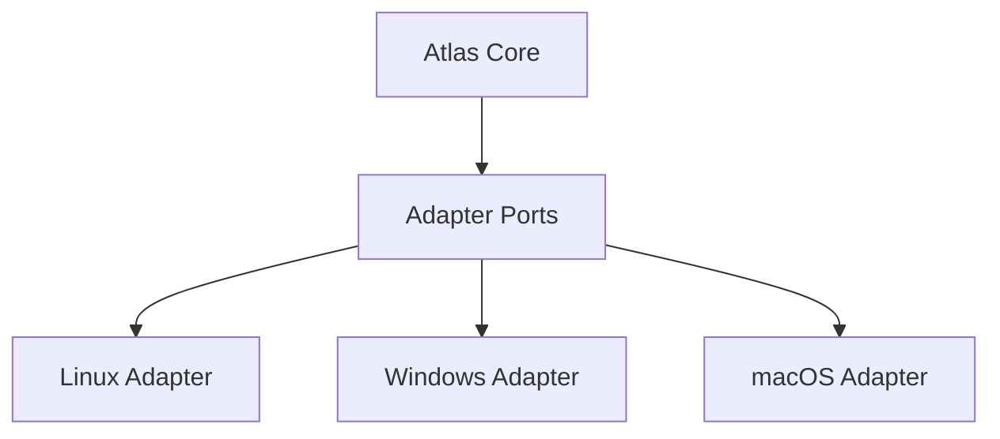
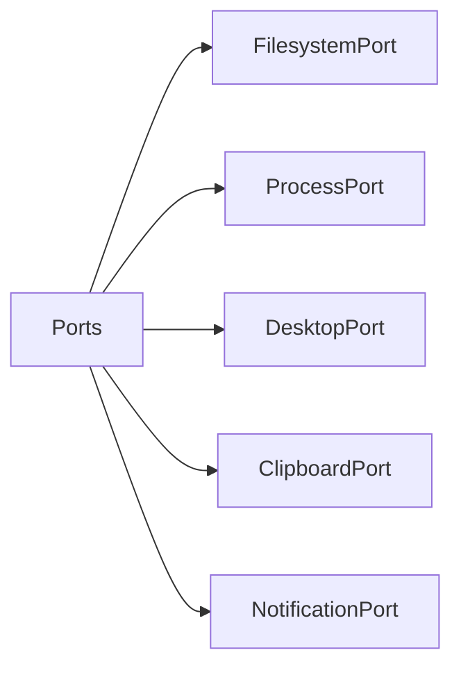
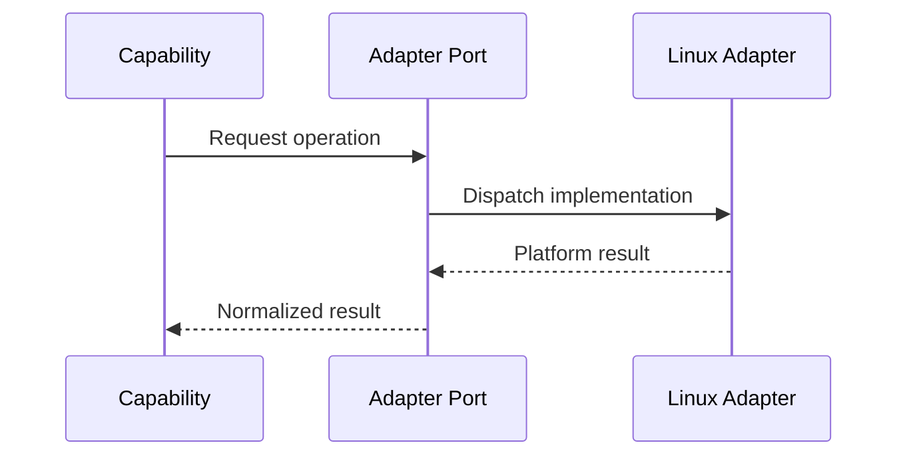

# Cross Platform Layer

## Purpose

The cross-platform layer defines adapter ports that let Atlas support Linux first without embedding Linux-only business logic in core services.

## Overview

Core services depend on abstract ports. Linux, Windows, and macOS adapters implement those ports using platform APIs and conventions.

## Motivation

The first target is Linux on Ubuntu, Debian, and Kali Linux, but Atlas's long-term identity is an operating layer, not a Linux-only automation tool.

## Architecture



## Design Decisions

Platform-specific code belongs under adapters. Capabilities may request ports such as `FilesystemPort`, `ProcessPort`, `WindowPort`, or `NotificationPort`, but may not import Linux-specific modules directly.

## Component Diagram



## Sequence Diagram



## Folder Structure

```text
atlas/adapters/
  ports/
  linux/
  windows/
  macos/
```

## Public Interfaces

Adapter interfaces include filesystem, process, desktop, window, clipboard, notification, browser, OCR, speech, and document ports.

## Implementation Strategy

Define ports in core-adjacent adapter contracts, implement Linux first, and create conformance tests that future Windows and macOS adapters must pass before they are considered supported.

## Testing

Run conformance tests against each adapter implementation. Platform-specific test fixtures should not change core expected behavior.

## Security

Adapters must validate execution context grants. They are the last line of defense against accidental direct access.

## Future Improvements

Add Windows and macOS adapters once Linux contracts survive real workflows.

## References

- [Linux Adapter](/code/ATLAS/docs/specifications/linux-adapter.md)
- [Windows Adapter](/code/ATLAS/docs/specifications/windows-adapter.md)
- [macOS Adapter](/code/ATLAS/docs/specifications/macos-adapter.md)
