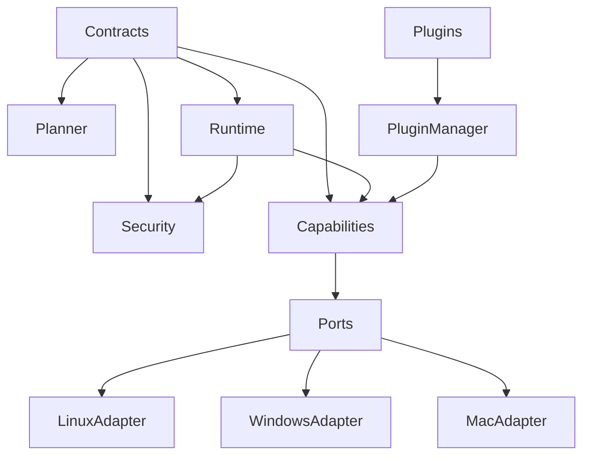
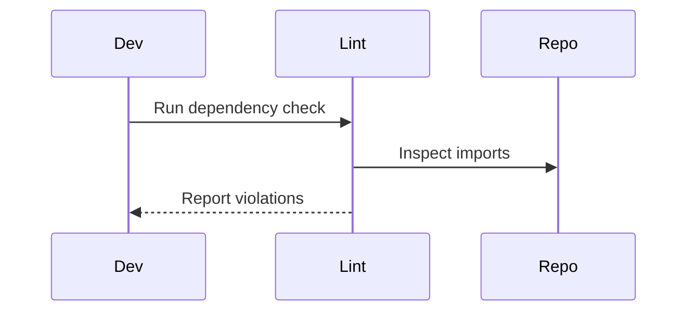
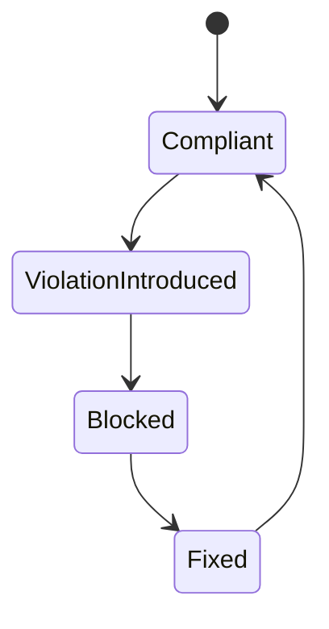

# Dependency Map

## Purpose

This document defines allowed dependency direction across Atlas modules.

## Motivation

Atlas must stay modular, testable, and cross-platform. Dependency direction is the main defense against planner/tool coupling and Linux assumptions leaking into core logic.

## Problem Statement

Without an explicit dependency map, contributors may import concrete adapters into core services, let plugins bypass the runtime, or duplicate contracts inside integrations.

## Requirements

- Define allowed and forbidden dependencies.
- Make platform-specific boundaries explicit.
- Keep capabilities high-level and adapter-backed.
- Support architecture linting later.

## Goals

- Prevent cyclic dependencies.
- Preserve testability with fake adapters.
- Keep runtime as the execution authority.

## Non Goals

- This document does not choose a programming language.
- This document does not define packaging dependency versions.

## Architecture Overview



## Component Responsibilities

The dependency map assigns ownership of import direction, interface ownership, and adapter isolation.

## Interfaces

Architecture linting should eventually expose:

```text
atlas lint dependencies
atlas graph dependencies
```

## Contracts

Allowed dependency rules are expressed as source package patterns and forbidden import patterns.

## Folder Structure

```text
docs/architecture/dependency-map.md
tools/architecture/
tests/architecture/
```

## Lifecycle

Update the dependency map when adding a subsystem, package boundary, or plugin extension point.

## Execution Flow



## Sequence Diagrams

See execution flow above.

## State Diagrams



## Failure Handling

Dependency violations block review unless an architecture decision record explicitly changes the map.

## Recovery

Fix violations by moving shared contracts down into `core/contracts`, moving platform code into adapters, or adding ports instead of direct imports.

## Performance

Dependency linting must run quickly in CI and should cache file graph analysis.

## Security

Forbidden dependencies are security boundaries. Planner-to-adapter imports and plugin-to-adapter imports are authority bypasses.

## Logging

Architecture checks should report violating file, imported symbol, rule id, and suggested boundary.

## Metrics

Track dependency violations, cycle count, and packages without tests.

## Configuration

Rules live in a future architecture-lint config file and mirror this document.

## Allowed Dependencies

| From | May Depend On |
| --- | --- |
| `core/contracts` | Standard library, schema tooling |
| `core/planner` | contracts, ai interfaces, context interfaces |
| `core/runtime` | contracts, security, capabilities, events, storage, observability |
| `core/security` | contracts, storage, observability |
| `core/capabilities` | contracts, adapter ports |
| `adapters/ports` | contracts |
| `adapters/linux` | adapter ports, Linux integrations |
| `integrations/*` | adapter ports, external libraries |
| `plugins` | plugin SDK, contracts |
| `storage` | contracts |
| `observability` | contracts, storage |

## Forbidden Dependencies

- Planner imports concrete adapters.
- Planner invokes raw tools or shell commands.
- Capabilities import Linux, Windows, or macOS modules directly.
- Plugins call OS APIs without scoped handles.
- Storage imports planner, runtime, or adapter implementations.
- Adapters import planner internals.

## Future Extensions

Add generated dependency graphs, architecture tests, and package ownership metadata.

## Testing

Add import graph tests once code exists. Include fixture packages that intentionally violate each rule.

## Acceptance Criteria

- Every package boundary has an allowed dependency rule.
- Every forbidden dependency is testable.
- The map agrees with [Implementation Map](/code/ATLAS/docs/implementation/implementation-map.md).

## Related Documents

- [Architecture](/code/ATLAS/ARCHITECTURE.md)
- [Implementation Map](/code/ATLAS/docs/implementation/implementation-map.md)
- [Cross Platform Layer](/code/ATLAS/docs/architecture/cross-platform-layer.md)

## References

- [Documentation Standard](/code/ATLAS/docs/specifications/documentation-standard.md)
