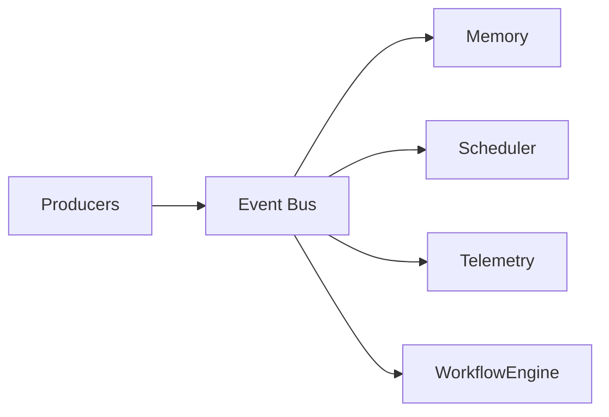
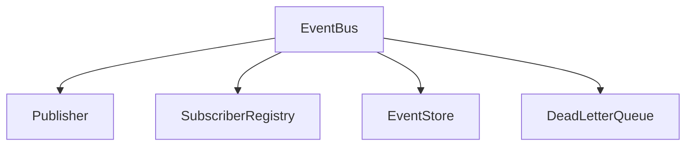
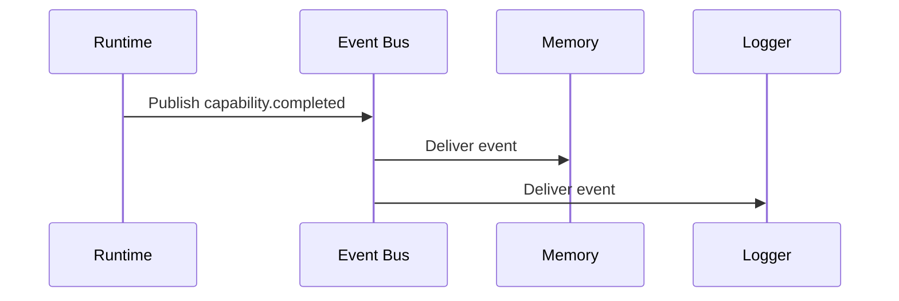

# Event Bus

## Purpose

The event bus connects Atlas subsystems without creating cyclic dependencies.

## Overview

Atlas subsystems publish immutable events. Consumers subscribe to event types and react asynchronously where possible.

## Motivation

An operating layer needs continuous context, scheduling, logging, and workflow coordination. Direct calls between every subsystem would produce tight coupling and unpredictable dependency cycles.

## Architecture



## Design Decisions

Events are immutable, versioned, timestamped, and locally persisted when they affect user-visible outcomes.

## Component Diagram



## Sequence Diagram



## Folder Structure

```text
atlas/core/events/
  bus.py
  schema.py
  store.py
  subscribers.py
```

## Public Interfaces

`EventBus.publish(event: Event)` and `EventBus.subscribe(event_type: str, handler: EventHandler)`.

## Implementation Strategy

Begin in-process with durable append-only storage. Avoid external brokers during early phases to preserve zero infrastructure.

## Testing

Test ordering, idempotency, subscriber failure isolation, schema migration, and replay.

## Security

Events may contain sensitive metadata. Apply redaction before persistence and enforce access controls for subscribers.

## Future Improvements

Add out-of-process event processing and distributed replay after local guarantees are mature.

## References

- [Logging and Telemetry](/code/ATLAS/docs/specifications/logging-telemetry.md)
- [Scheduler](/code/ATLAS/docs/architecture/scheduler.md)
