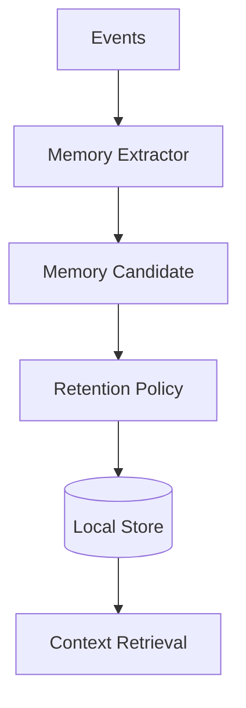
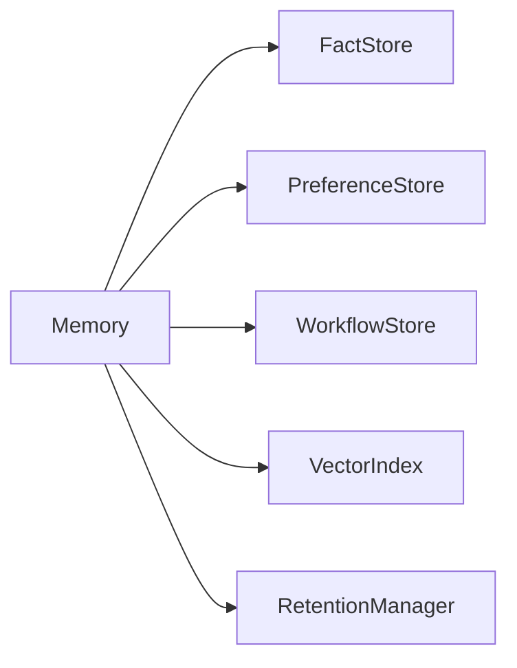
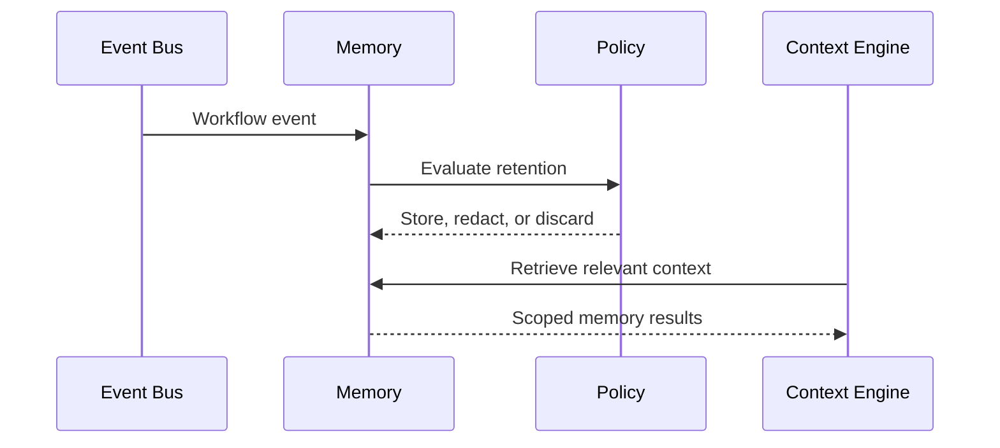

# Memory Architecture

## Purpose

Memory stores durable facts, workflow traces, user preferences, project context, and learned routines.

## Overview

Atlas memory is local, scoped, explainable, and erasable. It must distinguish observed facts from inferred preferences and temporary context from durable memory.

## Motivation

Atlas should understand the user's machine continuously, but that understanding must not become an opaque privacy risk. Memory needs provenance, retention policy, and user controls.

## Architecture



## Design Decisions

Every memory entry records source event, confidence, sensitivity, retention class, last verified time, and deletion eligibility. Memory is local by default and must support export and deletion.

## Component Diagram



## Sequence Diagram



## Folder Structure

```text
atlas/core/memory/
  store.py
  schema.py
  retention.py
  retrieval.py
  embeddings.py
```

## Public Interfaces

`MemoryStore.put(entry: MemoryEntry)`, `MemoryStore.search(query: ContextQuery)`, and `MemoryStore.delete(scope: DeletionScope)`.

## Implementation Strategy

Start with SQLite for structured memory and optional local vector indexes for semantic retrieval. Keep embeddings optional so offline text search remains available.

## Testing

Test provenance, retention, deletion, sensitivity filtering, stale fact handling, and retrieval relevance.

## Security

Sensitive memory must be redacted from logs and excluded from planner prompts unless explicitly required and authorized.

## Future Improvements

Add encrypted memory stores, user-visible memory review, project-scoped memory profiles, and conflict resolution for stale facts.

## References

- [Storage](/code/ATLAS/docs/specifications/storage.md)
- [Context Engine](/code/ATLAS/docs/architecture/context-engine.md)
