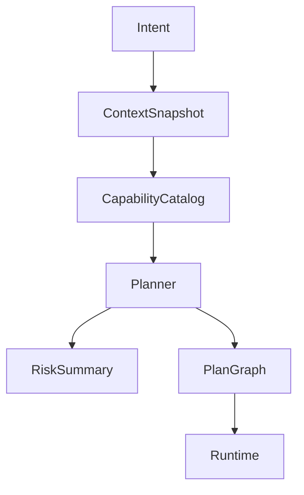
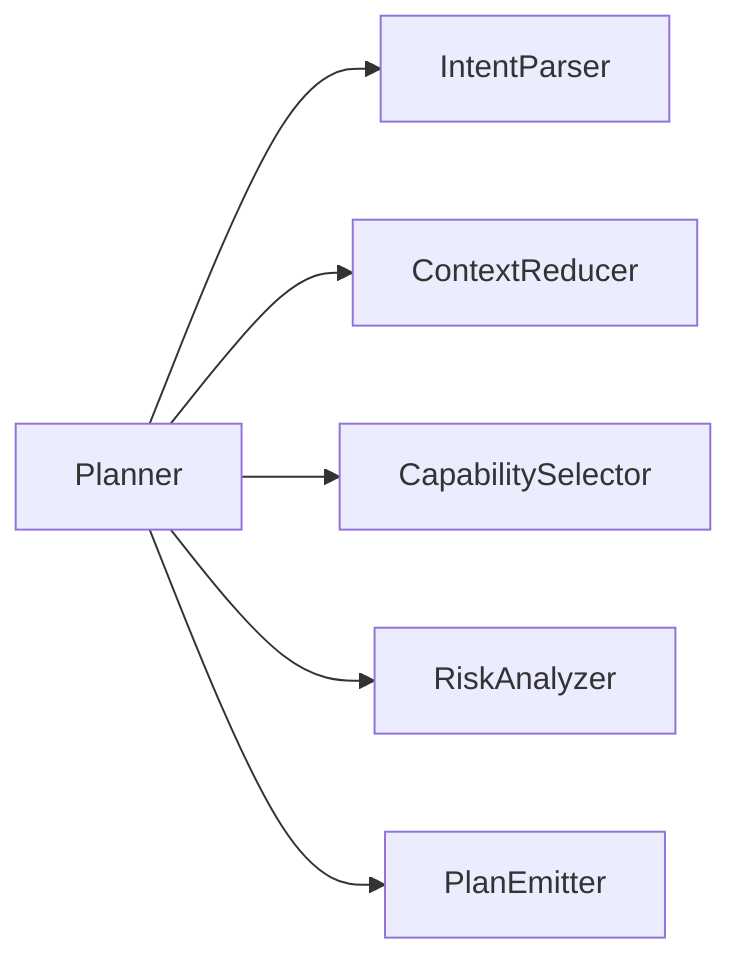
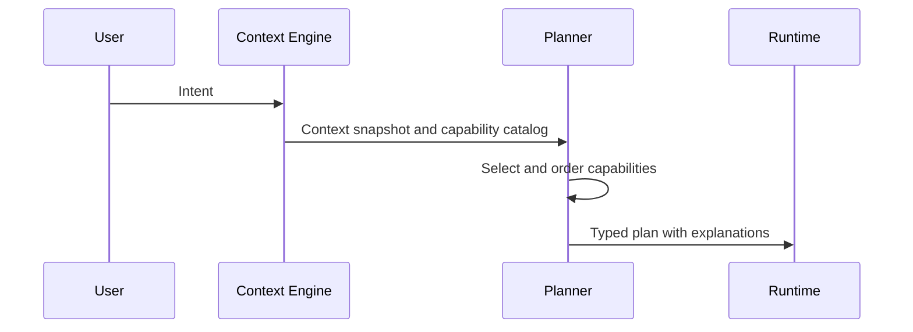

# Planner Architecture

## Purpose

The planner converts user intent and context snapshots into explainable, typed plans.

## Overview

The planner does not execute tools. It selects capabilities, orders them, identifies unknowns, describes risks, and produces a plan that the runtime can validate.

## Motivation

Atlas needs AI reasoning without surrendering execution control to a model. A narrow planner contract gives the system room to use local models, cloud models, rules, or hybrid planning while preserving runtime safety.

## Architecture



## Design Decisions

Plans must be structured data, not free-form prose. A plan includes objective, assumptions, selected capabilities, dependencies, required permissions, expected state changes, rollback hints, and verification criteria.

## Component Diagram



## Sequence Diagram



## Folder Structure

```text
atlas/core/planner/
  planner.py
  prompts/
  schemas.py
  validators.py
  risk.py
```

## Public Interfaces

`Planner.plan(intent: UserIntent, context: ContextSnapshot, catalog: CapabilityCatalog) -> Plan`.

## Implementation Strategy

Start with deterministic rule-assisted planning for simple capabilities. Introduce model-backed planning only behind a stable `PlanningModel` interface.

## Testing

Planner tests must verify schema validity, capability selection, refusal for unsupported actions, risk classification, and stable plans under equivalent context.

## Security

The planner cannot grant permissions, inspect secrets directly, or request raw adapter primitives.

## Future Improvements

Add plan repair, multiple-candidate ranking, learned workflow suggestions, and local fine-tuned planning models.

## References

- [AI Models](/code/ATLAS/docs/specifications/ai-models.md)
- [Runtime](/code/ATLAS/docs/architecture/runtime.md)
