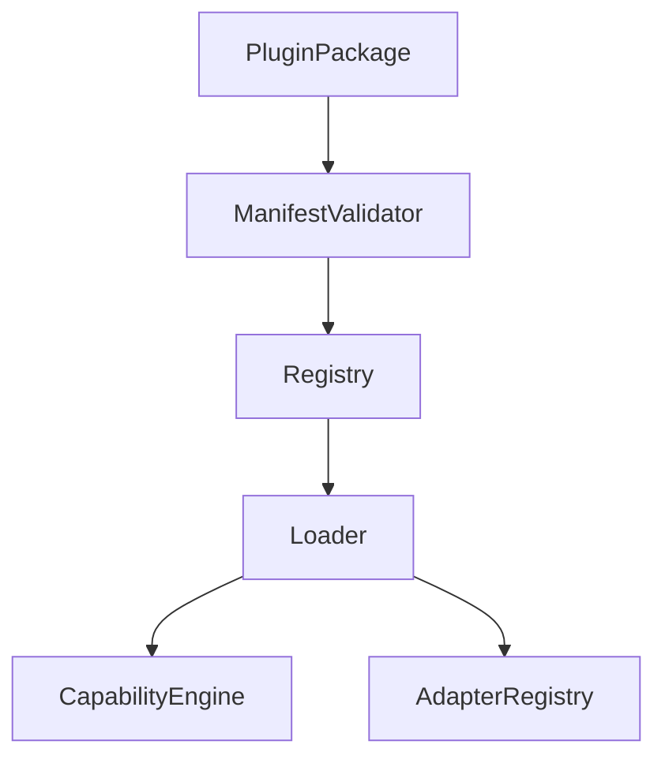
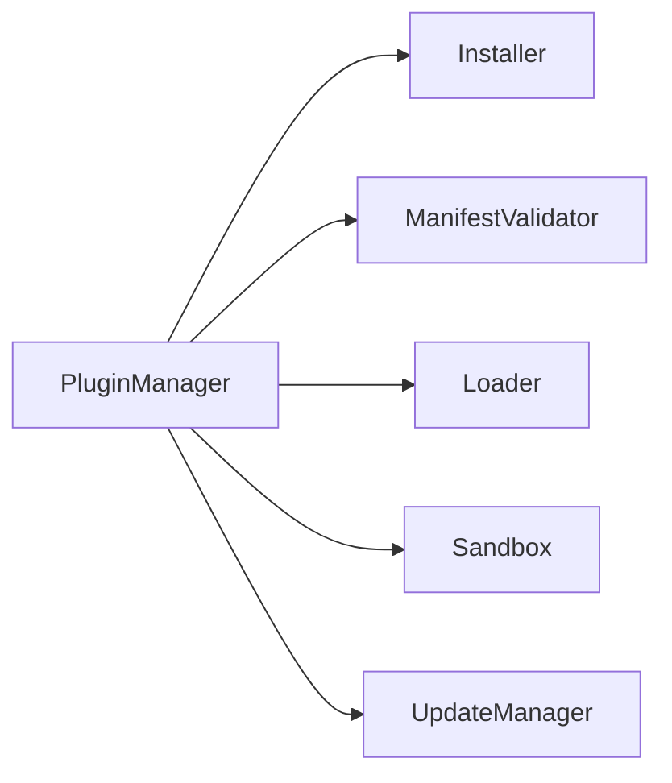
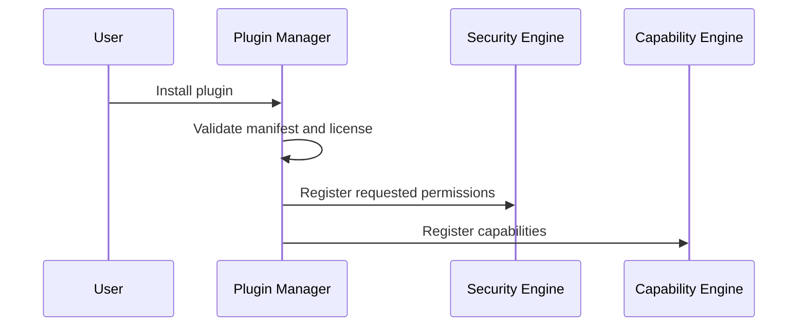

# Plugin Manager

## Purpose

The plugin manager installs, validates, loads, updates, and disables Atlas extensions.

## Overview

Plugins can contribute capabilities, adapters, workflows, UI surfaces, model providers, or context collectors. All plugin-provided behavior must pass manifest validation and runtime permission checks.

## Motivation

Atlas needs a broad ecosystem without turning every integration into trusted core code.

## Architecture



## Design Decisions

Plugin manifests declare permissions, exported capabilities, compatibility ranges, entrypoints, dependency licenses, and sandbox requirements.

## Component Diagram



## Sequence Diagram



## Folder Structure

```text
atlas/core/plugins/
  manager.py
  manifest.py
  loader.py
  sandbox.py
  compatibility.py
```

## Public Interfaces

`PluginManager.install(package: PluginPackage) -> PluginInstallResult` and `PluginManager.load(plugin_id: str)`.

## Implementation Strategy

Begin with local development plugins. Add signed packages and remote registries later.

## Testing

Test manifest validation, permission declaration, version compatibility, plugin disablement, malicious manifests, and load failures.

## Security

Plugins are untrusted by default. Plugin code must not bypass capability contracts, adapter scopes, or audit logging.

## Future Improvements

Add signed manifests, reproducible plugin builds, plugin review automation, and marketplace metadata.

## References

- [Plugin SDK](/code/ATLAS/docs/plugins/sdk.md)
- [Security](/code/ATLAS/docs/architecture/security.md)
