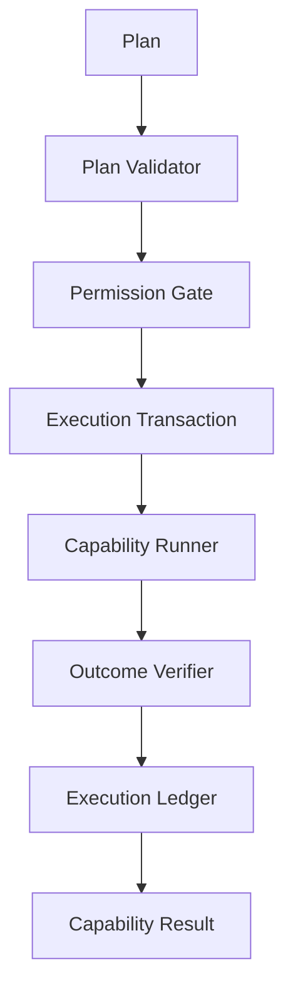
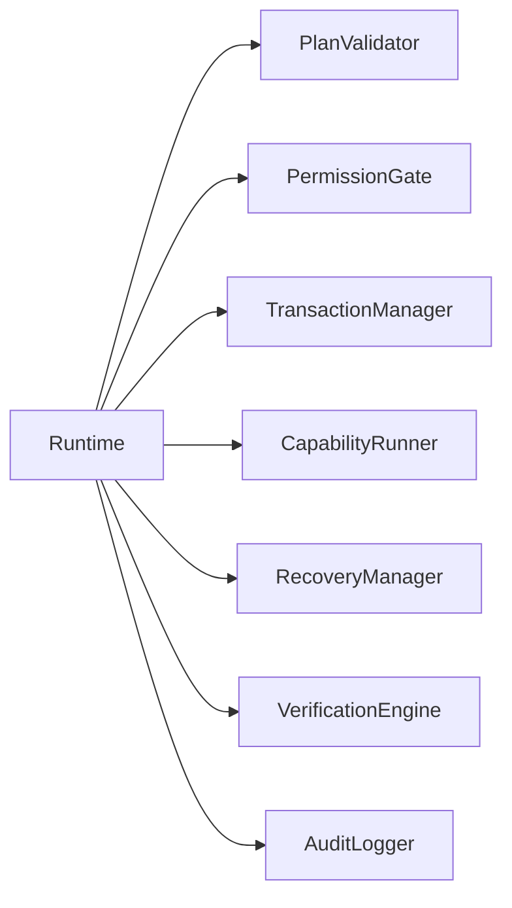
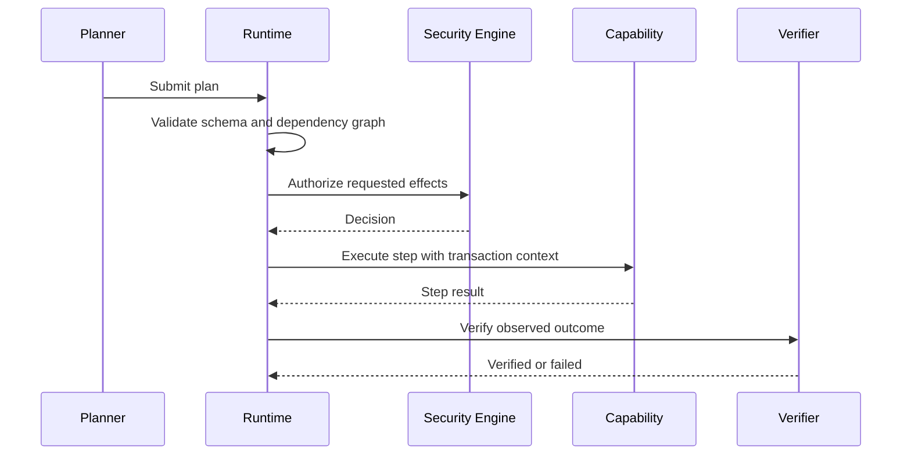

# Runtime Architecture

## Purpose

The runtime is Atlas's execution authority. It converts approved plans into durable, logged, verified capability executions.

## Overview

The runtime owns retries, recovery, permissions, logging, transactions, scheduling handoff, and verification. It receives a typed plan from the planner, validates the plan, asks the security engine for authorization, executes capability steps, records events, and verifies final state.

## Motivation

The planner is probabilistic and should not be trusted with direct execution. The runtime provides deterministic control around an uncertain planner by enforcing contracts and checking observed state.

## Architecture



## Design Decisions

Runtime execution is transaction-oriented. A transaction records requested effects, applied effects, compensating actions, logs, and verification status. Atlas should support idempotency keys for repeated requests and resumable execution for interrupted workflows.

## Component Diagram



## Sequence Diagram



## Folder Structure

```text
atlas/core/runtime/
  engine.py
  transactions.py
  recovery.py
  verification.py
  idempotency.py
  errors.py
```

## Public Interfaces

`Runtime.execute(plan: Plan) -> ExecutionResult` is the main interface. Supporting types are `ExecutionTransaction`, `StepResult`, `VerificationStatus`, `RecoveryAction`, and `RuntimeErrorCode`.

## Implementation Strategy

Implement the runtime with an in-memory ledger first, then add durable storage. Keep capability invocation behind an interface so tests can inject fake capabilities and adapters.

## Testing

Tests must cover successful execution, invalid plans, denied permissions, partial failure, retry exhaustion, idempotent replay, rollback, and verification failure.

## Security

The runtime must fail closed. If authorization, verification, policy loading, or audit logging fails, execution stops.

## Future Improvements

Add distributed execution, durable queues, crash recovery, and policy simulation once the local runtime is stable.

## References

- [Capability Engine](/code/ATLAS/docs/architecture/capability-engine.md)
- [Security](/code/ATLAS/docs/architecture/security.md)
- [API Contracts](/code/ATLAS/docs/api/contracts.md)
