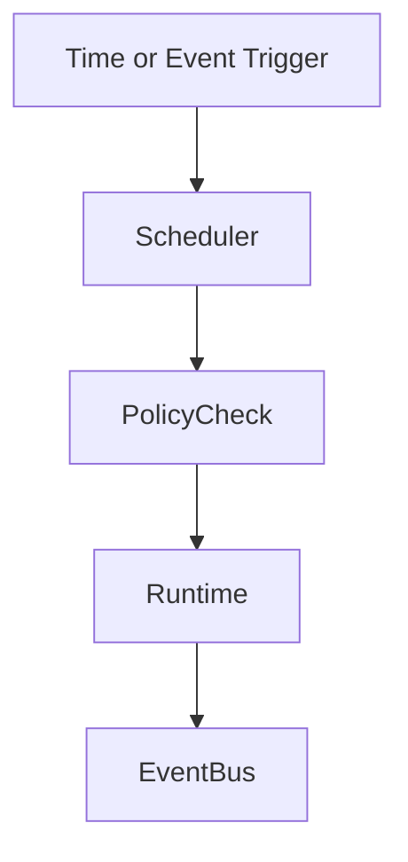
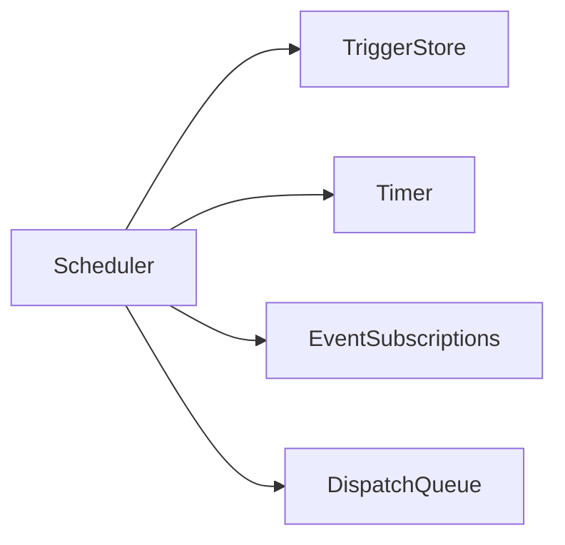
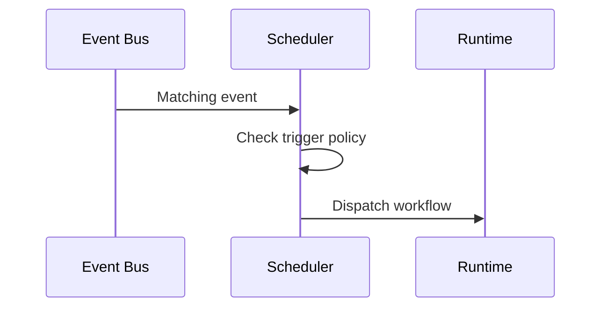

# Scheduler

## Purpose

The scheduler runs deferred, recurring, and event-triggered work.

## Overview

The scheduler receives workflow definitions and event subscriptions, then asks the runtime to execute eligible plans with proper permissions.

## Motivation

Atlas needs to monitor projects, reminders, downloads, repositories, and periodic maintenance without user commands every time.

## Architecture



## Design Decisions

Scheduled work is not privileged by default. Each scheduled task has an owner, scope, permission grant, expiration, and skip policy.

## Component Diagram



## Sequence Diagram



## Folder Structure

```text
atlas/core/scheduler/
  scheduler.py
  triggers.py
  queue.py
  policies.py
```

## Public Interfaces

`Scheduler.register(trigger: Trigger, workflow: WorkflowRef)` and `Scheduler.dispatch_due(now: datetime)`.

## Implementation Strategy

Start with in-process timers and event triggers. Add persistence before recurring tasks are considered reliable.

## Testing

Test clock handling, missed triggers, duplicate prevention, permission expiration, and recovery after restart.

## Security

Scheduled tasks cannot silently renew sensitive grants. Expired or changed scopes require user approval.

## Future Improvements

Add cron-like syntax, calendar-triggered work, and distributed scheduling after local semantics are stable.

## References

- [Workflow Engine](/code/ATLAS/docs/architecture/workflow-engine.md)
- [Event Bus](/code/ATLAS/docs/architecture/event-bus.md)
