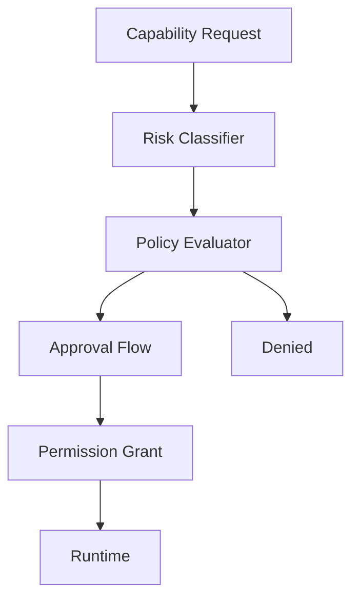
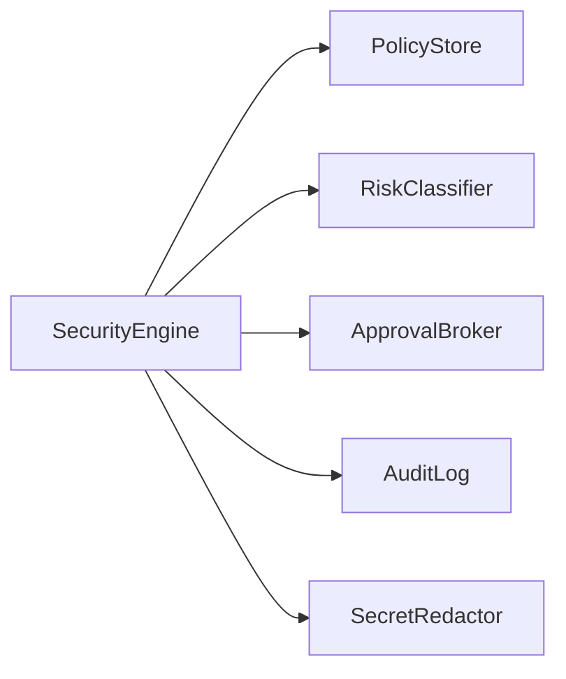
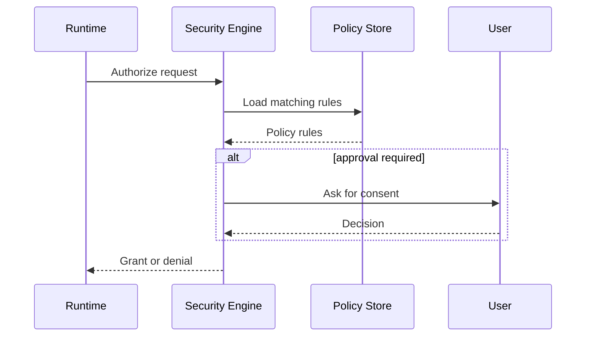

# Security Architecture

## Purpose

The security engine enforces permissions, risk policy, approval workflows, isolation, and auditability.

## Overview

Atlas assumes local machine actions are sensitive. The security engine evaluates every capability request against policy before execution and records decisions for review.

## Motivation

Users must be able to trust Atlas with broad context without granting unlimited authority. Security controls should be precise enough to support useful automation and strict enough to prevent surprise side effects.

## Architecture



## Design Decisions

Permissions are capability-scoped and resource-scoped. Examples include read-only project access, write access to a downloads folder, terminal execution in a repository, or browser automation in a specific profile.

## Component Diagram



## Sequence Diagram



## Folder Structure

```text
atlas/core/security/
  engine.py
  policy.py
  permissions.py
  approvals.py
  audit.py
  redaction.py
```

## Public Interfaces

`SecurityEngine.authorize(request: PermissionRequest) -> PolicyDecision`.

## Implementation Strategy

Ship with deny-by-default policy, explicit grants, local audit logs, and tests before enabling mutation capabilities.

## Testing

Cover policy matching, approval requirements, expired grants, conflicting rules, audit persistence, and redaction.

## Security

The security engine must be called by the runtime for every capability step. Adapter code should reject calls that lack execution-context grants.

## Future Improvements

Add sandboxing, signed plugins, per-project policies, and secret management integration.

## References

- [Permissions Specification](/code/ATLAS/docs/specifications/permissions.md)
- [Runtime](/code/ATLAS/docs/architecture/runtime.md)
