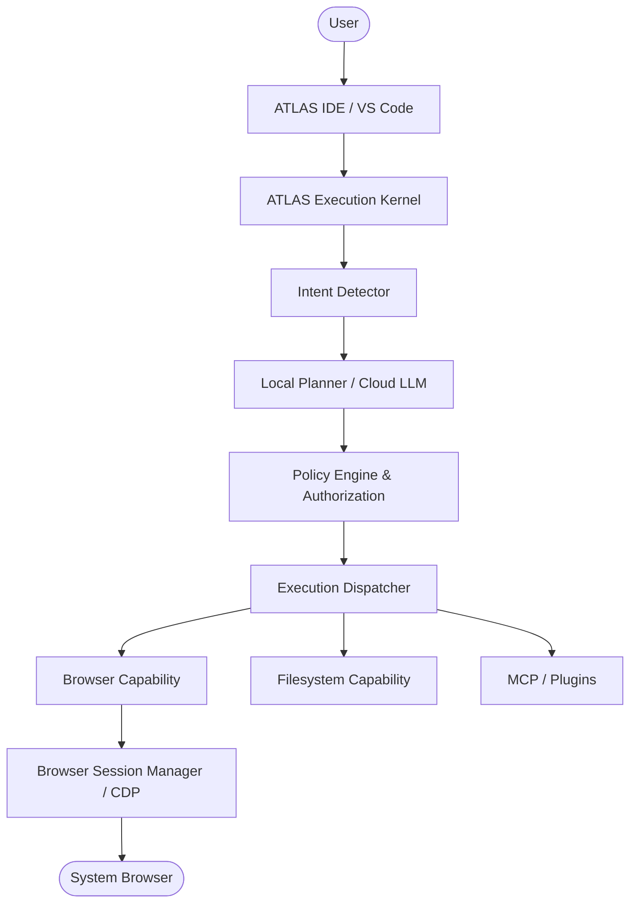
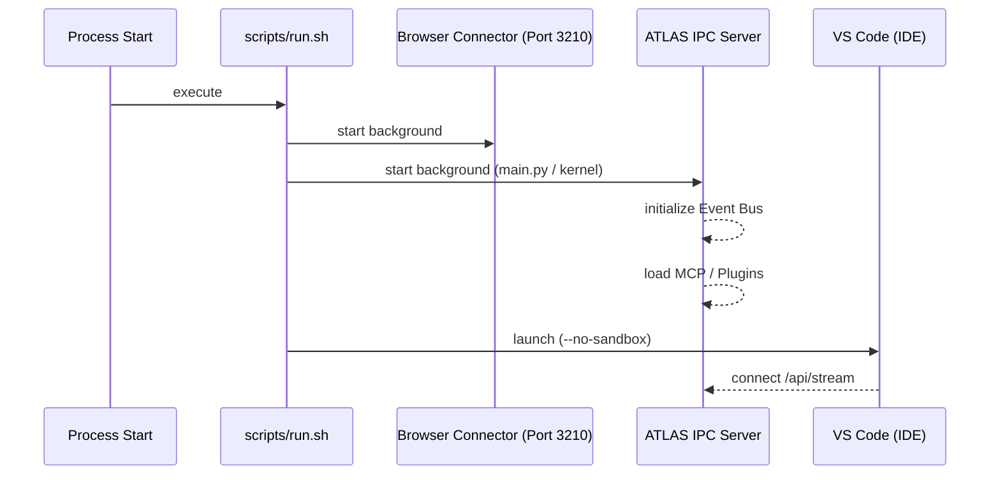

# ATLAS System Architecture

ATLAS is an AI-Native Browser Runtime and IDE. It is designed as a hybrid system comprising a customized VS Code frontend (the IDE) and a robust Python-based AI Execution Kernel (the Runtime).

This document outlines the Level 1 and Level 2 architectures as implemented in the repository.

## Level 1 — Product Architecture

The user interacts with ATLAS either through the modified VS Code workbench or via the browser. The architecture follows a strict separation between Intent (what the user wants), Policy (what is allowed), and Execution (how it gets done).

## Level 2 — Runtime Components

The AI Execution Kernel (`packages/runtime/main.py`) acts as an "Operating System" for AI execution, coordinating the following subsystems:

### 1. The Event Bus (`EnvelopedEventBus`)
- **Responsibility:** Handles asynchronous communication across the entire runtime. All major systems subscribe to the bus for state updates, logging, and tracing.
- **Implementation:** `runtime.events.bus.EventBus` wrapped by `EnvelopedEventBus` for trace metadata.

### 2. State & Session Managers
- **Responsibility:** Tracks task states, ongoing conversations, and active sessions.
- **Implementation:** `StateManager`, `TaskManager`, `ConversationManager`, `SessionManager`.

### 3. Intelligence Layer
- **Responsibility:** Determines user intent, manages memory, and routes requests to the appropriate LLM provider (Local vs. Cloud).
- **Implementation:** 
  - `MemoryEngine` handles semantic memory and vector search.
  - `IntentDetector` quickly determines the difficulty of a request. Fast-paths "easy" queries.
  - `LLMRouter` routes complex reasoning to OpenRouter/Cloud.

### 4. Planner & Execution Orchestration
- **Responsibility:** Decomposes complex intents into a Directed Acyclic Graph (DAG) of executable task nodes.
- **Implementation:** `LocalPlanner` generates a graph of capabilities required to fulfill the user's intent. The `Supervisor` and `CoreExecutionDispatcher` step through the DAG and execute the nodes.

### 5. Capability Registry & Policy Engine
- **Responsibility:** Registers tools (native, plugins, MCP) and enforces execution policies.
- **Implementation:** 
  - `CapabilityRegistry` acts as the directory for tools.
  - `AuthorizedToolExecutor` checks the `PermissionGateway` before allowing execution (e.g., confirming "DANGEROUS" operations).
  - MCP servers and native plugins are dynamically loaded and wrapped as `AdapterPort` instances.

### 6. Browser & CDP Proxy
- **Responsibility:** Connects to existing user browsers (Chrome, Brave, Edge), leases sessions, and executes actions.
- **Implementation:** `connector_server.py` listens on port 3210 to proxy WebSocket connections to the browser's DevTools Active Port. `BrowserPort` leverages the `atlas-browser` executable.

## Code Architecture (Startup Flow)

### Dependency Relationships

- **Frontend:** The VS Code fork (`apps/vscode`) depends heavily on standard VS Code dependencies but adds integrations for the ATLAS Copilot and Chat extensions.
- **Backend:** The Python runtime (`packages/runtime`) has no dependencies on the Node/TS side. It relies on standard ML/AI libraries (`pydantic`, `fastapi`, `websockets`) and provides HTTP/SSE endpoints.

---
**Implementation References:**
- `scripts/run.sh`
- `packages/runtime/main.py`
- `packages/runtime/kernel/atlas_kernel.py`
