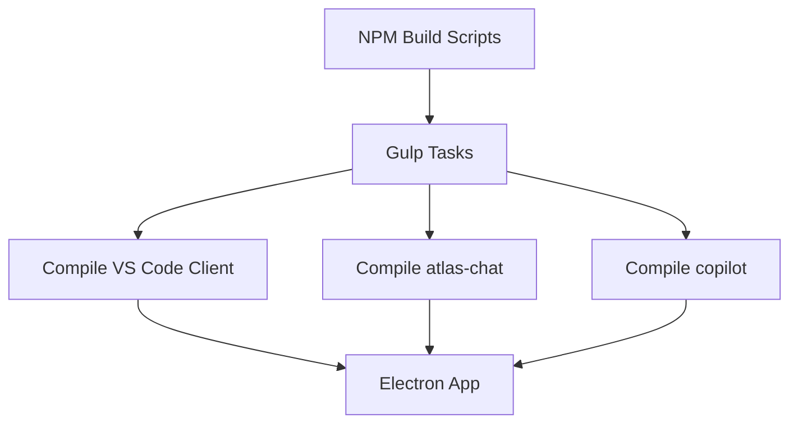

# ATLAS VS Code Fork Architecture

The frontend of the ATLAS IDE is a customized fork of Microsoft's open-source VS Code repository (`apps/vscode`).

This document explains what was inherited, what was modified, and how ATLAS integrates its agentic capabilities into the workbench.

## What ATLAS Inherited

ATLAS inherits the complete, production-ready foundation of VS Code, including:
- The Monaco editor component.
- The extension host architecture.
- The workbench layout (panels, sidebars, activity bar).
- Language servers and debugging protocols.

## What ATLAS Added & Modified

The fork modifies upstream VS Code to tightly integrate the ATLAS Execution Kernel.

### 1. Extensions
ATLAS bundles specific, proprietary extensions directly into the build:
- **`extensions/atlas-chat`**: Provides the chat interface for interacting with the local/cloud LLMs and triggering agent execution.
- **`extensions/copilot`**: A customized copilot implementation tailored for the ATLAS kernel.

These extensions are compiled alongside the client (`npm-run-all2 -lp compile-client compile-copilot compile-atlas-chat`).

### 2. IPC and Agent Integration
- The IDE communicates with the Python ATLAS Execution Kernel (running on `localhost:8000`) via HTTP and Server-Sent Events (SSE).
- Streams of agent reasoning ("THOUGHT") and tool executions are piped directly into the `atlas-chat` extension to render real-time execution graphs and progress.

### 3. Startup Scripts
- The `scripts/run.sh` script orchestrates the startup sequence. Before launching the VS Code binary (`./scripts/code.sh`), it first launches the ATLAS backend (the Connector Server and the IPC Server).
- It forces `--no-sandbox` during the Electron launch for specific prototype integration requirements.

## Architecture and Build

The build system utilizes the standard VS Code gulp tasks but injects compilation steps for the ATLAS-specific extensions. 

## Update Strategy and Divergence Risks

Because ATLAS is a hard fork of VS Code:
- **Upstream Merges:** Periodic merges from upstream `microsoft/vscode` are required to receive security updates and new features.
- **Merge Conflicts:** Customizations inside core workbench files (if any) are highly susceptible to merge conflicts. Most ATLAS functionality is currently encapsulated within built-in extensions (`atlas-chat`) to minimize core divergence.

---
**Implementation References:**
- `apps/vscode/package.json`
- `apps/vscode/scripts/`
- `apps/vscode/extensions/`
