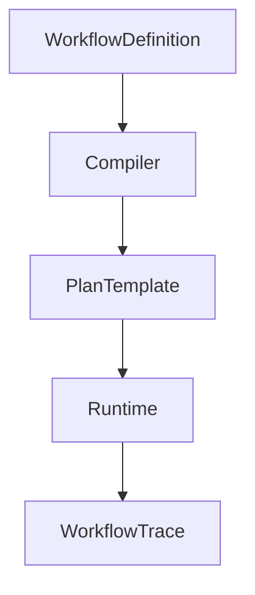
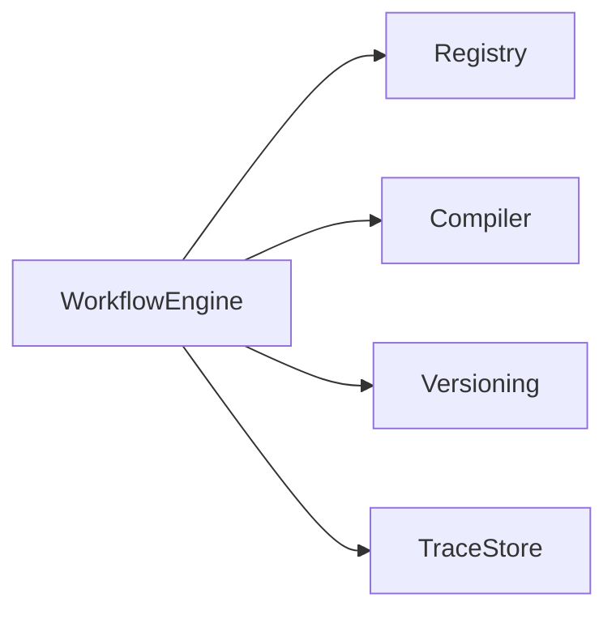
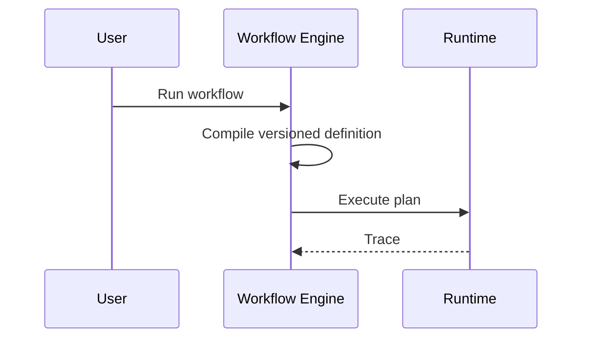

# Workflow Engine

## Purpose

The workflow engine stores and runs multi-step user routines.

## Overview

A workflow is a named, versioned graph of capability invocations with inputs, conditions, approvals, and verification rules.

## Motivation

Atlas should learn repeated user workflows and make them reliable instead of repeatedly improvising them.

## Architecture



## Design Decisions

Workflows are explicit artifacts. Learned workflows begin as suggestions and require user acceptance before becoming scheduled or reusable automation.

## Component Diagram



## Sequence Diagram



## Folder Structure

```text
atlas/core/workflows/
  definitions.py
  compiler.py
  registry.py
  traces.py
```

## Public Interfaces

`WorkflowEngine.compile(workflow: WorkflowDefinition, inputs: dict) -> Plan`.

## Implementation Strategy

Implement manually authored workflows first. Add workflow learning only after traces, memory, and approvals are stable.

## Testing

Test version compatibility, conditional branches, failed steps, resumability, approvals, and trace replay.

## Security

Workflow definitions cannot hide permissions. Required grants must be visible before execution.

## Future Improvements

Add workflow marketplace support, visual editing, and learned routine recommendations.

## References

- [Scheduler](/code/ATLAS/docs/architecture/scheduler.md)
- [Runtime](/code/ATLAS/docs/architecture/runtime.md)
