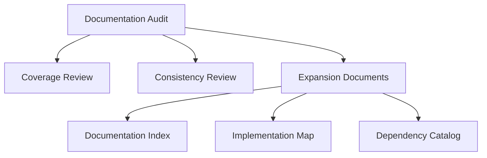
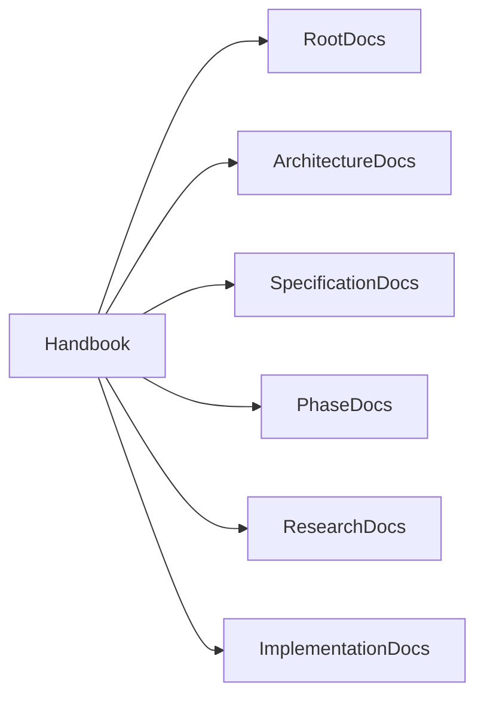
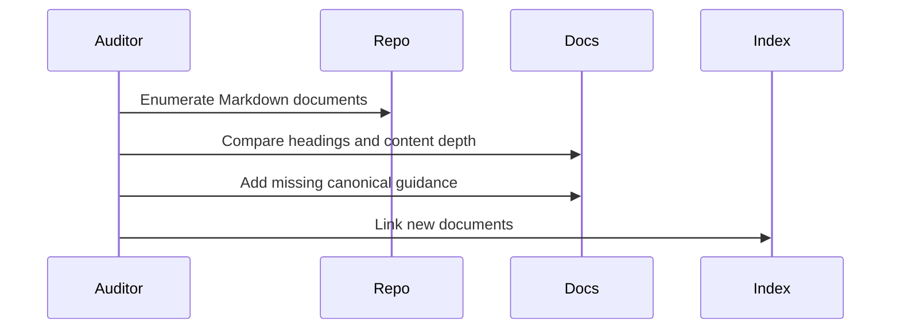
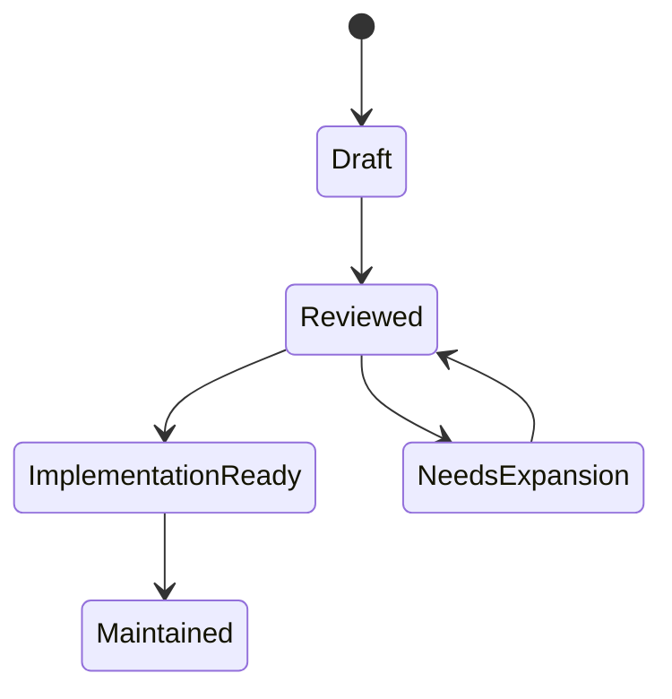

# Documentation Audit: 2026-08-01

## Purpose

This audit records the repository-wide documentation review performed against the Atlas engineering handbook standard.

## Problem Statement

The repository already contained a broad architecture handbook, but many documents were written at overview depth. The new standard requires implementation-ready guidance: user stories, requirements, data flow, lifecycle, IPC, storage, error handling, recovery, performance, dependency analysis, and definitions of done.

## Why This Audit Exists

Atlas is intended to be handed to senior engineers as a build guide. A broad but shallow handbook would leave too many design choices implicit, causing inconsistent implementations and unsafe local-machine authority.

## User Stories

- As a new contributor, I need to find the authoritative subsystem document and know exactly which interfaces, tests, and security checks I must implement.
- As a maintainer, I need to identify documentation gaps before accepting subsystem code.
- As a security reviewer, I need permission, recovery, audit, and adapter authority rules to be consistent across documents.
- As a platform engineer, I need Linux implementation details without contaminating the cross-platform core.

## Functional Requirements

- Inspect every Markdown document in the repository.
- Identify missing sections against the current documentation standard.
- Add canonical documents for repeated engineering concerns rather than duplicating weak prose in every file.
- Add navigation entries for the new documents.
- Preserve Atlas's product constraints: local-first, offline-first, zero cloud budget, Linux initial target, cross-platform core.

## Non-Functional Requirements

- Documentation must be internally consistent.
- Documents must avoid placeholders and speculative marketing language.
- Diagrams must be stored as Mermaid source in Markdown.
- Dependency choices must include license, maintenance, alternatives, integration strategy, and wrap/fork decisions.

## Architecture



## Component Diagram



## Sequence Diagrams



## State Diagrams



## Folder Structure

```text
docs/audits/
  2026-08-01-documentation-audit.md
docs/implementation/
  implementation-map.md
docs/features/
  core-feature-scenarios.md
docs/research/
  dependency-catalog.md
docs/specifications/
  linux-system-interfaces.md
  error-recovery.md
```

## Internal Modules

This is documentation-only. It defines review modules: coverage review, consistency review, dependency review, and implementation-readiness review.

## Public Interfaces

The audit exposes a status matrix and required follow-up documents for maintainers.

## Data Flow

Repository files are enumerated, headings are extracted, gaps are classified, and fixes are applied through new canonical documents and targeted edits.

## Lifecycle

Run this audit at the start of each major documentation phase and before accepting a new subsystem category.

## Threading Model

Not applicable to repository documentation. Future documentation tooling may parallelize link checks and heading validation.

## IPC Model

Not applicable. Documentation tooling should use local filesystem reads only.

## Storage

Audit reports are immutable historical records under `docs/audits`.

## Error Handling

If a document lacks a required section, the maintainer either expands that document or links it to a canonical document that supplies the missing implementation detail for the subsystem class.

## Recovery Strategy

If documentation becomes inconsistent, prefer updating the authoritative subsystem document and then updating indexes and related documents.

## Security

Audit reports must not include private machine paths, secrets, prompt transcripts containing sensitive data, or local environment details beyond repository-relative paths.

## Performance Considerations

Documentation checks should be fast enough to run in CI. Link checking and Mermaid validation can be incremental.

## Audit Findings

| Area | Finding | Action Taken |
| --- | --- | --- |
| Root documentation | Good navigation, but no explicit strict documentation standard | Added this audit and linked expansion docs |
| Architecture docs | Correct subsystem split, but repeated sections were concise | Added implementation map, error/recovery spec, and dependency direction guidance |
| Specification docs | Covered topics, but Linux API depth was insufficient | Added Linux system interfaces specification |
| Phase docs | Covered phase sequence, but feature-level guidance needed more depth | Added core feature scenarios and phase feature matrix |
| Research docs | Dependency format existed, but concrete researched dependencies were missing | Added dependency catalog with current source references |
| Testing docs | Covered test classes, but feature DoD and failure injection needed examples | Added feature scenarios and error/recovery spec |
| Index | Topic map existed, but new implementation docs were absent | Updated index and README references |

## Document Inspection Matrix

| Document Set | Files Reviewed | Status After Audit |
| --- | ---: | --- |
| Root docs | 7 | Consistent with project vision; cross-linked to expanded docs |
| Architecture docs | 11 | Architecturally consistent; expanded through canonical implementation and recovery docs |
| Specification docs | 12 | Consistent; Linux and error/recovery details expanded |
| Phase docs | 7 | Sequenced correctly; feature-level matrix added |
| API, plugin, testing, examples, diagrams, benchmarks | 6 | Consistent; linked to scenario and implementation maps |
| Research docs | 2 | Expanded with concrete dependency catalog |
| Index | 1 | Updated with new documents |

## Definition Of Done

- Every existing Markdown file has been inspected by path and heading coverage.
- New canonical documents fill the missing standard sections that apply across multiple subsystem docs.
- Dependency research contains concrete projects, licenses, maintenance posture, alternatives, wrap/fork decisions, and reuse boundaries.
- Linux API documentation covers kernel interfaces, syscalls, desktop APIs, D-Bus, Wayland/X11, permissions, services, package integration, and filesystem APIs.
- Feature scenarios include planner reasoning, capability selection, permissions, rollback, logs, edge cases, completion time, and success criteria.

## Future Improvements

Add CI jobs for Markdown link checking, Mermaid rendering, required-section checks, and stale dependency-review dates.

## References

- [Documentation Index](/code/ATLAS/docs/INDEX.md)
- [Implementation Map](/code/ATLAS/docs/implementation/implementation-map.md)
- [Dependency Catalog](/code/ATLAS/docs/research/dependency-catalog.md)
- [Linux System Interfaces](/code/ATLAS/docs/specifications/linux-system-interfaces.md)

## Related Documents

- [Architecture](/code/ATLAS/ARCHITECTURE.md)
- [Testing Strategy](/code/ATLAS/docs/testing/strategy.md)
- [Phase Feature Matrix](/code/ATLAS/docs/phases/phase-feature-matrix.md)
