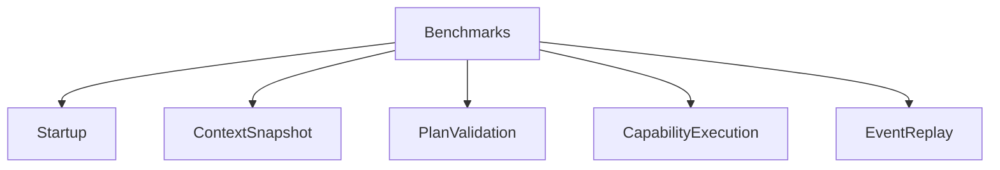
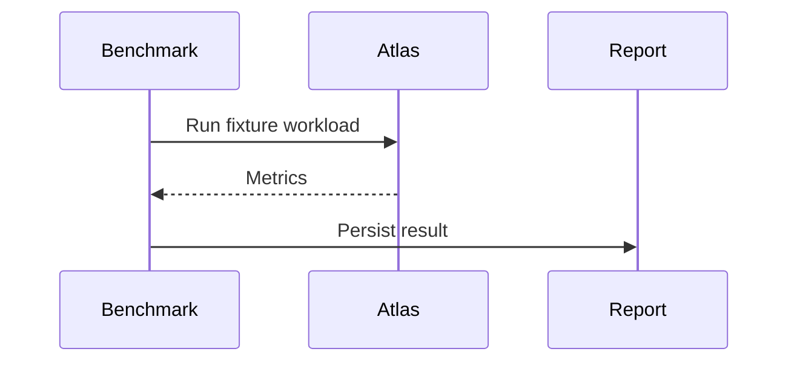

# Performance Benchmark Plan

## Purpose

This document defines the first Atlas benchmark suite.

## Overview

Benchmarks measure local responsiveness, indexing cost, runtime overhead, adapter latency, memory retrieval, and event replay.

## Motivation

Atlas must stay lightweight enough to run continuously on a user's machine.

## Architecture

## Design Decisions

Benchmarks use reproducible local fixtures and do not require cloud services.

## Component Diagram

## Sequence Diagram

## Folder Structure

Future executable benchmarks should live in `tests/performance` with reports under `docs/benchmarks/reports`.

## Public Interfaces

Benchmark results should expose duration, CPU, memory, disk reads/writes, event count, and failure count.

## Implementation Strategy

Define fixtures for empty profile, large project tree, active Git repository, crowded downloads folder, and event replay.

## Testing

Benchmarks should fail only on severe regressions at first. Tight budgets come after baseline data exists.

## Security

Fixtures must contain synthetic data only.

## Future Improvements

Add battery impact measurement and platform-specific benchmark baselines.

## References

- [Performance Specification](/code/ATLAS/docs/specifications/performance.md)
