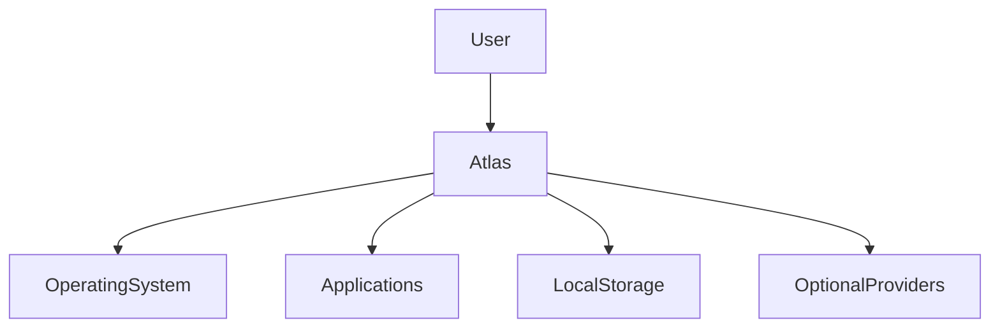
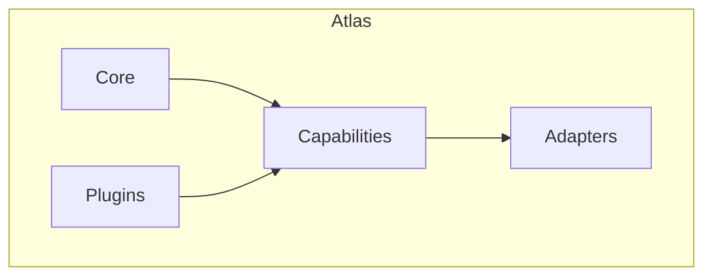
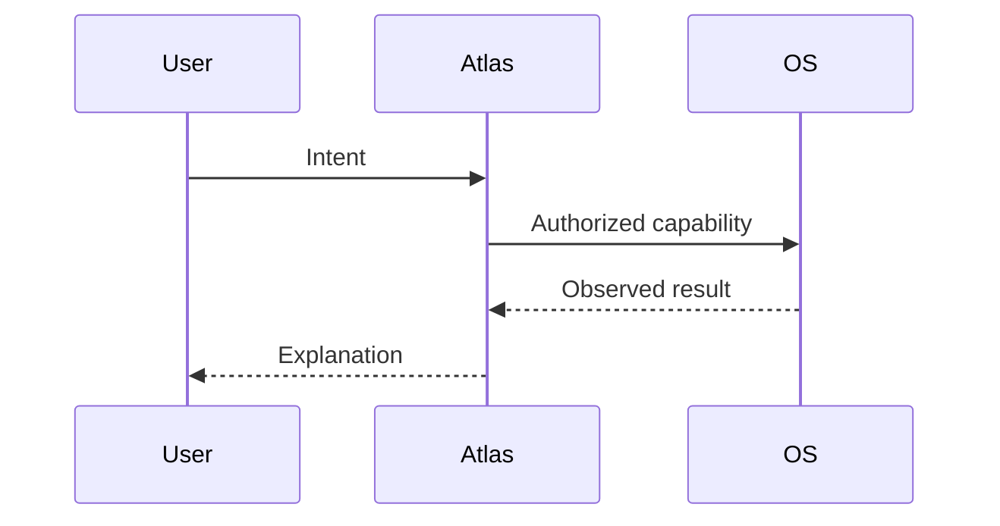

# System Context Diagrams

## Purpose

This document collects canonical diagrams used by the Atlas handbook.

## Overview

These diagrams describe Atlas at system, runtime, and adapter levels.

## Motivation

Shared diagrams reduce ambiguity across architecture and implementation phase documents.

## Architecture

## Design Decisions

Diagrams use Mermaid so they remain version-controlled and reviewable.

## Component Diagram

## Sequence Diagram

## Folder Structure

Diagram source belongs under `docs/diagrams`.

## Public Interfaces

Diagrams communicate architecture contracts to contributors.

## Implementation Strategy

Update diagrams in the same pull request as architecture changes.

## Testing

Markdown rendering should be checked during documentation CI.

## Security

Do not include secrets, real user paths, or private environment details in diagrams.

## Future Improvements

Add generated SVG artifacts for release documentation.

## References

- [Architecture](/code/ATLAS/ARCHITECTURE.md)
