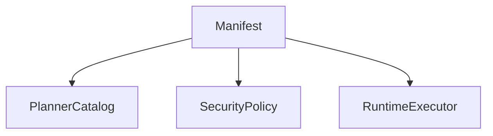
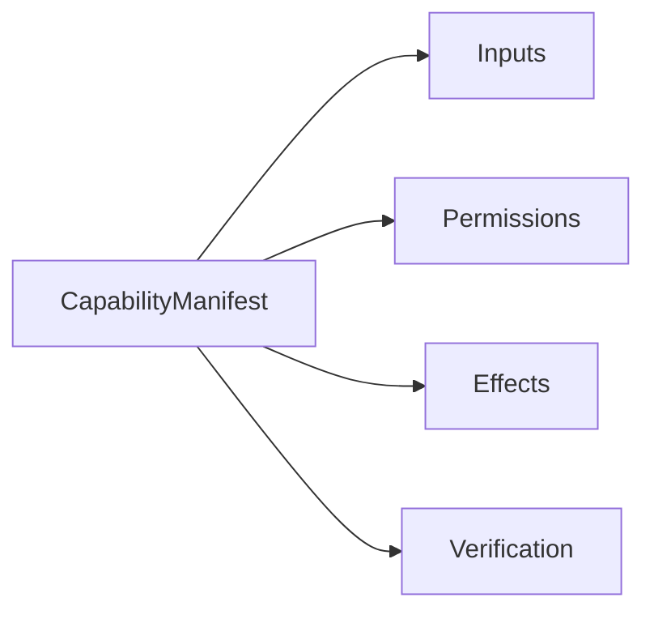
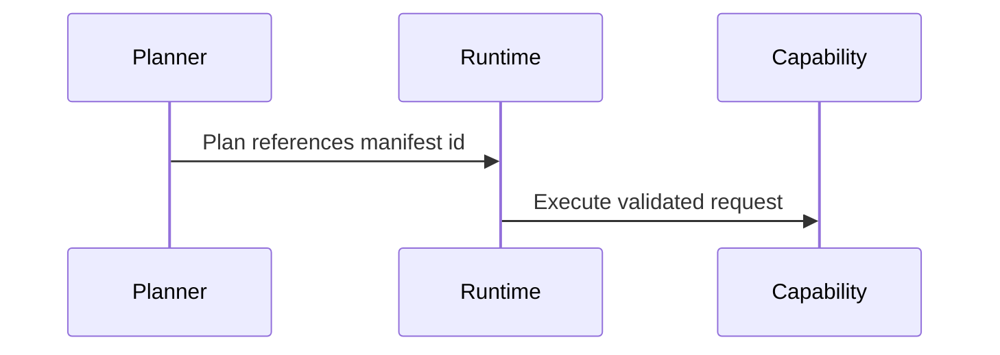

# Capability Manifest Examples

## Purpose

This document provides implementation-ready examples for Atlas capability manifests.

## Overview

Capabilities describe user-relevant actions with permissions and verification. They do not expose raw low-level operations to the planner.

## Motivation

Examples help contributors understand the difference between capabilities and tools.

## Architecture



## Design Decisions

Manifest fields include id, version, summary, inputs, outputs, permissions, preconditions, effects, verification, rollback, and adapter requirements.

## Component Diagram



## Sequence Diagram



## Folder Structure

Example manifests should eventually live under `docs/examples/manifests`.

## Public Interfaces

```yaml
id: atlas.files.organize_downloads
version: 0.1.0
summary: Organize files in the user's downloads directory according to a reviewed policy.
inputs:
  downloads_path: path
  policy:
    type: enum
    values: [by_type, by_date, by_project_hint]
permissions:
  - action: read
    resource: downloads_path
  - action: move
    resource: downloads_path
    approval: required
effects:
  - move_files_within_scope
verification:
  - all_moved_files_exist_at_destination
  - no_files_outside_scope_changed
rollback:
  - restore_original_paths_from_transaction_log
adapters:
  - filesystem
```

```yaml
id: atlas.git.commit_repository
version: 0.1.0
summary: Review repository state and create a user-approved commit.
inputs:
  repository_path: path
  message: string
permissions:
  - action: read
    resource: repository_path
  - action: execute_git
    resource: repository_path
    approval: required
effects:
  - create_git_commit
verification:
  - head_changed_to_new_commit
  - working_tree_status_matches_expected_policy
rollback:
  - no_automatic_rollback_for_published_history
adapters:
  - git
  - filesystem
```

## Implementation Strategy

Use manifests to drive planner catalogs, permission prompts, and contract tests.

## Testing

Each manifest should generate schema tests and permission simulation tests.

## Security

Manifests must not under-declare effects. Missing effects are security bugs.

## Future Improvements

Add generated docs and manifest linting.

## References

- [Capability Engine](/code/ATLAS/docs/architecture/capability-engine.md)
- [API Contracts](/code/ATLAS/docs/api/contracts.md)
