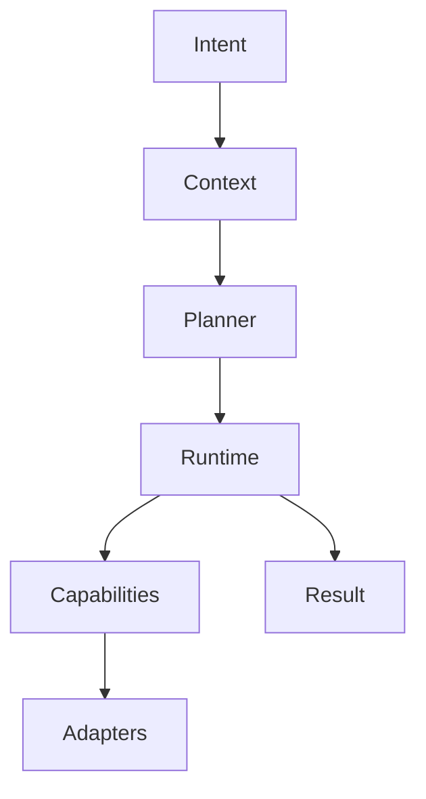
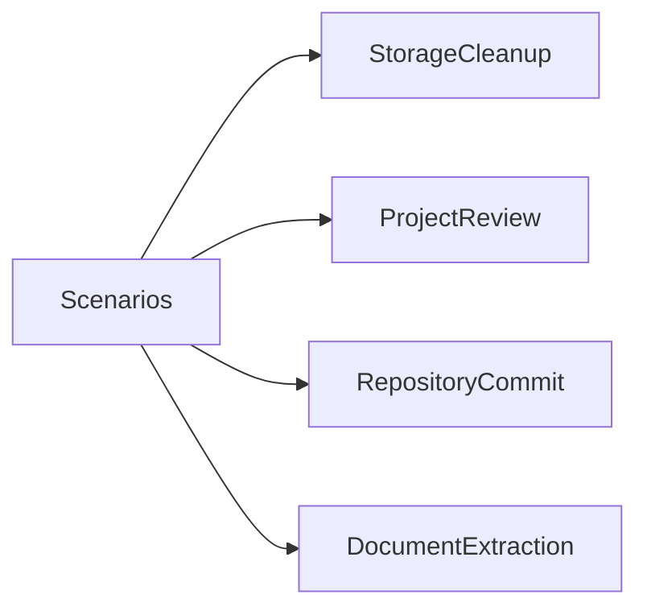
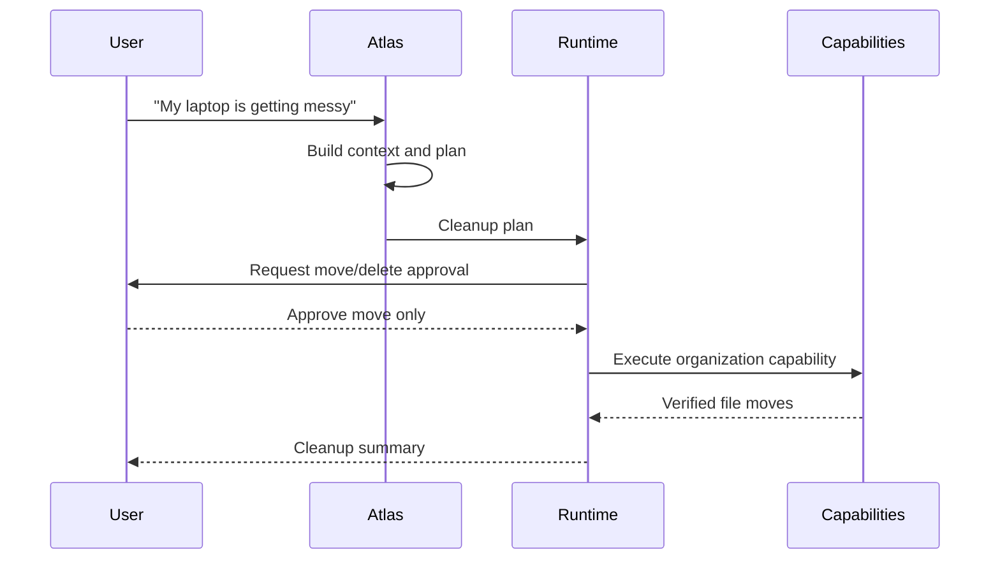
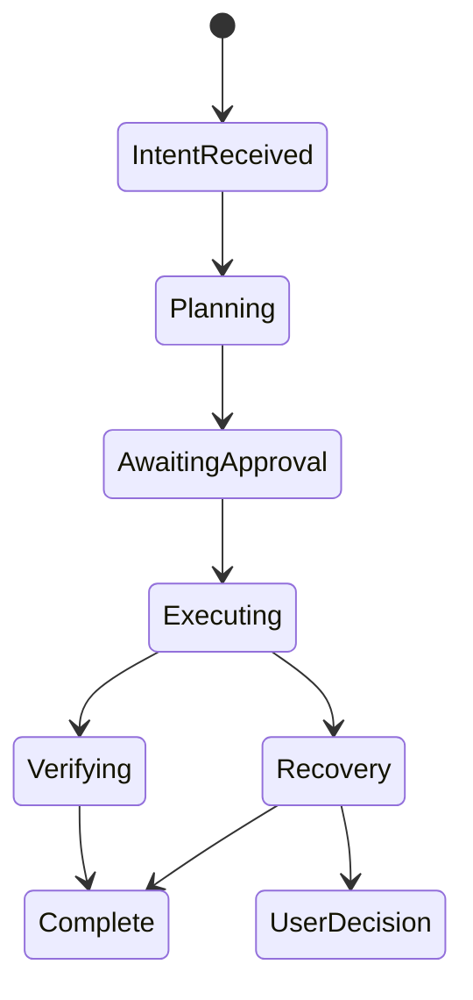

# Core Feature Scenarios

## Purpose

This document defines realistic Atlas feature scenarios with planner reasoning, selected capabilities, execution plans, permissions, rollback, logs, timing, edge cases, and success criteria.

## Problem Statement

Architecture documents explain subsystems, but engineers need concrete workflows that show how the subsystems collaborate under real user intent.

## Why This Subsystem Exists

Scenario documents keep Atlas grounded in user outcomes rather than isolated technical components.

## User Stories

- As a user, I want to say "My laptop is getting messy" and have Atlas propose safe cleanup actions.
- As a developer, I want to inspect a project and receive a reliable summary of files, Git state, tests, and risks.
- As a maintainer, I want Atlas to prepare a repository commit only after showing the diff and requesting approval.
- As a knowledge worker, I want Atlas to extract text from a local document or screenshot without uploading it.

## Functional Requirements

- Show planner reasoning and capability selection.
- Define permission prompts.
- Define execution and failure flows.
- Define logs and metrics.
- Define completion time expectations and success criteria.

## Non-Functional Requirements

- All scenarios must work offline unless explicitly marked optional cloud.
- Destructive actions require approval.
- Scenarios must use high-level capabilities, not raw tools.
- Edge cases must be documented before implementation.

## Architecture



## Component Diagram



## Sequence Diagrams



## State Diagrams



## Folder Structure

Scenario-specific fixtures should live under `tests/fixtures/scenarios`.

## Internal Modules

Scenarios exercise planner, context engine, runtime, security, capability engine, adapters, event bus, memory, and observability.

## Public Interfaces

Scenarios should eventually be runnable as acceptance tests:

```text
atlas scenario run storage-cleanup
atlas scenario run project-review
atlas scenario run repository-commit
atlas scenario run document-extraction
```

## Data Flow

Intent produces context; context drives plan; plan drives capability graph; capability results produce events; events update memory and logs.

## Lifecycle

Each scenario starts as documentation, becomes fixture-backed acceptance test, then becomes a release gate for the phase that owns it.

## Threading Model

Interactive approval blocks dependent actions. Background scans may run concurrently but must not mutate state.

## IPC Model

If the Atlas service is running, scenario execution uses the local IPC channel for progress, approval, and result streaming.

## Storage

Each scenario creates a trace, audit events for permissions, capability result records, and optional memory entries.

## Scenario: My Laptop Is Getting Messy

### User Intent

`My laptop is getting messy.`

### Planner Reasoning

The planner interprets the intent as local cleanup, not deletion. It asks the context engine for downloads, desktop, large files, recent screenshots, uncommitted repositories, and low-risk organization opportunities.

### Capabilities Selected

- `InspectStorage`
- `ClassifyLooseFiles`
- `ProposeFileOrganization`
- `OrganizeDownloads`
- `ReportStorageFindings`

### Execution Plan

1. Inspect downloads, desktop, and configured project roots read-only.
2. Classify files by type, age, project hints, duplicates, and size.
3. Present a proposed organization plan.
4. Request approval for file moves.
5. Move approved files within allowed scopes.
6. Verify destinations and produce a summary.

### Permission Requests

- Read: downloads and desktop.
- Move: files within downloads and user-approved target folders.
- Delete: not requested by default.

### Rollback Strategy

Record original path, destination path, file size, mtime, hash where practical, and move id. Roll back by moving files to original paths if no destination conflict exists.

### Logs

- `context.snapshot.created`
- `capability.started: InspectStorage`
- `permission.requested: move_files`
- `capability.completed: OrganizeDownloads`
- `verification.completed`

### Expected Output

Atlas reports what changed, what was skipped, and which files need manual review.

### Edge Cases

- File modified during move.
- Destination already exists.
- Symlink points outside approved scope.
- Cross-device move loses atomicity.
- Downloads folder contains active browser download.

### Failure Recovery

Pause if active downloads are detected. For cross-device moves, copy, verify hash, then remove source only after approval. If verification fails, preserve both copies and report.

### Expected Completion Time

Small folder: under 10 seconds. Large folder with hashes: bounded by configured scan budget and reported as progressive work.

### Success Criteria

No files outside approved scope change. All moved files are verified. User receives a clear summary and rollback remains possible.

## Scenario: Review This Project

### User Intent

`Review this project and tell me what state it is in.`

### Planner Reasoning

The planner treats the request as read-only project inspection. It should avoid modifying files or running arbitrary commands unless the user approves a test command.

### Capabilities Selected

- `InspectProjectTree`
- `ReadRepositoryState`
- `DetectProjectType`
- `SummarizeProjectHealth`
- `RecommendNextActions`

### Execution Plan

1. Determine project root.
2. Read file tree with ignore rules.
3. Inspect Git branch, status, remotes, and recent commits.
4. Detect languages, package managers, test commands, and docs.
5. Summarize architecture, risks, and next steps.

### Permission Requests

Read-only access to project root. Running tests requires separate terminal approval.

### Rollback Strategy

No mutation expected. If temporary cache files are created by indexers, they remain under Atlas cache directories.

### Logs

Record collector timings, skipped paths, Git adapter result, and summary generation metadata.

### Edge Cases

- Huge repository.
- Binary files.
- Nested Git repositories.
- Unreadable files.
- Secrets detected in files.

### Failure Recovery

Skip unreadable files with explicit report. Stop summarization if sensitive files would enter planner context without approval.

### Expected Completion Time

Under 15 seconds for ordinary repositories; large repositories use incremental progress.

### Success Criteria

Summary includes project type, Git state, likely commands, risks, and recommended next actions with provenance.

## Scenario: Commit This Repository

### User Intent

`Commit my changes with a good message.`

### Planner Reasoning

The planner recognizes a destructive/version-control operation. It must inspect changes, draft a message, and ask for approval before creating a commit.

### Capabilities Selected

- `ReadRepositoryState`
- `ReviewWorkingTree`
- `DraftCommitMessage`
- `CommitRepository`

### Execution Plan

1. Inspect Git status and diff.
2. Summarize changes.
3. Draft commit message.
4. Request user approval for exact files and message.
5. Run commit through Git adapter.
6. Verify `HEAD` changed and working tree policy is satisfied.

### Permission Requests

Read repository, read diff, execute Git commit in repository.

### Rollback Strategy

Atlas does not automatically rewrite Git history after a commit. It may offer a separate `UndoLocalCommit` capability if the commit has not been pushed and the user explicitly approves.

### Logs

Audit diff summary, approval decision, command abstraction, commit hash, verification result.

### Edge Cases

- Merge conflict state.
- Untracked files excluded from commit.
- Pre-commit hook fails.
- GPG signing prompt blocks.
- Remote branch diverged.

### Failure Recovery

If pre-commit hooks fail, preserve hook output and stop. If commit succeeds but verification fails, re-read Git state and report exact observed state.

### Expected Completion Time

Under 20 seconds without slow hooks.

### Success Criteria

User approved message and files. New commit exists. No unapproved files were staged or modified.

## Scenario: Extract Text From This Screenshot

### User Intent

`Read the text in this screenshot and add the important parts to my notes.`

### Planner Reasoning

The planner identifies OCR and note-writing. It must request read access to the image and write access to the target notes file or application.

### Capabilities Selected

- `ExtractTextFromImage`
- `SummarizeExtractedText`
- `UpdateNotes`

### Execution Plan

1. Read approved image file.
2. Run local OCR.
3. Report confidence and extracted text.
4. Ask for approval before writing notes if target is ambiguous.
5. Write approved summary.

### Permission Requests

Read image file. Write target notes location.

### Rollback Strategy

For file-based notes, record previous content hash and append range. Roll back by removing appended section if unchanged since write.

### Logs

Record OCR engine, language config, confidence, target note path, and write verification. Do not log full extracted text by default.

### Edge Cases

- Low OCR confidence.
- Image contains secrets.
- Target notes app unavailable.
- Handwriting or rotated text.

### Failure Recovery

Ask user to confirm low-confidence text. Redact suspected secrets. If note write fails, preserve extracted text in a transient result, not durable memory.

### Expected Completion Time

Under 15 seconds for ordinary screenshots on supported hardware.

### Success Criteria

Extracted content is local, user-visible, and written only after required approval.

## Error Handling

Every scenario uses the shared error taxonomy in [Error Handling and Recovery](/code/ATLAS/docs/specifications/error-recovery.md).

## Recovery Strategy

Recovery is capability-specific and must be declared in the manifest before implementation.

## Security

Scenarios deliberately avoid raw shell, click, mouse, or browser primitives. They use approved high-level capabilities.

## Performance Considerations

Scenarios include completion-time expectations so performance regressions are visible in acceptance tests.

## Definition Of Done

A scenario is complete when it has documentation, fixture data, automated acceptance tests, permission tests, failure tests, recovery tests, and manual test notes.

## Future Improvements

Add meeting preparation, browser research, Docker cleanup, desktop workspace launch, and notification triage scenarios.

## References

- [Capability Engine](/code/ATLAS/docs/architecture/capability-engine.md)
- [Permissions](/code/ATLAS/docs/specifications/permissions.md)
- [Error Handling and Recovery](/code/ATLAS/docs/specifications/error-recovery.md)

## Related Documents

- [Phase Feature Matrix](/code/ATLAS/docs/phases/phase-feature-matrix.md)
- [Capability Manifest Examples](/code/ATLAS/docs/examples/capability-manifests.md)
