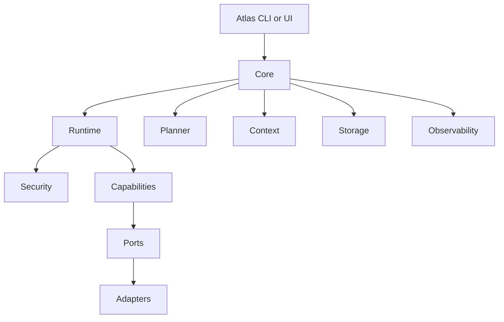
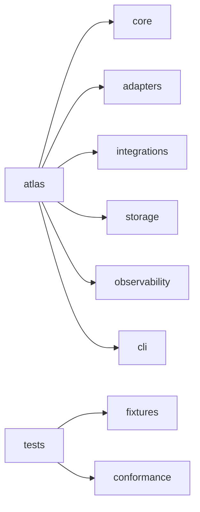
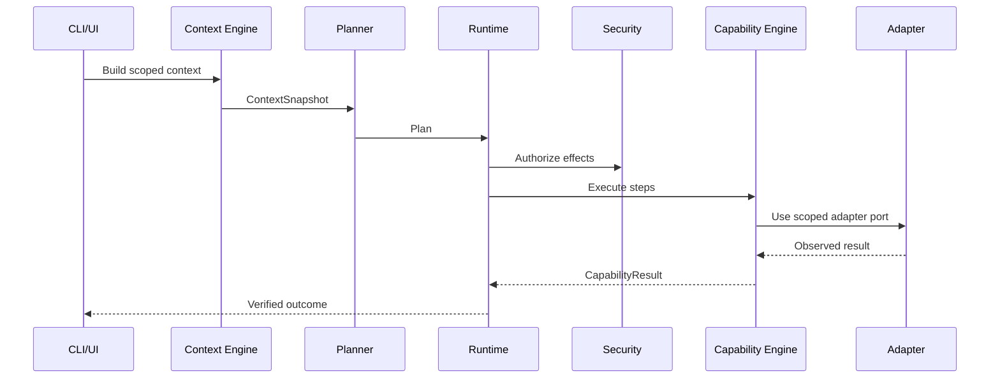
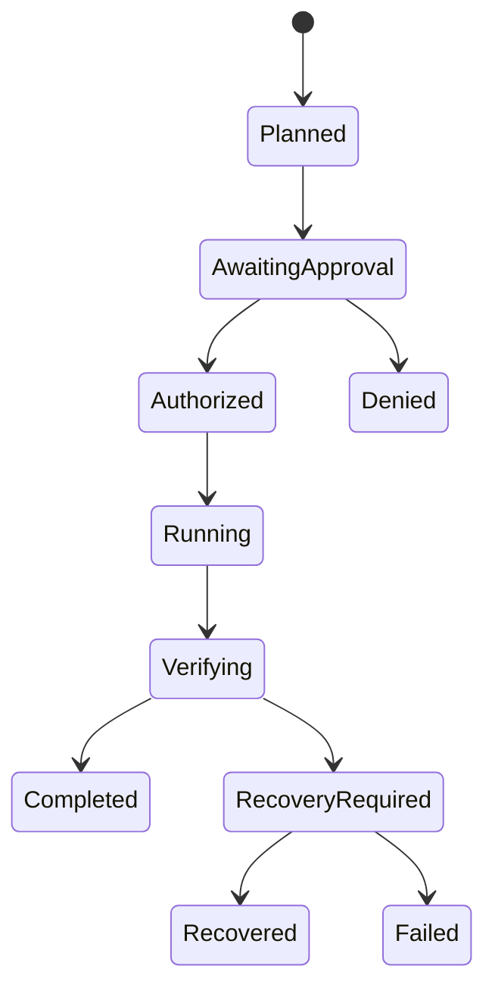

# Atlas Implementation Map

## Purpose

This document translates the Atlas architecture into implementation units a senior engineering team can assign, build, and test.

## Problem Statement

The architecture defines subsystems, but contributors need concrete modules, managers, workers, services, IPC boundaries, database ownership, and execution flows.

## Why This Subsystem Exists

The implementation map prevents drift between documentation and code. It is the bridge from handbook to repository structure.

## User Stories

- As a runtime engineer, I need to know which module owns transactions and verification.
- As an adapter engineer, I need to know which ports I must implement for Linux.
- As a plugin engineer, I need to know how a plugin capability enters the registry.
- As a test engineer, I need to map every feature to fixtures and acceptance gates.

## Functional Requirements

- Define implementation packages for core, adapters, integrations, storage, observability, tests, tools, and packaging.
- Define module ownership and dependency direction.
- Define services, managers, workers, background jobs, IPC, state, and configuration.
- Define pseudo code for the primary execution path.

## Non-Functional Requirements

- No cyclic dependencies.
- Core remains platform independent.
- All mutation passes through runtime permission gates.
- All durable state has migrations.
- Local execution works without cloud services.

## Architecture



## Component Diagram



## Sequence Diagrams



## State Diagrams



## Folder Structure

```text
atlas/
  cli/
  core/
    ai/
    capabilities/
    context/
    contracts/
    events/
    memory/
    planner/
    plugins/
    runtime/
    scheduler/
    security/
    workflows/
  adapters/
    ports/
    linux/
    windows/
    macos/
  integrations/
    applications/
    browser/
    clipboard/
    desktop/
    docker/
    documents/
    filesystem/
    git/
    networking/
    notifications/
    ocr/
    terminal/
    voice/
    windows/
  observability/
  storage/
tests/
  acceptance/
  conformance/
  failure/
  fixtures/
  integration/
  performance/
  recovery/
  regression/
  security/
  system/
  unit/
tools/
packaging/
```

## Internal Modules

| Module | Responsibility | May Depend On | Must Not Depend On |
| --- | --- | --- | --- |
| `core/contracts` | Shared typed schemas | Standard library, schema tooling | Concrete adapters |
| `core/planner` | Plan generation | contracts, ai, context | adapters, integrations |
| `core/runtime` | Deterministic execution | contracts, security, capabilities, events, observability | concrete OS APIs |
| `core/security` | Policy and approvals | contracts, storage, observability | planner internals |
| `core/capabilities` | Capability registry and execution | contracts, adapter ports | concrete adapters directly |
| `adapters/ports` | Abstract OS and app ports | contracts | platform code |
| `adapters/linux` | Linux port implementations | ports, integrations | planner |
| `integrations/*` | Wrapped application and OS APIs | adapter ports | planner |
| `storage` | Local databases and migrations | contracts | UI-only code |
| `observability` | Logs, metrics, traces, audit | contracts, storage | planner-specific prompts |

## Public Interfaces

The initial public developer interfaces are:

```text
atlas plan "<intent>"
atlas run <plan-id>
atlas capability validate <manifest>
atlas workflow run <workflow-id>
atlas plugin validate <path>
atlas trace show <trace-id>
atlas policy grant <capability> --scope <scope>
```

## Data Flow

1. Intent intake creates `UserIntent`.
2. Context engine creates `ContextSnapshot` from collectors and memory.
3. Planner emits `Plan`.
4. Runtime validates plan and opens `ExecutionTransaction`.
5. Security engine issues `PolicyDecision`.
6. Capability engine executes steps through scoped adapter ports.
7. Runtime verifies effects and writes event/audit logs.
8. Memory consumes events and stores durable facts.

## Lifecycle

Atlas processes have three lifecycle modes:

- Foreground CLI command: short-lived, explicit user intent.
- Local service: long-running event, memory, scheduler, and approval broker.
- Development harness: fake adapters and deterministic fixtures.

## Threading Model

Start with a single-process async runtime. CPU-heavy tasks such as OCR, embeddings, and document parsing run in bounded worker pools. All shared mutable state is accessed through storage transactions or event messages.

## IPC Model

Use local IPC only. The preferred Linux transport is a Unix domain socket under `$XDG_RUNTIME_DIR/atlas/atlas.sock` for CLI-to-service calls. If `$XDG_RUNTIME_DIR` is unavailable, use a private fallback directory with mode `0700` and a warning.

## Storage

Use SQLite for plans, events, memory metadata, policies, plugin registry, and workflow traces. Store large extracted artifacts as content-addressed blobs under the Atlas data directory.

## Error Handling

All subsystem errors map to typed error codes: validation, permission, adapter unavailable, timeout, partial effect, verification failed, recovery failed, unsupported platform, and dependency missing.

## Recovery Strategy

Recovery is transaction-based. Each mutating capability records pre-state, intended effects, applied effects, and compensating actions. If recovery cannot restore state, Atlas must report residual risk explicitly.

## Security

Every adapter handle is scoped by an execution context grant. No module may access shell, browser, filesystem mutation, clipboard, microphone, screen capture, or Docker daemon authority outside runtime execution.

## Performance Considerations

Interactive command overhead should be measured separately from capability work. Background indexers must be incremental, cancellable, and lower priority than user-initiated tasks.

## Pseudo Code

```python
def handle_intent(text, source):
    intent = UserIntent.create(text=text, source=source)
    snapshot = context_engine.snapshot(intent)
    plan = planner.plan(intent, snapshot, capability_engine.catalog())
    validation = runtime.validate(plan)
    if validation.requires_user_approval:
        approval = approval_broker.request(validation.permission_requests)
        if not approval.allowed:
            return DeniedResult(validation.explanation)
    return runtime.execute(plan)
```

## Failure Flow

```text
adapter error -> capability result: partial/failed
partial effect -> runtime pauses transaction
runtime selects recovery action
recovery succeeds -> mark recovered and report
recovery fails -> mark failed, preserve trace, request user decision
```

## Logging

Log structured events for intent intake, context snapshot creation, planning, permission decisions, capability start/end, adapter calls, verification, recovery, and user-facing result.

## Metrics

Track planning latency, context collection time, runtime overhead, capability duration, adapter failure rate, recovery success rate, and storage growth.

## Definition Of Done

The implementation map is complete when every phase deliverable maps to a module, owner boundary, interface, storage behavior, test class, and security gate.

## Future Improvements

Add generated ownership metadata and architecture dependency linting.

## References

- [Architecture](/code/ATLAS/ARCHITECTURE.md)
- [API Contracts](/code/ATLAS/docs/api/contracts.md)
- [Error and Recovery](/code/ATLAS/docs/specifications/error-recovery.md)

## Related Documents

- [Runtime](/code/ATLAS/docs/architecture/runtime.md)
- [Cross Platform Layer](/code/ATLAS/docs/architecture/cross-platform-layer.md)
- [Testing Strategy](/code/ATLAS/docs/testing/strategy.md)
