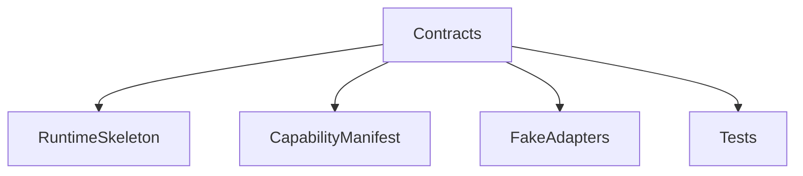

# Phase 0: Foundation

## Purpose

Phase 0 establishes project contracts, documentation, schemas, and test harnesses before broad implementation begins.

## Overview

This phase creates the repository structure, core contracts, capability manifest schema, permission model, event schema, and fake adapter test harness.

## Motivation

Atlas needs strong boundaries before it controls local machine resources.

## Objectives

- Define core contracts for planning, runtime, capabilities, permissions, events, memory, and adapters.
- Implement schema validation.
- Create fake adapters for deterministic tests.
- Establish local development and documentation workflow.

## Deliverables

- Contract modules
- Capability manifest schema
- Permission schema
- Event schema
- Fake adapter harness
- Initial test suite

## Architecture



## Components

Contracts, validators, fake adapters, documentation checks, and test fixtures.

## Folder Structure

```text
atlas/core/contracts/
atlas/core/capabilities/
atlas/core/security/
atlas/core/events/
tests/unit/
tests/fixtures/
```

## Internal APIs

`Plan`, `Capability`, `CapabilityRequest`, `CapabilityResult`, `PermissionRequest`, `PolicyDecision`, `Event`, and `AdapterPort`.

## External Dependencies

Use only standard libraries and schema tooling with compatible licensing if needed.

## Linux APIs

None required in Phase 0.

## Open Source Projects

Evaluate schema validation libraries and documentation tooling.

## What To Wrap

No OS capabilities yet.

## What To Fork

Nothing.

## Implementation Steps

1. Create contract packages.
2. Implement schema validation.
3. Add fake adapters.
4. Add capability manifest validation.
5. Add permission policy skeleton.
6. Add unit tests and documentation checks.

## Testing

Unit tests for schema validation, contract serialization, fake adapter behavior, and manifest validation.

## Definition Of Done

All Phase 0 contracts are documented, validated, tested, and referenced from the handbook.

## Stretch Goals

Generate human-readable API docs from schemas.

## Risk Analysis

Over-design is the main risk. Keep contracts minimal but explicit.

## Migration Strategy

Contract changes before Phase 1 may be breaking, but must be documented.

## Security

Default permission policy denies all mutation.

## Future Improvements

Add contract compatibility tests when versioning begins.

## References

- [API Contracts](/code/ATLAS/docs/api/contracts.md)
- [Testing Strategy](/code/ATLAS/docs/testing/strategy.md)
