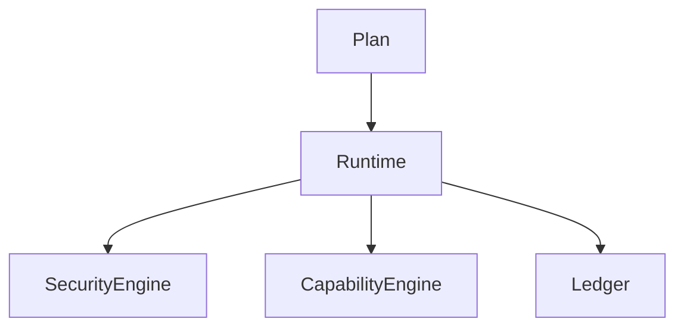

# Phase 1: Local Runtime

## Purpose

Phase 1 builds the deterministic runtime that executes approved capability plans locally.

## Overview

This phase implements runtime validation, transaction logging, permission checks, capability execution, verification, and recovery for fake and read-only capabilities.

## Motivation

The runtime is Atlas's safety boundary. It must exist before real filesystem, terminal, browser, or desktop mutation.

## Objectives

- Execute typed plans through a runtime engine.
- Enforce permission decisions.
- Record execution transactions.
- Verify capability outcomes.
- Support idempotent replay.

## Deliverables

- Runtime engine
- Transaction ledger
- Capability runner
- Verification hooks
- Recovery hooks
- Read-only sample capabilities

## Architecture



## Components

Runtime engine, security gate, capability registry, transaction manager, verifier, and local log store.

## Folder Structure

```text
atlas/core/runtime/
atlas/core/capabilities/builtin/
atlas/observability/
tests/integration/runtime/
```

## Internal APIs

`Runtime.execute`, `TransactionManager.begin`, `CapabilityEngine.execute`, `Verifier.verify`.

## External Dependencies

Prefer no external runtime dependency until storage choice is locked.

## Linux APIs

None required for fake adapters; read-only filesystem inspection may use portable filesystem APIs.

## Open Source Projects

Evaluate SQLite libraries for transaction ledger persistence.

## What To Wrap

Wrap filesystem read operations behind `FilesystemPort`.

## What To Fork

Nothing.

## Implementation Steps

1. Implement plan validation.
2. Implement runtime execution loop.
3. Add security decision integration.
4. Add transaction logging.
5. Add verification result handling.
6. Add idempotency tests.

## Testing

Unit, integration, failure, recovery, security, regression, and acceptance tests for runtime behavior.

## Definition Of Done

A read-only capability plan executes end to end with logs, permission checks, verification, and replay.

## Stretch Goals

Add a local trace viewer.

## Risk Analysis

Retry and rollback semantics can become inconsistent. Keep side-effect tracking explicit.

## Migration Strategy

Persisted transaction schema must include version fields from the start.

## Security

Runtime must fail closed if permission or audit subsystems fail.

## Future Improvements

Add durable queues and crash recovery.

## References

- [Runtime Architecture](/code/ATLAS/docs/architecture/runtime.md)
- [Security](/code/ATLAS/docs/architecture/security.md)
