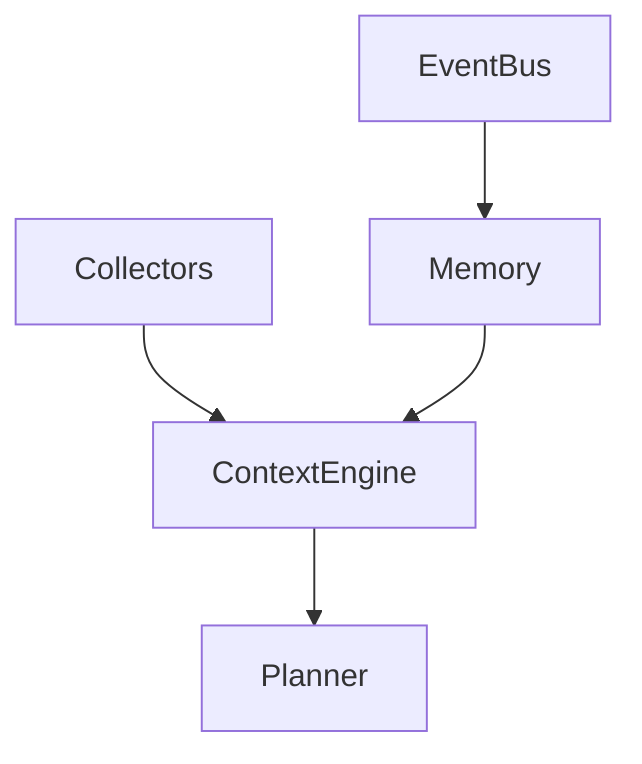

# Phase 2: Context and Memory

## Purpose

Phase 2 gives Atlas durable local understanding of projects, files, events, and user workflow traces.

## Overview

This phase implements the context engine, memory store, event bus persistence, retention policy, and project/file indexing.

## Motivation

Atlas should maintain understanding over time instead of rediscovering the machine for every request.

## Objectives

- Build scoped context snapshots.
- Persist events and workflow traces.
- Store durable facts with provenance.
- Add retention and deletion controls.
- Index projects and files incrementally.

## Deliverables

- Context engine
- Memory store
- Event bus
- Retention policy
- Filesystem and Git collectors

## Architecture



## Components

Collectors, normalizers, memory store, event bus, retention manager, and context snapshot builder.

## Folder Structure

```text
atlas/core/context/
atlas/core/memory/
atlas/core/events/
atlas/integrations/filesystem/
atlas/integrations/git/
```

## Internal APIs

`ContextEngine.snapshot`, `MemoryStore.search`, `EventBus.publish`, `Collector.collect`.

## External Dependencies

SQLite, filesystem watcher candidate, Git integration candidate.

## Linux APIs

Use filesystem metadata, inotify-compatible watchers where wrapped, and Git CLI or library through adapters.

## Open Source Projects

Evaluate watchdog-style file watchers, libgit2 bindings, and local vector indexes.

## What To Wrap

Wrap filesystem watching and Git status operations.

## What To Fork

Nothing unless a critical dependency is abandoned and small enough to maintain.

## Implementation Steps

1. Implement event bus persistence.
2. Implement memory schema.
3. Add retention policy.
4. Add filesystem collector.
5. Add Git collector.
6. Build scoped snapshots.

## Testing

Unit, integration, system, performance, failure, recovery, security, regression, and acceptance tests for context freshness and memory controls.

## Definition Of Done

Atlas can summarize a local project from indexed files and Git state using a scoped context snapshot with provenance.

## Stretch Goals

Add optional local embeddings.

## Risk Analysis

Context may become stale or too broad. Track freshness and sensitivity per fact.

## Migration Strategy

All memory schemas must be migratable from first persistence.

## Security

Sensitive files must not enter planner context without policy approval.

## Future Improvements

Add user-facing memory review and deletion UI.

## References

- [Context Engine](/code/ATLAS/docs/architecture/context-engine.md)
- [Memory](/code/ATLAS/docs/architecture/memory.md)
