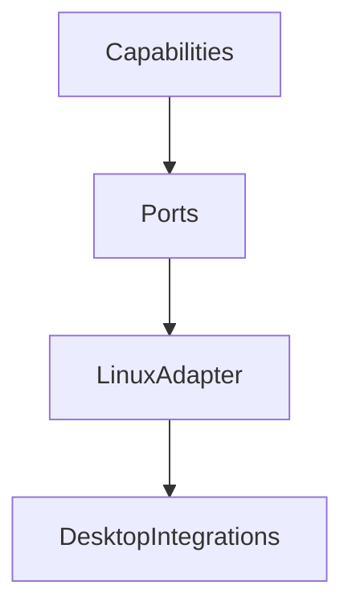

# Phase 3: Desktop Integrations

## Purpose

Phase 3 connects Atlas to Linux desktop, browser, terminal, clipboard, notifications, Docker, and application state.

## Overview

This phase adds real adapter implementations while preserving core platform independence.

## Motivation

Atlas becomes useful as an operating layer when it can coordinate real local applications safely.

## Objectives

- Implement Linux adapter ports.
- Add terminal runtime behind scoped execution.
- Add browser inventory and safe extraction.
- Add clipboard and notification support.
- Add Docker and application discovery.

## Deliverables

- Linux adapter
- Terminal integration
- Browser integration
- Clipboard integration
- Notification integration
- Docker integration
- Adapter conformance tests

## Architecture



## Components

Filesystem, terminal, browser, desktop, window manager, clipboard, notification, Git, Docker, and application adapters.

## Folder Structure

```text
atlas/adapters/linux/
atlas/integrations/terminal/
atlas/integrations/browser/
atlas/integrations/desktop/
atlas/integrations/docker/
tests/integration/adapters/
```

## Internal APIs

Adapter port methods defined in [API Contracts](/code/ATLAS/docs/api/contracts.md).

## External Dependencies

Candidates include Chrome DevTools Protocol libraries, Docker SDK or CLI wrapper, and desktop notification libraries.

## Linux APIs

XDG directories, D-Bus notifications, process APIs, filesystem APIs, shell execution, Docker socket or CLI, and browser debugging interfaces.

## Open Source Projects

Evaluate each dependency with the template in [Dependency Evaluations](/code/ATLAS/docs/research/dependency-evaluations.md).

## What To Wrap

Wrap Git, Docker, browser protocol, notification, and filesystem watcher libraries.

## What To Fork

Nothing initially.

## Implementation Steps

1. Implement adapter conformance tests.
2. Implement Linux filesystem and process ports.
3. Implement terminal runtime with command policy.
4. Implement notification and clipboard ports.
5. Implement browser read-only inventory.
6. Implement Docker inventory.

## Testing

Include live adapter tests, permission tests, command denial tests, browser profile scope tests, and rollback tests for file operations.

## Definition Of Done

Atlas can execute a user-approved local workflow involving project inspection, terminal command execution, Git state review, and notification reporting.

## Stretch Goals

Add desktop window inventory through accessibility APIs.

## Risk Analysis

Desktop environments vary widely. Use capability detection and clear unsupported-state errors.

## Migration Strategy

Adapter contract changes require conformance-test updates.

## Security

Terminal, browser, clipboard, and Docker access are high-risk and require strict scopes.

## Future Improvements

Add Windows and macOS adapter implementations after Linux stabilizes.

## References

- [Runtime Integrations](/code/ATLAS/docs/specifications/runtime-integrations.md)
- [Linux Adapter](/code/ATLAS/docs/specifications/linux-adapter.md)
