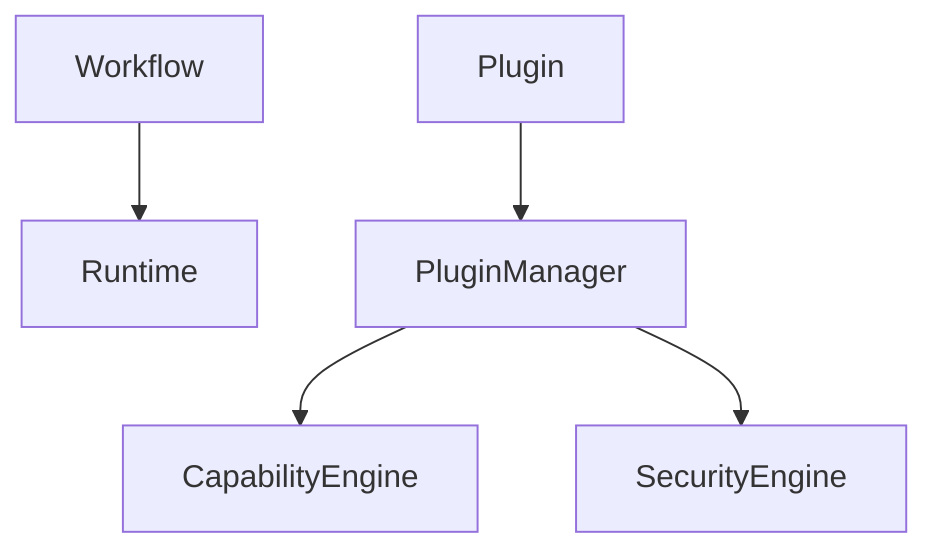

# Phase 4: Workflows and Plugins

## Purpose

Phase 4 makes Atlas extensible and repeatable through workflows and plugins.

## Overview

This phase implements workflow definitions, workflow execution traces, plugin manifests, local plugin loading, plugin capability registration, and plugin test harnesses.

## Motivation

Atlas should learn and repeat user routines while allowing contributors to add integrations outside core.

## Objectives

- Implement workflow registry and compiler.
- Implement local plugin manager.
- Register plugin capabilities safely.
- Add workflow trace replay.
- Add plugin validation tests.

## Deliverables

- Workflow engine
- Plugin manager
- Plugin manifest schema
- Local plugin loading
- Example plugins
- Plugin test harness

## Architecture



## Components

Workflow registry, compiler, trace store, plugin installer, manifest validator, loader, and sandbox boundary.

## Folder Structure

```text
atlas/core/workflows/
atlas/core/plugins/
plugins/examples/
tests/integration/plugins/
```

## Internal APIs

`WorkflowEngine.compile`, `PluginManager.install`, `PluginManager.load`, and `CapabilityEngine.register`.

## External Dependencies

No remote registry dependency. Use local filesystem loading first.

## Linux APIs

Only local filesystem loading is required in this phase.

## Open Source Projects

Evaluate sandboxing and package-signing approaches.

## What To Wrap

Wrap plugin package validation and optional sandbox runtime.

## What To Fork

Nothing.

## Implementation Steps

1. Define workflow schema.
2. Implement workflow compiler.
3. Implement trace replay.
4. Define plugin manifest schema.
5. Implement local plugin loading.
6. Add example plugin capabilities.

## Testing

Test plugin manifest validation, workflow execution, compatibility checks, permission declaration, malicious plugin inputs, and trace replay.

## Definition Of Done

A local plugin can register a safe capability, and a workflow can invoke it through the runtime with permission enforcement and trace logging.

## Stretch Goals

Add plugin scaffolding CLI.

## Risk Analysis

Plugin loading can undermine security. Keep all plugin operations behind runtime grants.

## Migration Strategy

Version plugin manifests and workflow definitions from the beginning.

## Security

Plugins are untrusted by default and cannot access adapters without scoped handles.

## Future Improvements

Signed plugins, marketplace metadata, and remote registries.

## References

- [Workflow Engine](/code/ATLAS/docs/architecture/workflow-engine.md)
- [Plugin SDK](/code/ATLAS/docs/plugins/sdk.md)
