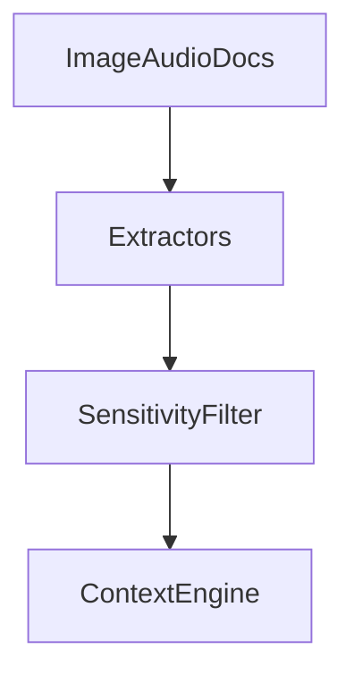

# Phase 5: Voice, OCR, and Documents

## Purpose

Phase 5 adds multimodal understanding through voice, OCR, and document processing.

## Overview

This phase introduces local-first speech transcription, OCR extraction, document parsing, and multimodal context ingestion.

## Motivation

The user's computer state includes images, PDFs, scanned documents, audio, and on-screen text.

## Objectives

- Add OCR adapter port and local implementation.
- Add speech transcription port and local implementation.
- Add document parser integration.
- Add sensitivity filters for extracted content.
- Add multimodal acceptance tests.

## Deliverables

- OCR integration
- Speech integration
- Document processing integration
- Multimodal context collectors
- Evaluation fixtures

## Architecture



## Components

OCR engine wrapper, speech-to-text wrapper, document parser wrapper, metadata extractor, and redaction filters.

## Folder Structure

```text
atlas/integrations/ocr/
atlas/integrations/voice/
atlas/integrations/documents/
tests/fixtures/multimodal/
```

## Internal APIs

`OCRPort.extract`, `SpeechPort.transcribe`, `DocumentPort.parse`.

## External Dependencies

Evaluate local OCR, speech, and document parsing libraries before selecting defaults.

## Linux APIs

Microphone and screen capture must use explicit user permission and platform APIs.

## Open Source Projects

Evaluate Tesseract-style OCR, local speech engines, PDF parsers, and office document parsers.

## What To Wrap

Wrap selected OCR, speech, and document parsers.

## What To Fork

Avoid forks unless a small parser patch is essential and upstream is inactive.

## Implementation Steps

1. Evaluate dependencies.
2. Implement local parser wrappers.
3. Add sensitivity filters.
4. Add fixtures.
5. Add context collector integration.
6. Add workflow examples.

## Testing

Test noisy OCR, offline speech, malformed documents, large files, redaction, performance, and permission denial.

## Definition Of Done

Atlas can extract scoped context from a local document or image and use it in a verified workflow without cloud services.

## Stretch Goals

Add layout-aware extraction and speaker diarization if local tooling is mature.

## Risk Analysis

Multimodal extraction can be slow and privacy-sensitive. Keep it explicit, scoped, and cancellable.

## Migration Strategy

Store extracted content with provenance and retention policy.

## Security

Screen capture and microphone access require visible user approval.

## Future Improvements

Add multimodal workflow triggers and document memory graphs.

## References

- [Multimodal Processing](/code/ATLAS/docs/specifications/multimodal-processing.md)
