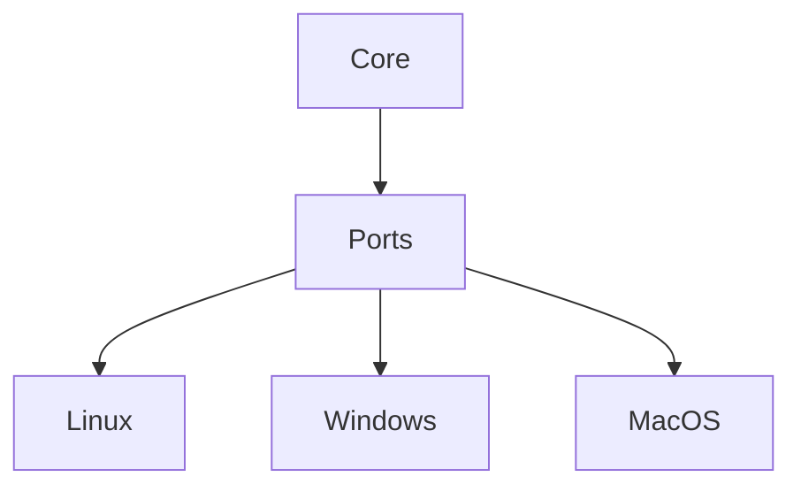

# Phase 6: Cross Platform Expansion

## Purpose

Phase 6 expands Atlas beyond Linux while preserving a platform-independent core.

## Overview

This phase implements Windows and macOS adapters against existing conformance tests.

## Motivation

Atlas's long-term vision is a cross-platform operating layer. Platform expansion should validate the adapter architecture, not rewrite core behavior.

## Objectives

- Implement Windows adapter.
- Implement macOS adapter.
- Expand adapter conformance suites.
- Add platform-specific packaging notes.
- Document unsupported features clearly.

## Deliverables

- Windows adapter implementation
- macOS adapter implementation
- Cross-platform conformance tests
- Platform packaging plans

## Architecture



## Components

Adapter ports, platform implementations, packaging, conformance tests, and permission-flow documentation.

## Folder Structure

```text
atlas/adapters/windows/
atlas/adapters/macos/
tests/integration/adapters/windows/
tests/integration/adapters/macos/
```

## Internal APIs

Existing adapter contracts from [Cross Platform Layer](/code/ATLAS/docs/architecture/cross-platform-layer.md).

## External Dependencies

Platform-specific APIs and libraries selected after research.

## Linux APIs

Linux remains supported and serves as the reference implementation.

## Open Source Projects

Evaluate platform-specific accessibility, notification, shell, and packaging tooling.

## What To Wrap

Wrap OS-native APIs behind existing adapter ports.

## What To Fork

Nothing by default.

## Implementation Steps

1. Audit Linux assumptions in core.
2. Expand conformance tests.
3. Implement Windows adapter.
4. Implement macOS adapter.
5. Add packaging and install tests.
6. Update documentation and support matrix.

## Testing

Run full contract, adapter conformance, permission, packaging, install, rollback, and acceptance tests per platform.

## Definition Of Done

A representative Atlas workflow runs on Linux, Windows, and macOS through the same core capability contracts.

## Stretch Goals

Add platform-specific UX polish for approvals and notifications.

## Risk Analysis

Platform behavior differs substantially around permissions, shells, windows, and app automation.

## Migration Strategy

No core contract changes without compatibility review.

## Security

Respect platform-native permission prompts and never bypass OS privacy controls.

## Future Improvements

Add mobile companion surfaces and remote worker support.

## References

- [Windows Adapter](/code/ATLAS/docs/specifications/windows-adapter.md)
- [macOS Adapter](/code/ATLAS/docs/specifications/macos-adapter.md)
