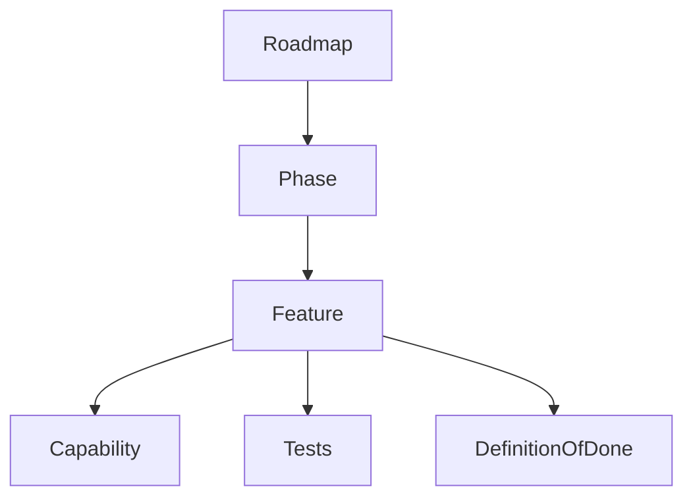
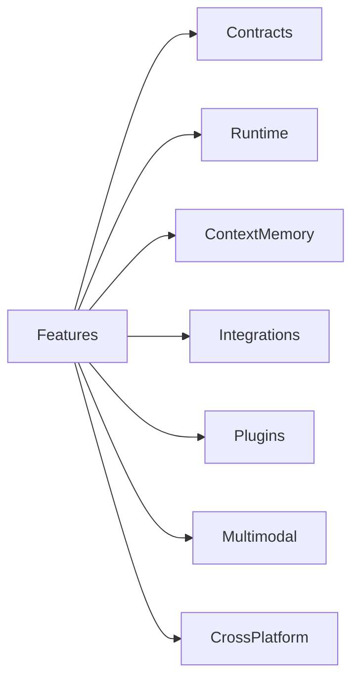
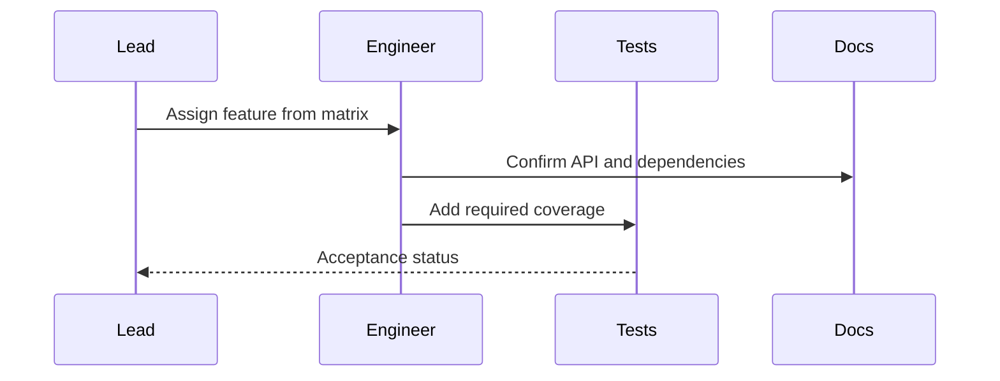
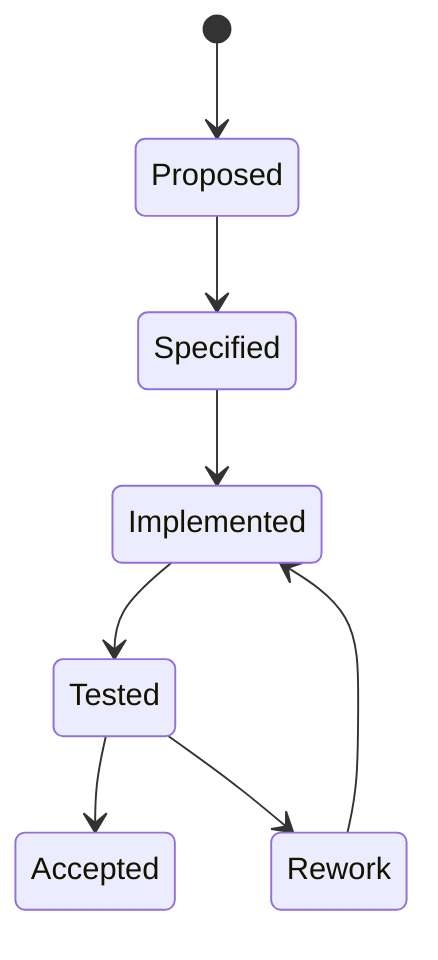

# Phase Feature Matrix

## Purpose

This document expands the Atlas phases into feature-level implementation guidance.

## Problem Statement

The phase plans define major deliverables, but the audit standard requires every feature to explain why it exists, how it works, workflows, architecture, data flow, APIs, dependencies, edge cases, failure handling, recovery, performance, security, future extension points, and definition of done.

## Why This Subsystem Exists

The phase feature matrix lets engineers start implementation without waiting for additional design meetings.

## User Stories

- As a phase owner, I need to know exactly which features belong in my phase.
- As a contributor, I need feature boundaries and acceptance criteria.
- As a reviewer, I need security and testing expectations for each feature.

## Functional Requirements

- Break each phase into buildable features.
- Define developer and user workflows.
- Connect each feature to APIs, dependencies, tests, and security gates.

## Non-Functional Requirements

- Features must preserve dependency direction.
- Features must work offline.
- Features must be testable with fake adapters before live adapters.

## Architecture

## Component Diagram

## Sequence Diagrams

## State Diagrams

## Folder Structure

Feature implementation follows [Implementation Map](/code/ATLAS/docs/implementation/implementation-map.md).

## Internal Modules

Each feature names its owning subsystem and dependent modules.

## Public Interfaces

Feature APIs are defined by [API Contracts](/code/ATLAS/docs/api/contracts.md), capability manifests, CLI commands, and plugin SDK contracts.

## Data Flow

Feature data flow must identify input, context lookup, runtime execution, storage writes, events, and user-visible result.

## Lifecycle

Features move from specification to implementation to acceptance test to release gate.

## Threading Model

Features that run background work must define worker ownership, cancellation, and shared-state boundaries.

## IPC Model

Features that cross CLI/service boundaries must use the local IPC model in [Implementation Map](/code/ATLAS/docs/implementation/implementation-map.md).

## Storage

Features that persist data must define schema, migrations, retention, export, and deletion behavior.

## Phase 0 Features

| Feature | Why It Exists | How It Works | APIs | Dependencies | Edge Cases | DoD |
| --- | --- | --- | --- | --- | --- | --- |
| Contract schemas | Stabilize subsystem boundaries | Define serializable plan, capability, event, permission, and adapter types | `Plan`, `CapabilityRequest`, `Event` | Schema tooling only | Version mismatch, invalid model output | Schema tests and compatibility fixtures pass |
| Fake adapters | Test core without OS side effects | Simulate ports in memory | `AdapterPort` | None | Simulated failure, partial effect | Runtime tests run fully offline |
| Manifest validator | Prevent unsafe capability declarations | Validate id, inputs, permissions, effects, verification | `CapabilityManifest` | Schema tooling | Under-declared effects | Invalid manifests fail with actionable errors |

## Phase 1 Features

| Feature | Why It Exists | How It Works | APIs | Dependencies | Edge Cases | DoD |
| --- | --- | --- | --- | --- | --- | --- |
| Runtime execution loop | Deterministic plan execution | Validate, authorize, execute, verify, log | `Runtime.execute` | Contracts | Invalid graph, duplicate step | End-to-end read-only plan passes |
| Transaction ledger | Recovery and audit | Persist planned/applied effects | `ExecutionTransaction` | SQLite candidate | Crash mid-step | Replay tests pass |
| Permission gate | Safety boundary | Ask security engine before steps | `SecurityEngine.authorize` | Policy store | Expired grant | Denial blocks execution |
| Verification engine | Avoid false completion | Compare expected and observed effects | `Verifier.verify` | Adapter observations | Stale state | Failed verification prevents dependent steps |

## Phase 2 Features

| Feature | Why It Exists | How It Works | APIs | Dependencies | Edge Cases | DoD |
| --- | --- | --- | --- | --- | --- | --- |
| Event bus | Decouple subsystems | Publish immutable events to subscribers | `EventBus.publish` | SQLite | Subscriber failure | Dead-letter and replay tests pass |
| Memory store | Durable local understanding | Store facts with provenance and retention | `MemoryStore` | SQLite, optional vector index | Sensitive fact, stale fact | Delete/export tests pass |
| Context snapshots | Scope planner input | Collect current state and memory into immutable snapshot | `ContextEngine.snapshot` | Collectors | Huge repo, unreadable file | Snapshot has provenance and sensitivity |
| Filesystem/Git collectors | Project awareness | Index files and repository state | `Collector.collect` | Watchdog, Git wrapper | Nested repos, symlinks | Project summary scenario passes |

## Phase 3 Features

| Feature | Why It Exists | How It Works | APIs | Dependencies | Edge Cases | DoD |
| --- | --- | --- | --- | --- | --- | --- |
| Linux filesystem adapter | Real file operations | Enforce scopes, perform VFS operations, verify | `FilesystemPort` | Linux APIs | Cross-device move, symlink escape | Conformance tests pass |
| Terminal runtime | Approved commands | Run scoped process with timeout and stream logs | `ProcessPort` | POSIX process APIs | Hanging command, prompt | Cancellation and timeout tests pass |
| Browser inventory | Browser context | Read approved profile/tab state | `BrowserPort` | Playwright or CDP | Locked profile, auth pages | Read-only browser test passes |
| Notifications | User feedback | Post D-Bus notification | `NotificationPort` | D-Bus notification spec | No notification server | Graceful degraded result |
| Docker inventory | Container awareness | Query Engine API read-only | `DockerPort` | Docker SDK/API | Socket denied | No mutation without grant |

## Phase 4 Features

| Feature | Why It Exists | How It Works | APIs | Dependencies | Edge Cases | DoD |
| --- | --- | --- | --- | --- | --- | --- |
| Workflow compiler | Repeat routines | Convert workflow definitions into plans | `WorkflowEngine.compile` | Contracts | Version mismatch | Trace replay tests pass |
| Plugin manifest | Safe extension | Declare exports and permissions | `PluginManifest` | Schema tooling | Hidden permission | Malicious manifest rejected |
| Local plugin loader | Developer extensibility | Load approved local plugin package | `PluginManager.load` | Sandbox candidate | Broken entrypoint | Plugin failure isolated |

## Phase 5 Features

| Feature | Why It Exists | How It Works | APIs | Dependencies | Edge Cases | DoD |
| --- | --- | --- | --- | --- | --- | --- |
| OCR extraction | Read image text offline | Wrap OCR engine and return text/confidence | `OCRPort.extract` | Tesseract candidate | Low confidence, secrets | Screenshot scenario passes |
| Speech transcription | Voice input offline | Wrap local STT engine | `SpeechPort.transcribe` | whisper.cpp candidate | Noise, large model | Local transcription fixture passes |
| Document parsing | Understand PDFs/docs | Extract text, metadata, structure | `DocumentPort.parse` | Parser candidates | Malformed PDF | Parser failure is isolated |

## Phase 6 Features

| Feature | Why It Exists | How It Works | APIs | Dependencies | Edge Cases | DoD |
| --- | --- | --- | --- | --- | --- | --- |
| Windows adapter | Cross-platform reach | Implement existing ports | Adapter ports | Windows APIs | ACLs, PowerShell differences | Conformance tests pass |
| macOS adapter | Cross-platform reach | Implement existing ports | Adapter ports | macOS APIs | Privacy prompts | Conformance tests pass |
| Packaging | User installability | Build signed artifacts | Release interfaces | Packaging tools | Upgrade rollback | Install/uninstall tests pass |

## Error Handling

All features use the shared taxonomy in [Error Handling and Recovery](/code/ATLAS/docs/specifications/error-recovery.md).

## Recovery Strategy

Every mutating feature must define pre-state capture, applied effects, rollback capability, and residual-risk reporting.

## Security

Security requirements are release-blocking. Missing permission declarations are implementation defects.

## Performance Considerations

Each feature must define timeouts, cancellation, resource budgets, and benchmark coverage before acceptance.

## Future Extension Points

Feature extension points include new capabilities, plugin-provided collectors, additional adapters, richer local models, and workflow templates.

## References

- [Roadmap](/code/ATLAS/ROADMAP.md)
- [Implementation Map](/code/ATLAS/docs/implementation/implementation-map.md)
- [Testing Strategy](/code/ATLAS/docs/testing/strategy.md)

## Related Documents

- [Core Feature Scenarios](/code/ATLAS/docs/features/core-feature-scenarios.md)
- [Dependency Catalog](/code/ATLAS/docs/research/dependency-catalog.md)
