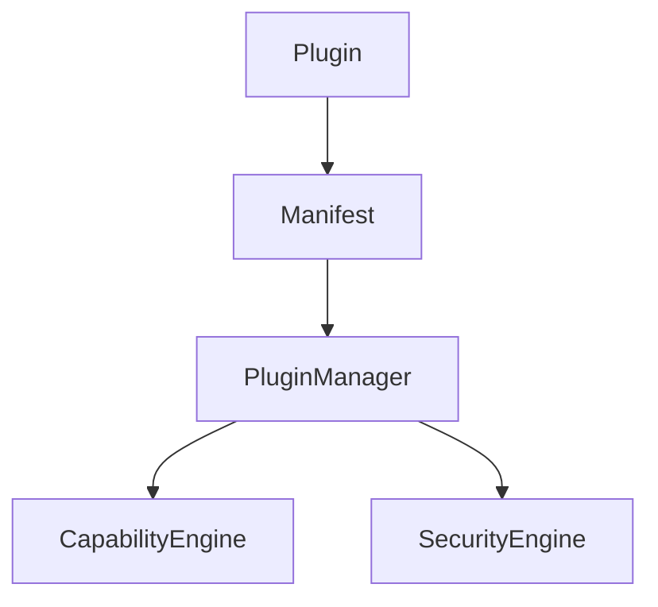
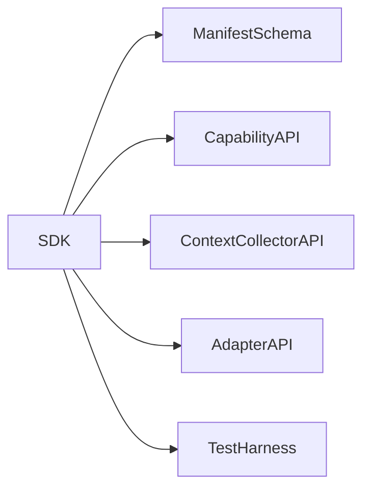
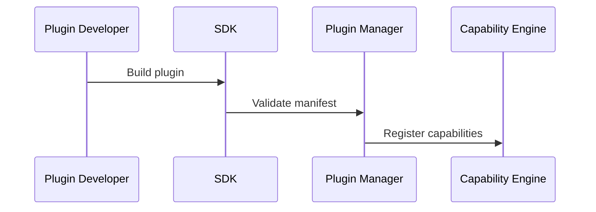

# Atlas Plugin SDK

## Purpose

This document defines how plugins extend Atlas safely.

## Overview

Plugins may provide capabilities, context collectors, adapter implementations, workflows, model providers, or UI extensions. They are untrusted until validated and authorized.

## Motivation

Atlas cannot ship every possible application integration in core. A plugin SDK allows extension while preserving the runtime and security model.

## Architecture



## Design Decisions

Every plugin includes a manifest with id, version, author, exported components, permissions, compatibility range, license, entrypoints, and declared dependencies.

## Component Diagram



## Sequence Diagram



## Folder Structure

```text
docs/plugins/
  sdk.md
  manifest-schema.md
plugins/
  examples/
```

## Public Interfaces

```text
PluginManifest(id, version, atlas_version, capabilities, permissions, entrypoints)
PluginContext(log, storage, permissions, adapters)
register_capability(manifest, executor)
```

## Implementation Strategy

Start with local plugins loaded from a development directory. Provide manifest validation and a test harness before remote installation.

## Testing

Plugin tests must include manifest validation, permission declaration, capability execution with fake adapters, and malicious input cases.

## Security

Plugins cannot receive unrestricted OS access. The runtime supplies scoped adapter handles and records plugin-originated audit events.

## Future Improvements

Add signing, package registries, compatibility scanners, and automated review checks.

## References

- [Plugin Manager](/code/ATLAS/docs/architecture/plugin-manager.md)
- [Permissions](/code/ATLAS/docs/specifications/permissions.md)
