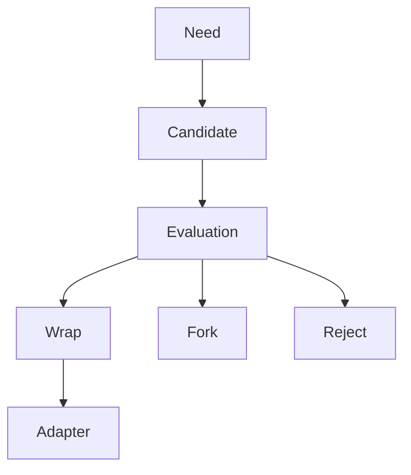
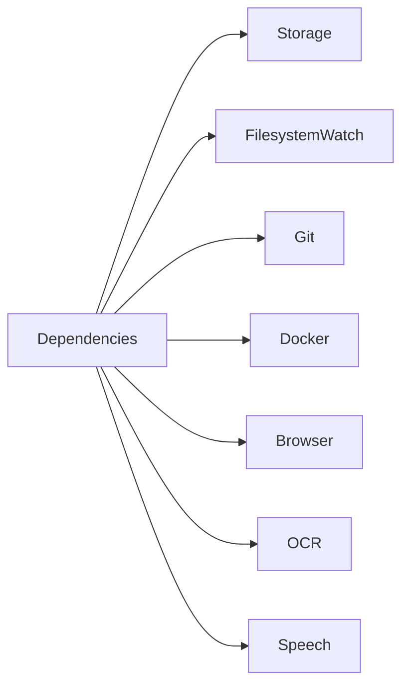
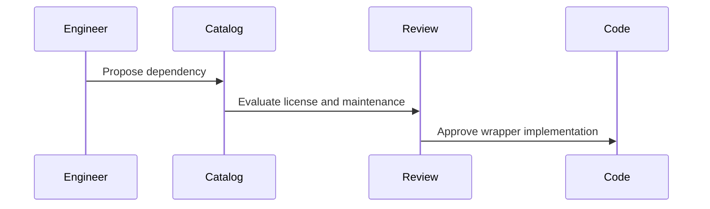
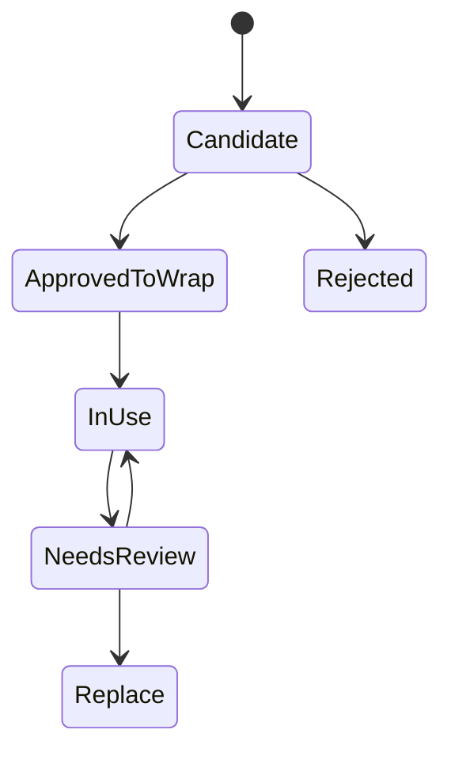

# Dependency Catalog

## Purpose

This document records concrete dependency candidates for Atlas and the current recommendation for each.

## Problem Statement

Atlas needs mature local libraries for storage, filesystem watching, Git, Docker, browser automation, OCR, speech, and desktop integration. Choosing poorly would increase maintenance burden or compromise security.

## Why This Subsystem Exists

Dependency decisions are architecture decisions. They affect licensing, packaging, offline behavior, reliability, and long-term maintainability.

## User Stories

- As a contributor, I need to know which dependencies are acceptable before writing integration code.
- As a maintainer, I need a review date and wrap/fork decision for every major dependency.
- As a packager, I need licenses and native dependency implications.
- As a security reviewer, I need to know which dependencies touch sensitive local data.

## Functional Requirements

- Identify repository or canonical project location.
- Record license, purpose, alternatives, advantages, disadvantages, maintenance status, integration strategy, and wrap/fork decision.
- State what Atlas should reuse, modify, and leave untouched.

## Non-Functional Requirements

- Prefer local-first and offline-capable dependencies.
- Prefer actively maintained projects with compatible licenses.
- Avoid forks unless the project is abandoned or Atlas needs a small, auditable patch that upstream cannot accept.

## Architecture

## Component Diagram

## Sequence Diagrams

## State Diagrams

## Folder Structure

Dependency wrappers belong under the adapter or integration that owns them. Research notes remain under `docs/research`.

## Internal Modules

Each dependency gets a wrapper module, conformance tests, and a compatibility shim if the upstream API is volatile.

## Public Interfaces

Dependencies must not become public Atlas interfaces. Public contracts are Atlas ports and capability manifests.

## Data Flow

External library output is normalized into Atlas contracts before reaching core services.

## Lifecycle

Each dependency has a review date, upgrade policy, and replacement plan. Re-review on major releases, security advisories, or packaging failures.

## Threading Model

Dependencies that run blocking work must be isolated in worker pools or async wrappers.

## IPC Model

Dependencies that communicate through sockets, subprocesses, browser ports, or Docker sockets must be mediated by adapter permissions.

## Storage

Dependency metadata is documented here. Runtime dependency state belongs in Atlas storage only through wrapper-owned schemas.

## Evaluations

Audit date: 2026-08-01. Re-review each dependency before first code adoption and again on major upstream releases.

### SQLite

| Field | Decision |
| --- | --- |
| Review Date | 2026-08-01 |
| Repository | https://sqlite.org |
| License | Public domain |
| Purpose | Local durable storage for plans, events, memory metadata, policies, plugin registry, and traces |
| Why Atlas Should Use It | Single-file, serverless, ACID, cross-platform, zero infrastructure |
| Alternatives | LMDB, RocksDB, PostgreSQL, DuckDB |
| Advantages | Offline, stable format, widely deployed, excellent reliability profile |
| Disadvantages | Single-writer constraints require careful transaction design |
| Maintenance Status | Actively maintained; official site listed release 3.53.3 on 2026-06-26 during this audit |
| Integration Strategy | Wrap through Atlas `Storage` interfaces and migrations |
| Wrap or Fork | Wrap |
| Reuse | SQL engine, transactions, WAL, backups |
| Modify | Nothing upstream |
| Leave Untouched | SQLite core and build system |

### Watchdog

| Field | Decision |
| --- | --- |
| Review Date | 2026-08-01 |
| Repository | https://github.com/gorakhargosh/watchdog |
| License | Apache-2.0 |
| Purpose | Cross-platform filesystem event monitoring |
| Why Atlas Should Use It | Provides mature watcher abstractions and Linux inotify support |
| Alternatives | inotify bindings, watchfiles, pyinotify, polling |
| Advantages | Cross-platform path, existing Python ecosystem, permissive license |
| Disadvantages | Event semantics still require platform-specific normalization |
| Maintenance Status | Active enough for Phase 2 consideration; search results showed release 6.0.0 on 2024-11-01 |
| Integration Strategy | Wrap behind `FilesystemWatchPort`; normalize overflow and move events |
| Wrap or Fork | Wrap |
| Reuse | Watch scheduling and event delivery |
| Modify | Nothing upstream |
| Leave Untouched | Platform backend internals |

### libgit2

| Field | Decision |
| --- | --- |
| Review Date | 2026-08-01 |
| Repository | https://github.com/libgit2/libgit2 |
| License | GPLv2 with linking exception |
| Purpose | Linkable Git operations |
| Why Atlas Should Use It | Structured API avoids fragile shell parsing for many repository operations |
| Alternatives | Git CLI, GitPython, Dulwich |
| Advantages | Cross-platform, mature, used by many tools |
| Disadvantages | Native dependency, license requires care for modifications |
| Maintenance Status | Active; search results showed v1.9.3 on 2026-05-04 |
| Integration Strategy | Evaluate for read-heavy repository state; keep CLI fallback |
| Wrap or Fork | Wrap |
| Reuse | Repository discovery, status, object inspection |
| Modify | Nothing upstream |
| Leave Untouched | Core Git implementation |

### GitPython

| Field | Decision |
| --- | --- |
| Review Date | 2026-08-01 |
| Repository | https://github.com/gitpython-developers/GitPython |
| License | BSD-3-Clause |
| Purpose | Python Git integration |
| Why Atlas Should Use It | Simple integration if Atlas implementation is Python-first |
| Alternatives | libgit2 bindings, Git CLI, Dulwich |
| Advantages | Easy developer experience, production/stable PyPI classifier |
| Disadvantages | Often shells out to Git; still requires command policy and output care |
| Maintenance Status | Active; PyPI showed 3.1.53 on 2026-07-20 during this audit |
| Integration Strategy | Consider for Phase 2 prototype, but keep behind `GitPort` |
| Wrap or Fork | Wrap |
| Reuse | Repository object model and common operations |
| Modify | Nothing upstream |
| Leave Untouched | Git command execution internals |

### Docker Engine API and Docker SDK for Python

| Field | Decision |
| --- | --- |
| Review Date | 2026-08-01 |
| Repository | https://github.com/docker/docker-py and https://docs.docker.com/reference/api/engine/ |
| License | Docker Engine is Apache-2.0; SDK license must be checked in repository before vendoring |
| Purpose | Container inventory and approved container operations |
| Why Atlas Should Use It | Official Engine API is versioned and SDKs exist for Python and Go |
| Alternatives | Docker CLI wrapper, direct HTTP client, Podman APIs |
| Advantages | Structured API, version negotiation, avoids parsing CLI tables |
| Disadvantages | Docker socket is high authority; daemon may be absent |
| Maintenance Status | Docker docs current during audit; SDK docs showed 7.2.0 pages |
| Integration Strategy | Start read-only inventory; require explicit grants for mutation |
| Wrap or Fork | Wrap |
| Reuse | Client connection, container/image/network/volume APIs |
| Modify | Nothing upstream |
| Leave Untouched | Docker daemon and SDK internals |

### Playwright

| Field | Decision |
| --- | --- |
| Review Date | 2026-08-01 |
| Repository | https://github.com/microsoft/playwright |
| License | Apache-2.0 |
| Purpose | Browser automation and testing |
| Why Atlas Should Use It | Mature cross-browser automation with strong testing ecosystem |
| Alternatives | Chrome DevTools Protocol libraries, Selenium, Puppeteer |
| Advantages | Chromium, Firefox, WebKit support; isolation and auto-waiting |
| Disadvantages | Browser downloads can be large; broad automation authority requires strict scopes |
| Maintenance Status | Active; search results showed roughly 91k stars and current browser support |
| Integration Strategy | Use for tests and controlled browser workflows, not as raw planner tool |
| Wrap or Fork | Wrap |
| Reuse | Browser contexts, page inspection, screenshots in approved workflows |
| Modify | Nothing upstream |
| Leave Untouched | Browser engine packaging and Playwright runner internals |

### Tesseract OCR

| Field | Decision |
| --- | --- |
| Review Date | 2026-08-01 |
| Repository | https://github.com/tesseract-ocr/tesseract |
| License | Apache-2.0; Leptonica dependency is BSD-style |
| Purpose | Offline OCR |
| Why Atlas Should Use It | Mature local OCR engine with no cloud dependency |
| Alternatives | local vision-language models, EasyOCR, OCRmyPDF wrappers |
| Advantages | Offline, packaged by Linux distributions, broad language data ecosystem |
| Disadvantages | Accuracy varies by layout and image quality; trained data management required |
| Maintenance Status | Active; search results showed 5.5.2 released on 2025-12-26 |
| Integration Strategy | Wrap CLI or library through `OCRPort`; store provenance and confidence |
| Wrap or Fork | Wrap |
| Reuse | OCR engine, language data packages |
| Modify | Nothing upstream |
| Leave Untouched | Recognition engine internals |

### whisper.cpp

| Field | Decision |
| --- | --- |
| Review Date | 2026-08-01 |
| Repository | https://github.com/ggml-org/whisper.cpp |
| License | MIT |
| Purpose | Local speech-to-text inference |
| Why Atlas Should Use It | Offline Whisper inference in C/C++ with broad community adoption |
| Alternatives | Vosk, Coqui STT successors, cloud speech APIs |
| Advantages | Local execution, portable, active ecosystem |
| Disadvantages | Model files are large; CPU performance varies by hardware |
| Maintenance Status | Active; search results showed roughly 52k stars and recent crawling |
| Integration Strategy | Wrap as `SpeechPort`; treat model download/configuration as explicit user setup |
| Wrap or Fork | Wrap |
| Reuse | Inference binary/library and model formats |
| Modify | Nothing upstream |
| Leave Untouched | Model runtime internals |

## Error Handling

If a dependency is missing, incompatible, or fails at runtime, the wrapper returns `DEPENDENCY_MISSING`, `UNSUPPORTED_VERSION`, `ADAPTER_UNAVAILABLE`, or `PARTIAL_EFFECT` as appropriate.

## Recovery Strategy

Dependency wrappers must not perform hidden recovery. They report state to the runtime, which selects retry or rollback.

## Security

Dependencies are not trusted with unscoped authority. Browser, Docker, OCR, speech, and filesystem wrappers all process sensitive local data and must receive only scoped inputs.

## Performance Considerations

Native libraries may block. Long-running OCR, speech, Docker calls, browser sessions, and repository scans need timeouts and cancellation.

## Definition Of Done

A dependency is approved when its wrapper has conformance tests, license notes, threat model, upgrade path, and failure behavior.

## Future Improvements

Add scored dependency templates, automated advisory checks, SBOM generation, and scheduled re-review dates.

## References

- SQLite: https://www.sqlite.org/about.html
- Watchdog: https://github.com/gorakhargosh/watchdog
- libgit2: https://github.com/libgit2/libgit2
- GitPython: https://pypi.org/project/GitPython/
- Docker Engine API: https://docs.docker.com/reference/api/engine/
- Docker SDK for Python: https://docker-py.readthedocs.io/
- Playwright: https://github.com/microsoft/playwright
- Tesseract: https://github.com/tesseract-ocr/tesseract
- whisper.cpp: https://github.com/ggml-org/whisper.cpp

## Related Documents

- [Dependency Evaluations](/code/ATLAS/docs/research/dependency-evaluations.md)
- [Linux System Interfaces](/code/ATLAS/docs/specifications/linux-system-interfaces.md)
- [Runtime Integrations](/code/ATLAS/docs/specifications/runtime-integrations.md)
