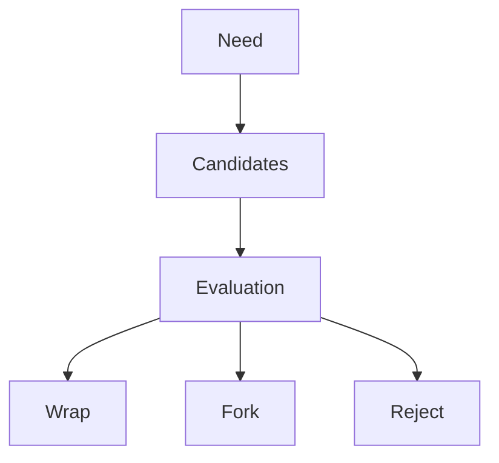
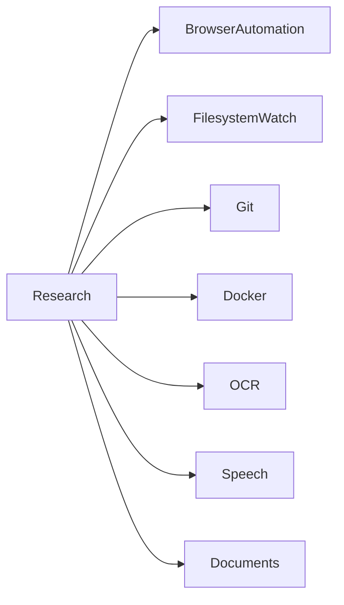
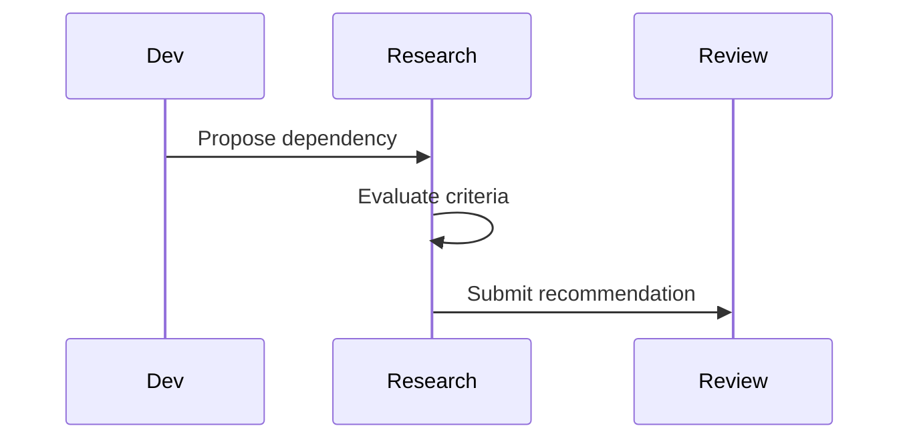

# Open Source Research and Dependency Evaluations

## Purpose

This document records how Atlas evaluates open-source dependencies before adoption.

## Overview

Atlas should wrap mature libraries when they are stable, maintained, secure, and compatible with the license. Forking is a last resort.

## Motivation

Maintaining custom implementations for filesystem watching, OCR, speech, browser control, Git, Docker, or desktop APIs would slow the project and increase risk.

## Architecture

## Design Decisions

Every dependency evaluation must document why it was chosen, alternatives, maintenance status, license, integration strategy, pros, cons, and long-term risks.

## Component Diagram

## Sequence Diagram

## Folder Structure

Detailed evaluations should be added as separate files under `docs/research`.

## Public Interfaces

Research outcomes feed adapter and capability implementation choices.

## Implementation Strategy

Initial candidates to evaluate:

| Domain | Candidate Direction | Why Evaluate |
| --- | --- | --- |
| Filesystem watching | Linux inotify wrappers and cross-platform watchers | Needed for context freshness |
| Git | libgit2 bindings or shell-wrapped Git | Needed for repository capabilities |
| Docker | Docker SDK or CLI wrapper | Needed for container context |
| Browser | Chrome DevTools Protocol libraries | Needed for browser state and safe automation |
| OCR | Tesseract wrappers and local vision models | Needed for offline OCR |
| Speech | local speech-to-text engines | Needed for offline voice |
| Documents | PDF and office document parsers | Needed for document context |

Concrete current evaluations are maintained in [Dependency Catalog](/code/ATLAS/docs/research/dependency-catalog.md). This document defines the evaluation method; the catalog records project-specific decisions and review dates.

## Testing

Dependency wrappers require conformance tests and failure injection.

## Security

Reject dependencies with unclear provenance, hostile licenses, unsafe native code posture, or weak maintenance for core surfaces.

## Future Improvements

Maintain a scored dependency registry with review dates and replacement plans.

## References

- [License](/code/ATLAS/LICENSE.md)
- [Runtime Integrations](/code/ATLAS/docs/specifications/runtime-integrations.md)
- [Dependency Catalog](/code/ATLAS/docs/research/dependency-catalog.md)
