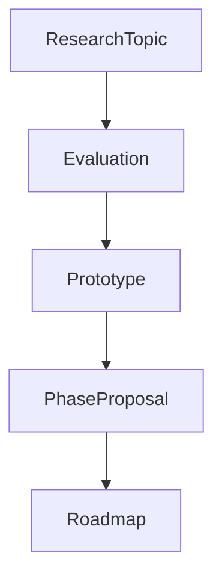
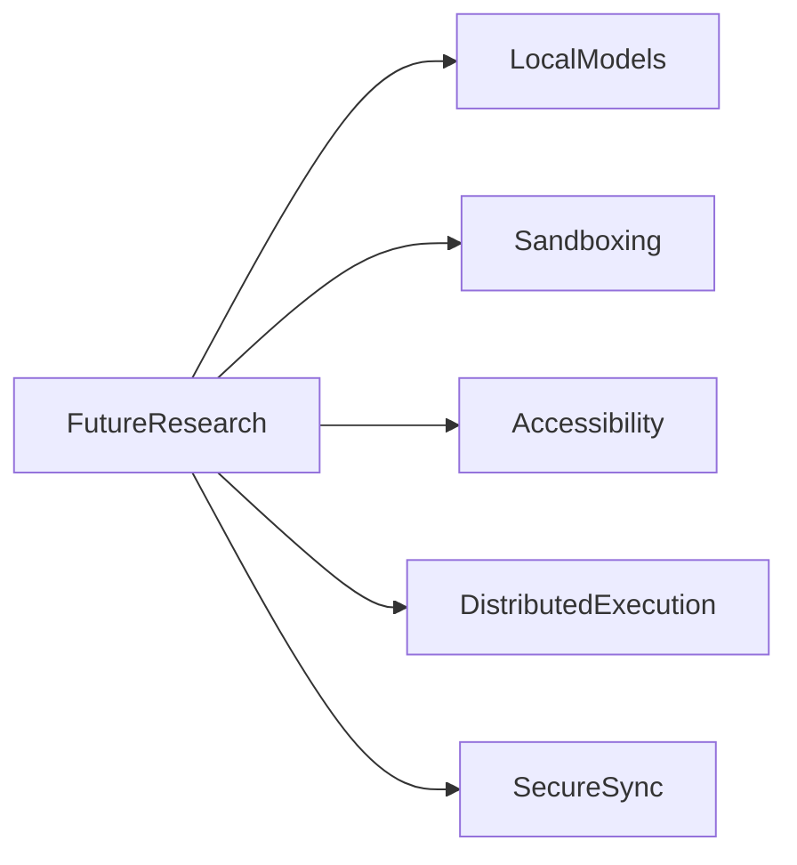
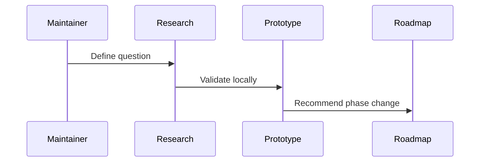

# Future Research

## Purpose

This document records strategic research areas that should inform Atlas after the foundational implementation is stable.

## Overview

Research should remain grounded in working local software. Atlas should avoid speculative dependencies until a phase needs them.

## Motivation

Atlas spans operating systems, AI models, local memory, desktop automation, multimodal processing, and plugin ecosystems. Research keeps long-term decisions deliberate.

## Architecture

## Design Decisions

Research must compare alternatives and state long-term risks. No research item becomes an implementation dependency without phase approval.

## Component Diagram

## Sequence Diagram

## Folder Structure

Future research notes live under `docs/research`.

## Public Interfaces

Research outcomes affect phase plans, dependency evaluations, and architecture decision records.

## Research Areas

| Area | Key Question | Success Criteria |
| --- | --- | --- |
| Local planning models | Which local models can reliably emit valid plans? | Valid schema output, acceptable latency, offline operation |
| Sandboxed execution | How should untrusted plugins execute? | Strong isolation, low overhead, cross-platform feasibility |
| Accessibility APIs | Which desktop control path is reliable per platform? | Works across common environments with clear permission prompts |
| Secure memory sync | Can user-controlled sync preserve privacy? | End-to-end encryption and local-first conflict resolution |
| Distributed execution | Can Atlas dispatch work to local or trusted workers? | Deterministic traceability and permission preservation |
| Workflow learning | How can Atlas suggest routines without becoming opaque? | User review, editable workflows, clear provenance |

## Implementation Strategy

Prototype outside core first. Promote only when tests, security review, and maintenance plans are ready.

## Testing

Research prototypes should include minimal reproducible benchmarks and failure cases.

## Security

Research involving private data, remote services, or plugin execution requires security review before integration.

## Future Improvements

Add architecture decision records and periodic research review dates.

## References

- [Roadmap](/code/ATLAS/ROADMAP.md)
- [Dependency Evaluations](/code/ATLAS/docs/research/dependency-evaluations.md)
