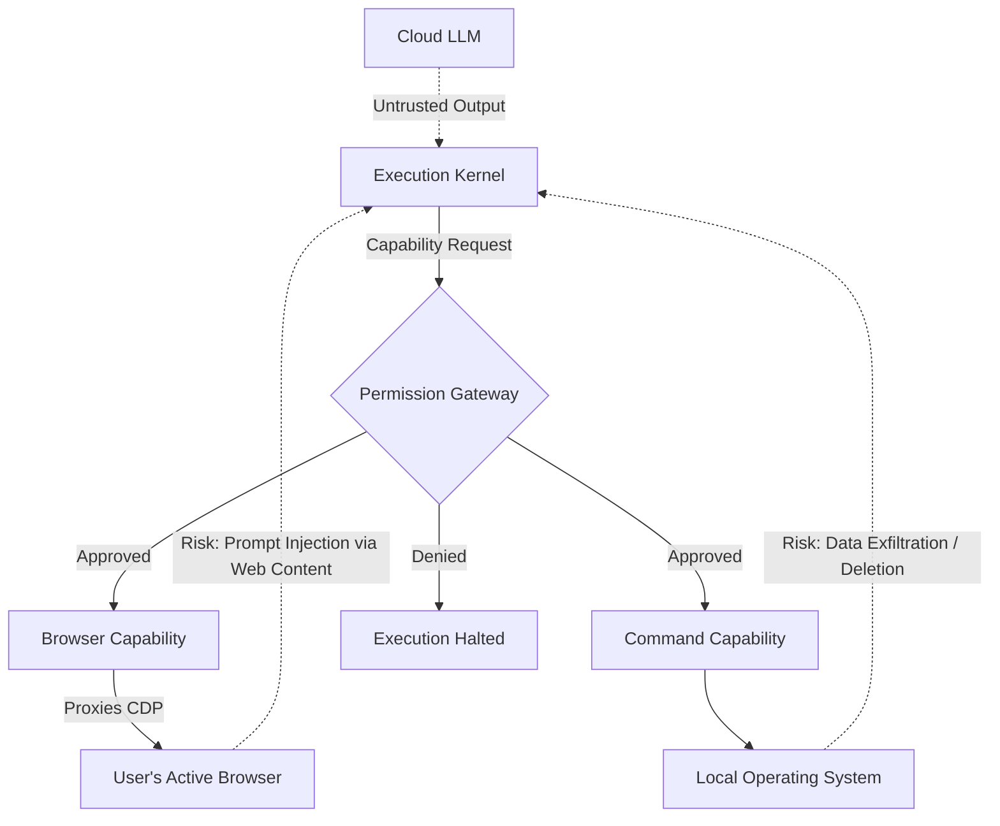

# ATLAS Security and Threat Model

ATLAS is an AI agent running directly on the developer's local machine with high privileges. Because it interacts with the filesystem, executes commands, and drives the user's active browser, security is a paramount concern.

## 1. Trust Boundaries

- **User & IDE (Trusted):** The developer interacting with the ATLAS frontend.
- **Execution Kernel (Trusted):** The Python backend executing the agent logic.
- **Cloud LLM (Untrusted Data Source):** The external model provider (OpenRouter). While we trust the provider to return completions, the *content* of the completions (e.g., generated shell commands or browser scripts) is inherently untrusted and must be validated.
- **External Websites (Untrusted):** Websites visited by the agent via the browser capability.
- **MCP Servers (Semi-Trusted):** External tools running in isolated processes.

## 2. Authorization and Policy Engine

The Execution Kernel uses a capability-based security model.

### The Permission Gateway
Before any tool is executed, the `AuthorizedToolExecutor` checks the `PermissionGateway`.
- The `SessionPolicyRegistry` tracks what permissions have been granted for the current session.
- Currently, when a session starts, it grants `["SAFE", "READ", "WRITE", "BROWSER", "NETWORK", "DANGEROUS"]` to the agent.
- *Future Work:* The system is architected to pause execution and prompt the user in the IDE when a "DANGEROUS" capability is requested, though auto-approval is currently active in the prototype.

### Browser Authorization
The `AuthorizationManager` specifically intercepts CDP requests. Because ATLAS connects to the user's active, authenticated browser profile (e.g., Gmail, GitHub), it represents a massive risk if a malicious LLM payload or prompt injection coerces the agent into exfiltrating data.

## 3. Network and API Security

- **Local Binding:** Both the FastAPI Execution Kernel and the Browser Connector Server bind exclusively to `127.0.0.1`. They are inaccessible from external machines on the local network.
- **CORS:** The FastAPI server allows `*` origins to support the local VS Code extension, which is acceptable given the local binding constraint.

## 4. Threat Model Diagram

## 5. Security Posture of the Prototype

> [!CAUTION]
> ATLAS is currently a **prototype**. While the authorization architecture is in place, many checks currently default to auto-approval to facilitate rapid testing.
> - **Do not run ATLAS on untrusted projects.**
> - **Do not allow ATLAS to browse untrusted or adversarial websites.**
> - **Assume the agent has the same privileges as the user running it.**

---
**Implementation References:**
- `runtime/policy/gateway.py`
- `runtime/policy/authorized_executor.py`
- `core/python/agents/core_types/policy.py`
