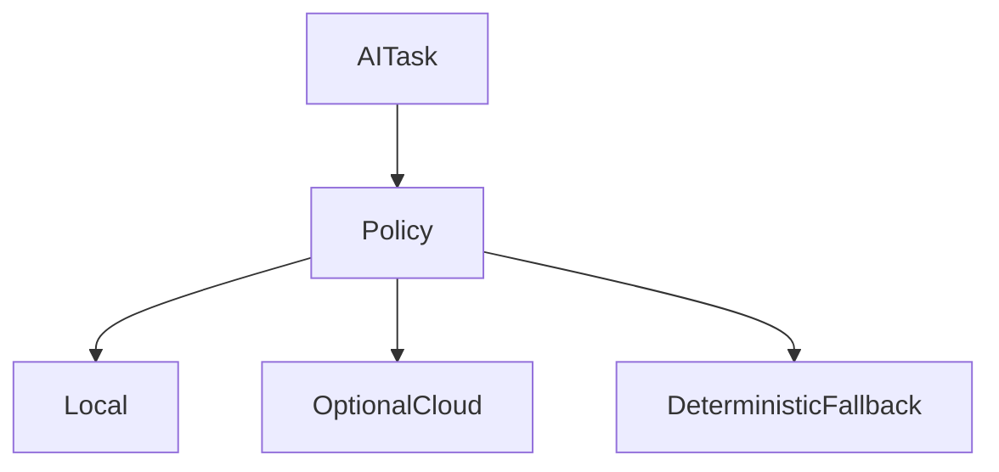
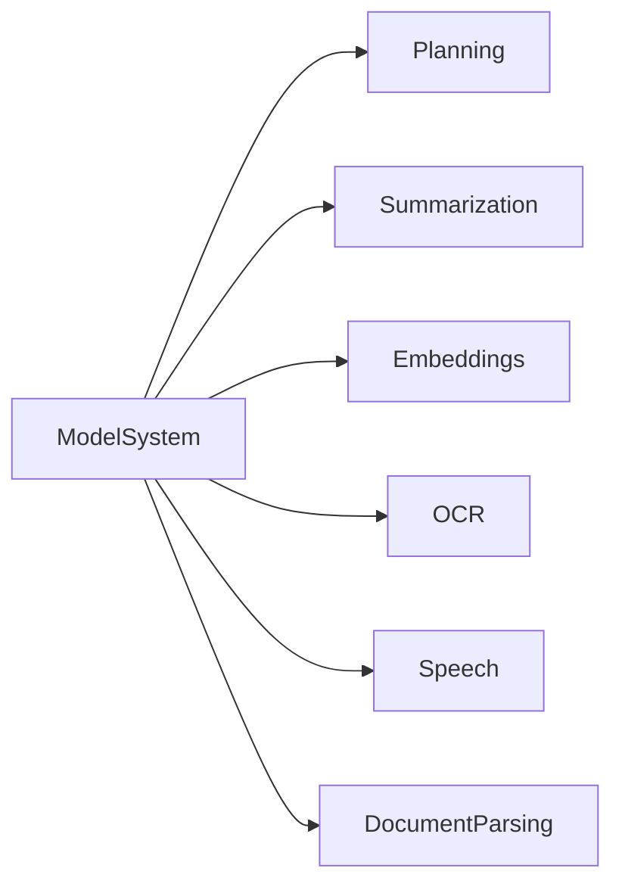
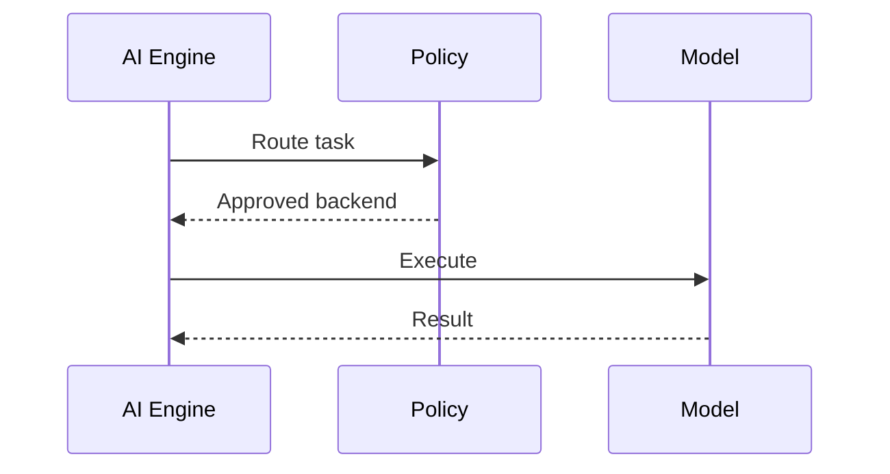

# AI Models Specification

## Purpose

This document defines Atlas model policy and model integration requirements.

## Overview

Atlas prefers local models. Optional cloud providers may be configured by users, but no core workflow may require cloud infrastructure.

## Motivation

Atlas handles private machine context. Model routing must protect privacy, cost, and offline functionality.

## Architecture

## Design Decisions

Each model backend declares supported tasks, context limits, latency class, privacy properties, and output validation support.

## Component Diagram

## Sequence Diagram

## Folder Structure

Model code belongs in `atlas/core/ai/providers` with tests in `tests/integration/ai`.

## Public Interfaces

`PlanningModel`, `EmbeddingModel`, `SummarizationModel`, `SpeechModel`, `OCRModel`, and `DocumentModel`.

## Implementation Strategy

Begin with local provider interfaces and mock providers for tests. Add concrete local runtime integrations after benchmarks select viable defaults.

## Testing

Test routing, schema validation, prompt redaction, timeout handling, fallback, and reproducibility of evaluation fixtures.

## Security

Cloud providers require explicit opt-in and visible data disclosure.

## Future Improvements

Add model packs, benchmark leaderboards, and per-user model routing profiles.

## References

- [AI Engine](/code/ATLAS/docs/architecture/ai-engine.md)
