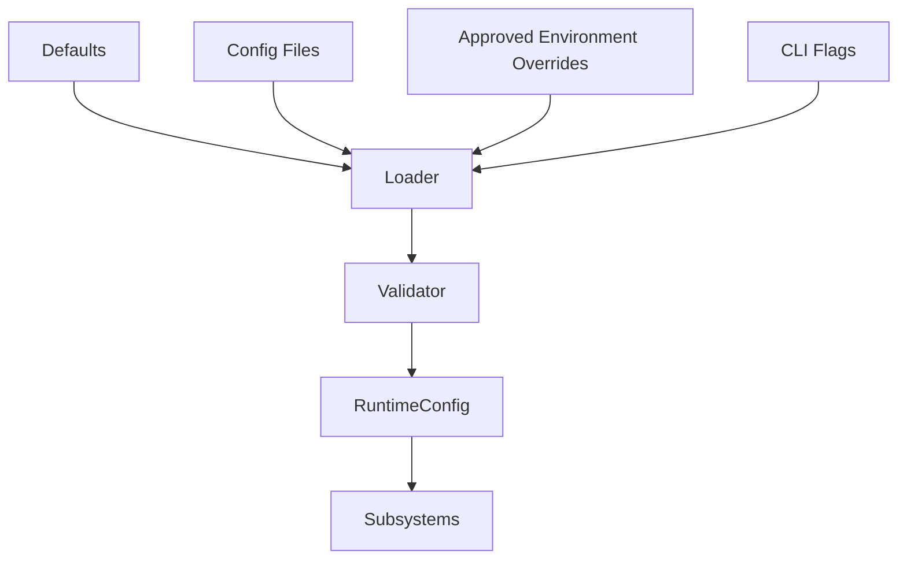
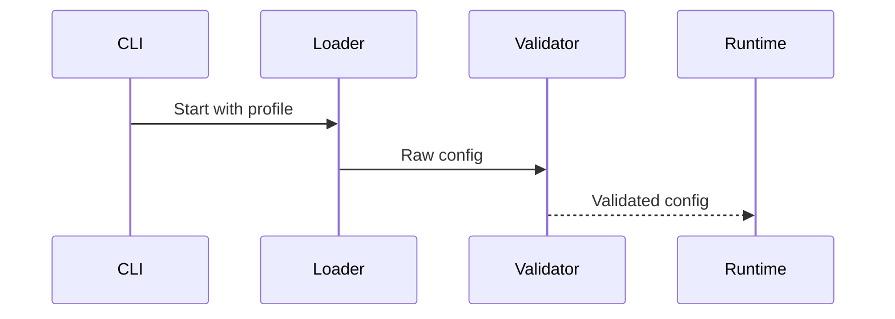
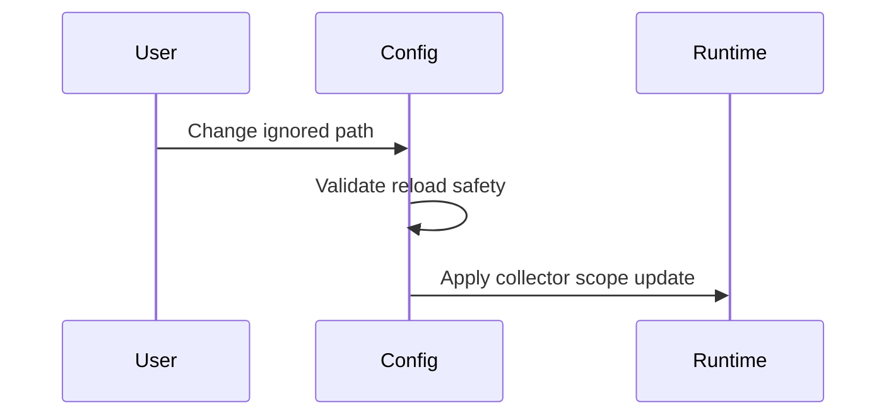
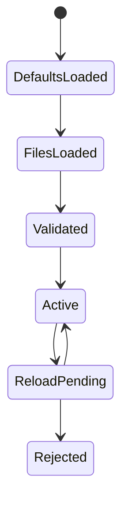

# Configuration

## Purpose

This document defines Atlas configuration sources, schema ownership, precedence, validation, secrets handling, and runtime reload behavior.

## Motivation

Atlas must be configurable without cloud infrastructure and without encouraging unsafe local authority. Configuration controls scopes, policies, adapters, model providers, storage paths, logging, performance budgets, and plugin behavior.

## Problem Statement

Ad hoc configuration would lead to inconsistent defaults, insecure permissions, and unreproducible local environments. Atlas needs one coherent configuration model.

## Requirements

- Support local configuration files under XDG-compliant paths on Linux.
- Validate configuration before runtime startup.
- Separate regular configuration from secrets.
- Support profile-specific configuration.
- Support explicit user overrides without hidden environment magic.
- Keep defaults safe and offline.

## Goals

- Make Atlas predictable to run, test, package, and debug.
- Make user-visible authority configurable through policy, not scattered flags.
- Allow local model/provider configuration without making cloud required.

## Non Goals

- Atlas does not require a remote configuration service.
- Atlas does not silently migrate insecure settings.
- Atlas does not store provider secrets in plain-text config.

## Architecture Overview



## Component Responsibilities

| Component | Responsibility |
| --- | --- |
| Config loader | Read defaults, files, env overrides, and CLI flags |
| Config validator | Validate schema, ranges, paths, and unsafe combinations |
| Secret resolver | Resolve secrets from OS keyring or explicit local secret store |
| Reload manager | Apply safe runtime changes without restart |
| Config auditor | Log effective non-secret configuration |

## Interfaces

```text
ConfigLoader.load(profile) -> RawConfig
ConfigValidator.validate(raw) -> ValidatedConfig
SecretResolver.resolve(ref) -> SecretValue
ReloadManager.apply(delta) -> ReloadResult
```

## Contracts

Configuration records include schema version, profile id, source, value, validation status, and sensitivity.

## Folder Structure

```text
atlas/core/config/
  schema.py
  loader.py
  validation.py
  secrets.py
  reload.py
docs/specifications/configuration.md
tests/unit/config/
```

## Lifecycle

Configuration is loaded at process start, validated before subsystem initialization, watched for safe reloadable changes, and migrated through versioned schemas.

## Execution Flow



## Sequence Diagrams



## State Diagrams



## Failure Handling

Invalid configuration blocks startup unless the invalid key is optional and has a safe default. Unsafe policy changes are rejected and logged.

## Recovery

Atlas preserves the last known valid configuration hash. If a reload fails, Atlas continues with the previous active configuration and reports the validation error.

## Performance

Configuration validation should be fast and deterministic. Expensive checks such as probing model files or Docker sockets belong in subsystem health checks, not generic config validation.

## Security

Secrets use references, not inline values. Redacted effective configuration can be logged; secret values cannot. Configuration cannot grant dangerous authority without policy review.

## Logging

Log config schema version, profile, loaded files, validation failures, reload attempts, and active config hash.

## Metrics

Track config load time, reload count, validation failures, and rejected unsafe changes.

## Configuration

Linux paths:

```text
$XDG_CONFIG_HOME/atlas/config.toml
$XDG_CONFIG_HOME/atlas/profiles/<profile>.toml
$XDG_STATE_HOME/atlas/config-history/
```

Precedence:

1. Built-in safe defaults
2. System package defaults when present
3. User profile config
4. Approved environment overrides
5. CLI flags for the current invocation

## Future Extensions

Add configuration diff tooling, policy simulation, profile export/import, and managed policy bundles.

## Testing

Test precedence, schema migration, invalid values, unsafe grants, redaction, reload, and last-known-valid recovery.

## Acceptance Criteria

- Atlas starts offline with safe defaults.
- Invalid config fails with actionable messages.
- Secrets are never logged.
- Runtime reload cannot bypass permission policy.

## Related Documents

- [Permissions](/code/ATLAS/docs/specifications/permissions.md)
- [Storage](/code/ATLAS/docs/specifications/storage.md)
- [Linux System Interfaces](/code/ATLAS/docs/specifications/linux-system-interfaces.md)

## References

- XDG Base Directory Specification: https://specifications.freedesktop.org/basedir/0.8/
