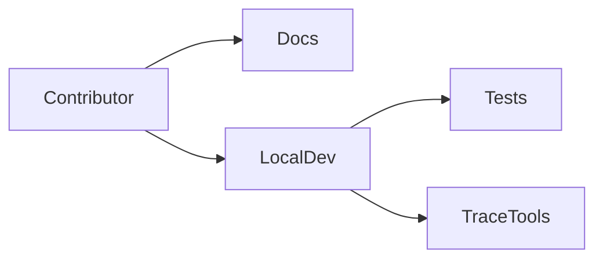
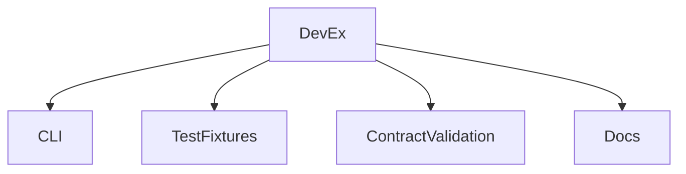
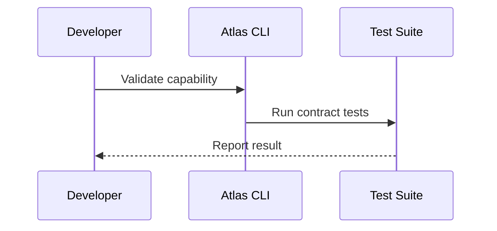

# Developer Experience

## Purpose

This document defines how Atlas should feel to build, test, debug, and extend.

## Overview

Contributors should be able to clone the repository, run tests offline, inspect capability contracts, add plugins, and reproduce workflow traces.

## Motivation

A strong developer experience is necessary for an open-source operating-layer project with many integration surfaces.

## Architecture

## Design Decisions

Local development must not require paid services. Mock adapters and fixture-driven tests are first-class.

## Component Diagram

## Sequence Diagram

## Folder Structure

Future developer tooling should live in `tools/`, fixtures in `tests/fixtures`, and examples in [docs/examples](/code/ATLAS/docs/examples).

## Public Interfaces

Developer-facing interfaces include CLI commands for validating manifests, running workflows in dry-run mode, inspecting plans, and replaying traces.

## Implementation Strategy

Build developer tooling alongside runtime contracts. Do not wait until integrations become complex.

## Testing

Developer tools need snapshot tests, fixture tests, and smoke tests in clean local environments.

## Security

Debug modes must not dump secrets by default.

## Future Improvements

Add generated docs, local trace UI, plugin scaffolding, and architecture dependency checks.

## References

- [Contributing](/code/ATLAS/CONTRIBUTING.md)
- [Plugin SDK](/code/ATLAS/docs/plugins/sdk.md)
